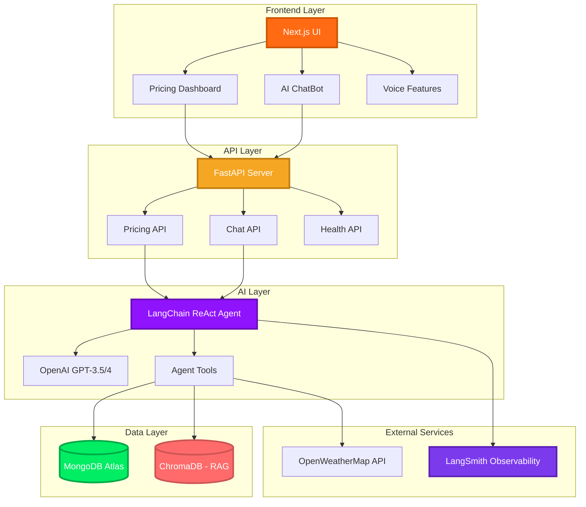
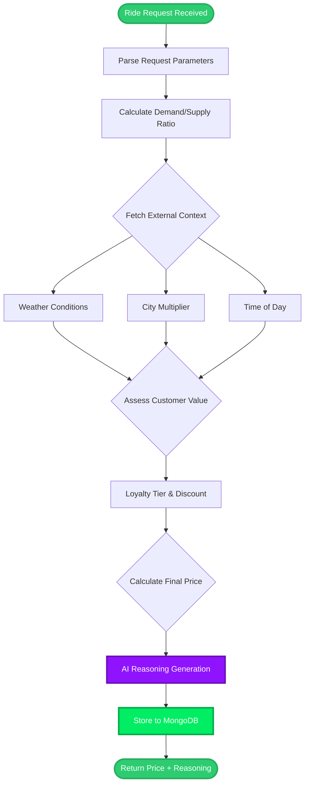
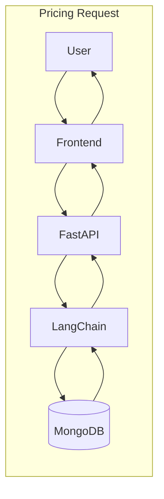
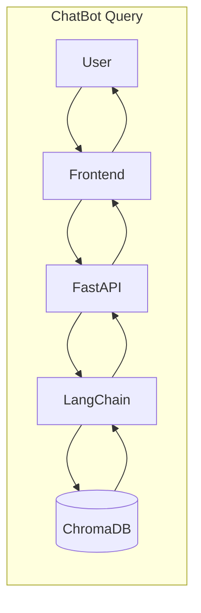
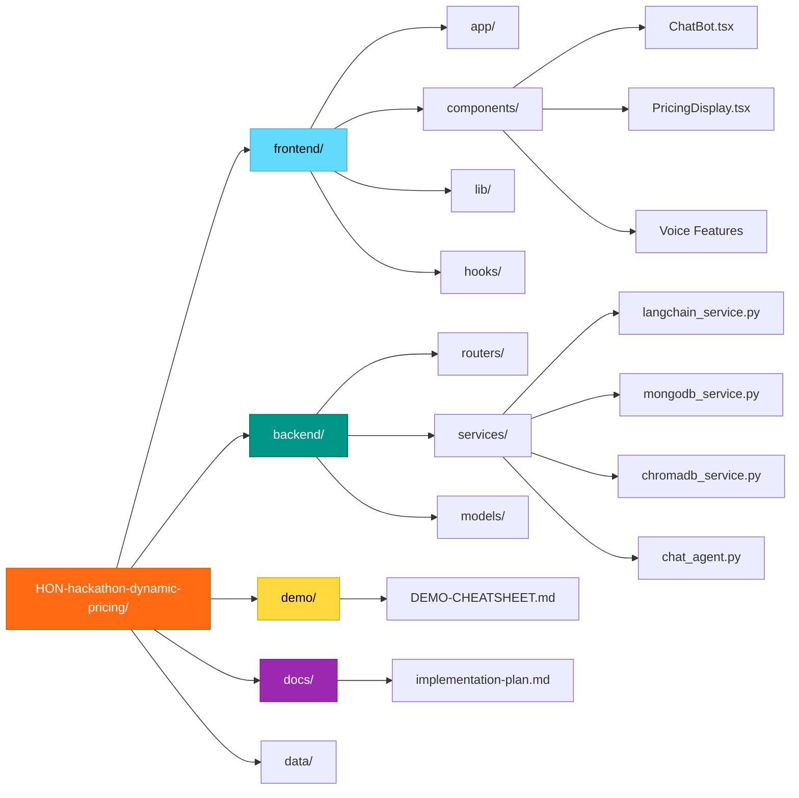

# 🚖 HoneyGo: Intelligent Ride-Sharing Platform

**Presentation Slides:** 
- Presentation:  [HoneyGo: Agentic AI Dynamic Pricing Slides](https://www.canva.com/design/DAG6mrQ8m6o/DIbzwOQzS8fNMocYqRcpUA/view?utm_content=DAG6mrQ8m6o&utm_campaign=designshare&utm_medium=link2&utm_source=uniquelinks&utlId=h6d54794bee#1)

**Video Link:** 
- Video:  [HoneyGo: Agentic AI Dynamic Pricing | Honeywell Hackathon 2025 | Team #1](https://www.youtube.com/watch?v=XKJh-7hi7Ek)

> **Agentic AI-Powered Dynamic Pricing for Honeywell's Ride-Sharing Division**

[]()
[]()
[]()
[]()

---

## 📋 Project Overview

**HoneyGo** is an innovative Agentic AI solution for dynamic pricing in a ride-sharing context, demonstrating reasoning applicable to Honeywell's catalog demand pricing, supply constraints, and customer tier management.

### 🎯 Key Objectives

- **Maximize Profitability**: Intelligent pricing that balances demand, supply, and customer value
- **Agentic AI**: Autonomous reasoning with explainable decision-making using LangChain ReAct agents
- **Real-World Applicability**: Demonstrate concepts transferable to Honeywell's B2B catalog pricing
- **Explainability**: Full transparency into AI reasoning for trust and compliance

---

## 👥 Development Team

**Course:** AI Vibe Coding  |  Fall 2025  
**Offered by:** Arizona State University (https://www.asu.edu)  
**Taught through:** Revature (https://www.revature.com)  
**Instructor:** Charles J.

**Project:** Hackathon  |  Agentic AI solution for dynamic pricing in a ride-sharing context for Honeywell  
**Timeline:** 1 Week | 4 days Development, 1 day Presentation  
**Branch Strategy (GitHub):** Feature branches → dev → main  
**Company/Product name chosen by Contributors:** <span style="color: #FF6A13; font-weight: bold; font-size: 1.1em;">HoneyGo</span>

**Project Contributors/Developers (Alphabetical Order):**
| Name | LinkedIn |
|------|----------|
| Darimar C. | [Connect](https://www.linkedin.com/in/daricaceres/) |
| Jason M. | [Connect](https://www.linkedin.com/in/aztuxmann/) |
| Safa M. | [Connect](https://www.linkedin.com/in/safa-matin-4177678/) |
| Steven J. | [Connect](https://www.linkedin.com/in/YOUR-LINKEDIN/) |

---
---

## 👥 Team Roles

| Role | Name | Responsibilities |
|------|------|------------------|
| **Frontend + Voice Features** | Jason, Safa | Next.js UI, Voice I/O |
| **MongoDB Engineer** | Jason | Database design, data import |
| **Backend/FastAPI Engineer** | Dari | API development, integration |
| **LangChain/Agent + LangSmith** | Safa | AI agent, observability |
| **ChromaDB/Vector DB Engineer** | Safa | RAG, semantic search |
| **n8n/MCP Workflow Engineer** | Steve | Workflow automation |
| **Project Lead/Coordinator** | Safa | Integration, coordination |
| **Presentation Slides** | Steve | Slide deck creation |
| **Slides Presenter** | Dari | Presenting slides during demo |
| **Live Demo Presenter** | Safa (Primary), Team (Support) | Live app demo execution |
| **Demo Video Creator** | Dari, Safa | Backup video recording |
| **Docker/DevOps Engineer** | Dari | Containerization, deployment |

---

## 🏗️ System Architecture

### Architecture & Technology Stack



### Agent Reasoning Workflow



### Data Flow

**Pricing Flow:**
```
User → Frontend → FastAPI → LangChain AI → MongoDB (save) → Response with Reasoning
```

**ChatBot Flow:**
```
User → Frontend → FastAPI → LangChain AI → ChromaDB (RAG) → Response with Suggestions
```





### Project Folder Structure



> 📖 **For complete architecture details, see [Implementation Plan](docs/implementation-plan.md)**

---

## 🛠️ Tech Stack

### **Frontend**
- **Next.js 14** (App Router)
- **React 18** with TypeScript
- **Tailwind CSS** for styling
- **Web Speech API** for voice features (Mic 🎤 & Speaker 🔊)

### **Backend**
- **FastAPI** (Python 3.11+)
- **Pydantic** for data validation
- **OpenAPI/Swagger** for API documentation

### **AI & Intelligence**
- **LangChain** (ReAct agent framework)
- **OpenAI GPT-3.5-Turbo / GPT-4** (LLM)
- **LangSmith** (Agent observability & debugging)

### **Databases**
- **MongoDB Atlas** (Structured data: 988 rides, 500 customers, pricing decisions)
- **ChromaDB** (Vector database for RAG & semantic search)

### **External APIs**
- **OpenWeatherMap** (Real-time weather data)

---

## 🚀 Quick Start

### Prerequisites

- **Node.js** 18+ and **npm**
- **Python** 3.11+
- **MongoDB Atlas** account (FREE M0 tier)
- **Git**

---

### Setup Instructions

#### 1. Clone the Repository

**Windows (PowerShell) & macOS/Linux (Bash):**
```bash
git clone https://github.com/fly2safa/HON-hackathon-dynamic-pricing.git
cd HON-hackathon-dynamic-pricing
```

---

#### 2. Set Up Environment Variables

**Windows (PowerShell) & macOS/Linux (Bash):**
```bash
cp env.example .env
```

Edit `.env` with your API keys:
- `OPENAI_API_KEY` - Required for AI pricing
- `MONGODB_URI` - MongoDB Atlas connection string
- `LANGSMITH_API_KEY` - Optional, for observability
- `NEXT_PUBLIC_OPENWEATHER_API_KEY` - Optional, for live weather

---

#### 3. Install Frontend Dependencies

**Windows (PowerShell):**
```powershell
cd frontend
npm install
cd ..
```

**macOS/Linux (Bash):**
```bash
cd frontend
npm install
cd ..
```

---

#### 4. Install Backend Dependencies

**Windows (PowerShell):**
```powershell
cd backend
python -m venv venv
.\venv\Scripts\Activate.ps1
pip install -r requirements.txt
```

**macOS/Linux (Bash):**
```bash
cd backend
python3 -m venv venv
source venv/bin/activate
pip install -r requirements.txt
```

---

#### 5. Seed ChromaDB (One-Time Setup for RAG)

**Windows (PowerShell):**
```powershell
cd backend
.\venv\Scripts\Activate.ps1
python seed_chromadb.py
```

**macOS/Linux (Bash):**
```bash
cd backend
source venv/bin/activate
python seed_chromadb.py
```

This seeds 988 historical rides for semantic search.

---

#### 6. Run the Application

**Windows (PowerShell) - Backend:**
```powershell
cd backend
.\venv\Scripts\Activate.ps1
uvicorn main:app --reload --host 0.0.0.0 --port 8000
```

**macOS/Linux (Bash) - Backend:**
```bash
cd backend
source venv/bin/activate
uvicorn main:app --reload --host 0.0.0.0 --port 8000
```

**Frontend - Development Mode (same for both OS):**
```bash
cd frontend
npm run dev
```

**Frontend - Production Mode (same for both OS):**
```bash
cd frontend
npm run build
npm run start
```

> **Note:** Production mode is recommended for demo (cleaner UI, no dev tools overlay).

---

#### 7. Access the Application

| Service | URL |
|---------|-----|
| **Frontend** | http://localhost:3000 |
| **Backend API** | http://localhost:8000 |
| **API Docs (Swagger)** | http://localhost:8000/docs |

---

### Docker Deployment (Optional)

```bash
# Build and run all services
docker-compose up --build

# Stop services
docker-compose down
```

---

## 📚 Documentation

| Document | Description |
|----------|-------------|
| **[Implementation Plan](docs/implementation-plan.md)** | Complete project roadmap and architecture |
| **[MongoDB Design](docs/mongoDB-design-decision.md)** | Database schema and design decisions |
| **[ChromaDB RAG Design](docs/chromadb-rag-design.md)** | Hybrid database and RAG approach |
| **[LangSmith Proposal](docs/langsmith-observability-proposal.md)** | Agent tracing and observability |
| **[Project Structure](docs/project-structure-guide.md)** | Folder structure and setup guide |
| **[Demo Cheat Sheet](demo/DEMO-CHEATSHEET.md)** | Demo queries and talking points |

---

## 🧪 Testing Tool

The **HoneyGo Testing Tracker** (`testing_tool/honeygo_test_tracker.py`) is a standalone GUI application for tracking manual testing progress during QA and demos.

### Features
- 📋 **40+ Test Cases** organized by category (Backend, Frontend, LangSmith, Weather, Demand, Loyalty, Cities, UI, E2E)
- 💡 **Hints** for each test to guide execution
- 📊 **Progress Tracking** with pass/fail/blocked statistics
- 💾 **Save/Load** test progress as JSON
- 📝 **Generate Reports** as Markdown
- 🔗 **Quick Links** to Frontend, API Docs, LangSmith

### How to Run

**Windows (PowerShell):**
```powershell
cd testing_tool
pip install -r requirements.txt
python honeygo_test_tracker.py
```

**macOS/Linux (Bash):**
```bash
cd testing_tool
pip3 install -r requirements.txt
python3 honeygo_test_tracker.py
```

> **Note:** Requires Python 3.8+ with tkinter (usually included). See [`testing_tool/README.md`](testing_tool/README.md) for detailed instructions and troubleshooting.

### Results Location
Test results are saved to `testing_tool/results/`:
- `test_progress_<name>_<timestamp>.json` - Raw data (can be loaded later)
- `test_report_<name>_<timestamp>.md` - Markdown report for sharing

---

## 🏗️ Project Structure

```
HON-hackathon-dynamic-pricing/
├── backend/                  # FastAPI application
│   ├── routers/              # API endpoints (pricing, chat, health)
│   ├── services/             # Business logic
│   │   ├── langchain_service.py   # AI pricing reasoning
│   │   ├── mongodb_service.py     # Database operations
│   │   ├── chromadb_service.py    # RAG/semantic search
│   │   └── chat_agent.py          # ChatBot AI agent
│   ├── models/               # Pydantic data models
│   ├── seed_chromadb.py      # ChromaDB seeding script
│   └── main.py               # Application entry point
├── frontend/                 # Next.js application
│   ├── app/                  # App router pages
│   ├── components/           # React components
│   │   ├── ChatBot.tsx       # AI ChatBot with voice
│   │   ├── PricingDisplay.tsx # Price display with voice playback
│   │   └── ...               # Other UI components
│   ├── lib/                  # Utilities
│   └── hooks/                # Custom React hooks
├── demo/                     # Demo resources
│   └── DEMO-CHEATSHEET.md    # Demo script and queries
├── testing_tool/             # GUI testing tracker
├── docs/                     # Documentation
├── data/                     # Data exports and scripts
├── docker-compose.yml        # Container orchestration
├── env.example               # Environment template
└── README.md                 # This file
```

---

## 🎯 Key Features (Implemented)

### 1. **AI-Powered Dynamic Pricing** ✅
- Real-time pricing calculation with LangChain AI agent
- Multi-factor reasoning: demand, weather, time, location, loyalty
- Explainable AI reasoning with numbered bullet points
- Auto-save pricing decisions to MongoDB

### 2. **Hybrid Database Architecture** ✅
- **MongoDB Atlas**: Live structured data (988 rides, 500 customers)
- **ChromaDB**: Local vector database for RAG semantic search
- Live average price updates when new rides are calculated

### 3. **Natural Language ChatBot** ✅
- Query ride data: "Find Urban rides at Night"
- Get statistics: "What's the average price?"
- Semantic search via ChromaDB RAG
- Weather queries: "What's the weather in Phoenix?"

### 4. **Voice-Enabled Interface** ✅
- 🔊 **Speaker Button** (green): Toggle text-to-speech
- 🎤 **Microphone Button** (red): Voice input for queries
- 🎵 **AI Reasoning Playback**: Play/Pause/Stop with highlighting

### 5. **Real-Time Market Conditions** ✅
- Live weather data from OpenWeatherMap API
- Demand thermometer (Low/Medium/High/Surge)
- City-specific pricing (NYC 1.35x, SF 1.30x, Chicago 1.20x)

### 6. **Customer Loyalty Integration** ✅
- Tier-based discounts: Gold (15%), Silver (10%), Bronze (5%)
- Loyalty badges in UI
- Discount reflected in AI reasoning

### 7. **LangSmith Observability** ✅
- Full agent tracing for every pricing decision
- Real-time debugging and monitoring
- Project: `honeygo-pricing`

### 8. **Competitor Price Comparison** ✅
- Compare with Uber, Lyft, Waymo
- Show savings percentage

---

## 📅 Timeline

| Date | Phase | Focus |
|------|-------|-------|
| **Nov 30** | Planning | Implementation plan, architecture |
| **Dec 1** | Foundation | API contracts, MongoDB, LangSmith |
| **Dec 2** | Core Dev | Backend, ChromaDB, agent tools |
| **Dec 3** | Integration | Full-stack, RAG, voice features |
| **Dec 4 AM** | Polish | Bug fixes, demo prep |
| **Dec 4 PM** | Submission | GitHub + slides submitted |
| **Dec 5** | Demo Day | Live presentation |

---

## 🏆 Judging Criteria Alignment

| Criterion | Our Approach |
|-----------|--------------|
| **Innovation** | Agentic AI + RAG + hybrid database + voice |
| **Technical Depth** | LangChain, MongoDB, ChromaDB, LangSmith |
| **Explainability** | Numbered reasoning, voice playback, traces |
| **Applicability** | B2B pricing recommendations for Honeywell |
| **Presentation** | Live demo, cheat sheet, backup video |

---

## 📊 Deliverables

- ✅ **GitHub Repository**: Clean, documented codebase
- ✅ **Live Demo**: Functional AI-powered pricing
- ✅ **Presentation Slides**: Key decisions highlighted
- ✅ **Demo Video**: Backup recording
- ✅ **Documentation**: Comprehensive guides
- ✅ **Demo Cheat Sheet**: Query library and talking points

---

## 🔗 Links

- **GitHub**: [github.com/fly2safa/HON-hackathon-dynamic-pricing](https://github.com/fly2safa/HON-hackathon-dynamic-pricing)
- **LangSmith**: Team access via `.env`
- **MongoDB Atlas**: Connection string in `.env`

---

## 📝 License

Developed for the HON Dynamic Pricing Hackathon (Team #1).

---

## 🙏 Acknowledgments

Special thanks to Honeywell and the hackathon organizers for this opportunity to explore Agentic AI in dynamic pricing!

---

**Built with ❤️ by Team #1 | Dec 2025**
