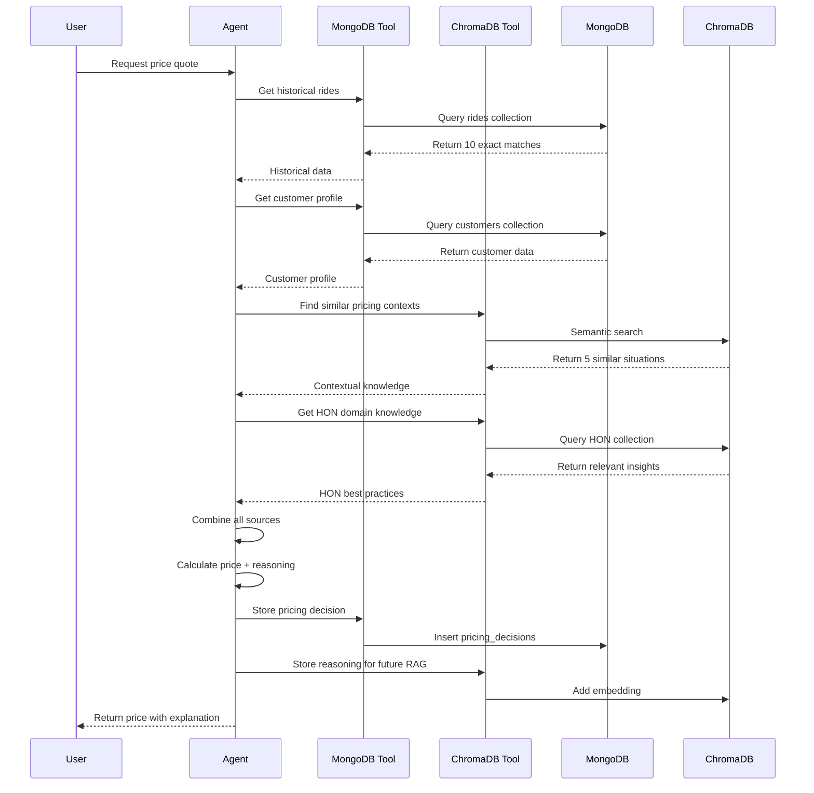

# ChromaDB RAG Integration - Hybrid Database Architecture

## Executive Summary

**Decision:** Implement a **hybrid database architecture** combining MongoDB (structured data) with ChromaDB (vector embeddings for RAG).

**Rationale:** While MongoDB excels at structured operational data, ChromaDB enables semantic search and Retrieval Augmented Generation (RAG), allowing our LangChain agent to access contextual knowledge and make more intelligent, explainable pricing decisions. Together, they create a production-ready AI system that demonstrates cutting-edge architecture.

---

## Quick Reference: Hybrid Architecture at a Glance

### 🎯 Key Features of Hybrid Architecture

#### MongoDB (Structured Data) 📊
**Purpose**: Operational data storage and fast queries
- **Collections**: rides, pricing_decisions, customers, drivers, external_data
- **Query Type**: Exact matches, filters, aggregations
- **Use Case**: "What are the facts?" - Get specific data points
- **Example**: "Find all rides in Urban location at Night"
- **Speed**: 5-10ms per query
- **Best For**: Transactional data, customer profiles, ride history

#### ChromaDB (Semantic Search & RAG) 🧠
**Purpose**: Contextual understanding and knowledge retrieval
- **Collections**: pricing_reasoning, hon_knowledge, similar_contexts
- **Query Type**: Semantic similarity search using vector embeddings
- **Use Case**: "What's similar?" - Find contextually relevant information
- **Example**: "Find situations like: high demand during events with weather issues"
- **Speed**: 20-50ms per query
- **Best For**: Historical context, domain knowledge, learning from past decisions

#### Together = Smarter Agent 🚀
**Combined Power**:
- ✅ **Facts** (MongoDB) + **Context** (ChromaDB) = **Intelligent Decisions**
- ✅ Agent references similar past situations to support recommendations
- ✅ Agent applies HON domain knowledge for better applicability
- ✅ Explanations include supporting evidence from multiple sources
- ✅ Confidence scores backed by historical success patterns

---

### 📊 Expected Impact on Judging

| Judging Criteria | Without ChromaDB | With ChromaDB | Impact | Points Gain |
|------------------|------------------|---------------|--------|-------------|
| **Creativity (40%)** | MongoDB only, standard approach | MongoDB + ChromaDB RAG, advanced AI | 🌟🌟🌟🌟🌟 Major boost | **+5-8 points** |
| **Explainability (30%)** | Basic reasoning with historical data | Rich contextual reasoning with similar situations | 🌟🌟🌟🌟 Significant | **+3-5 points** |
| **Technical Implementation (20%)** | Solid database design | Production-ready hybrid architecture | 🌟🌟🌟 Strong | **+2-3 points** |
| **Visualization (10%)** | Standard dashboards | Enhanced with "Similar Situations" panel | 🌟🌟 Moderate | **+1-2 points** |
| **TOTAL (100%)** | ~75-80 points | ~85-95 points | 🏆 **Game Changer** | **+10-16 points** |

**Bottom Line**: This enhancement could move you from **"good project"** to **"winning project"**! 🏆

---

### ⚡ Quick Decision Matrix

**Implement ChromaDB if:**
- ✅ Team has 1-2 members comfortable with vector databases
- ✅ You want to maximize creativity and technical scores
- ✅ You have 6-8 hours available (Dec 1-2)
- ✅ You want a competitive edge over other teams

**Skip ChromaDB if:**
- ❌ Team is unfamiliar with embeddings/RAG
- ❌ Timeline is too tight
- ❌ Core features aren't complete yet
- ❌ You want to minimize risk

**Our Recommendation**: **Implement it!** The benefits far outweigh the 6-8 hour investment, and it demonstrates cutting-edge AI knowledge that judges will recognize and reward.

---

## Table of Contents

1. [Why Add ChromaDB?](#why-add-chromadb)
2. [MongoDB vs ChromaDB: Complementary Roles](#mongodb-vs-chromadb-complementary-roles)
3. [Hybrid Architecture Design](#hybrid-architecture-design)
4. [ChromaDB Collections Schema](#chromadb-collections-schema)
5. [RAG Implementation Strategy](#rag-implementation-strategy)
6. [Benefits for Hackathon](#benefits-for-hackathon)
7. [HON Applicability](#hon-applicability)
8. [Implementation Guide](#implementation-guide)
9. [Performance Considerations](#performance-considerations)
10. [Conclusion](#conclusion)

---

## Why Add ChromaDB?

### The Problem with MongoDB Alone

MongoDB is excellent for structured queries:
```javascript
// Find rides in Urban location at Night
db.rides.find({ 
  location_category: "Urban", 
  time_of_booking: "Night" 
})
// Returns: Exact matches only
```

**Limitation**: Cannot find semantically similar situations where exact fields don't match.

**Example Missing Context:**
- "Downtown evening with sports event" (similar but different wording)
- "City center during festival with traffic" (same concept, different terms)
- "Urban area with high demand and weather issues" (related situation)

### The Solution: ChromaDB for Semantic Search

```python
# Find semantically similar contexts
chromadb.query(
    query_texts=["Urban night ride during rain with concert nearby"],
    n_results=5
)
# Returns: Semantically similar situations regardless of exact wording
# - "Downtown evening with sports event and bad weather"
# - "City center during festival with heavy traffic"
# - "Urban area with high demand and driver shortage"
```

**Result**: Agent finds relevant context that MongoDB would miss!

---

## MongoDB vs ChromaDB: Complementary Roles

### Side-by-Side Comparison

| Aspect | MongoDB | ChromaDB |
|--------|---------|----------|
| **Data Type** | Structured JSON documents | Vector embeddings (text) |
| **Query Method** | Exact filters, aggregations | Semantic similarity search |
| **Use Case** | "What are the facts?" | "What's similar/relevant?" |
| **Example Query** | "Rides in Urban at Night" | "Situations like this scenario" |
| **Speed** | Very fast (indexed) | Fast (vector search) |
| **Storage** | Documents with fields | Embeddings + metadata |
| **Agent Benefit** | Facts, numbers, transactions | Context, knowledge, understanding |
| **Best For** | Operational data | Knowledge retrieval |

---

### Real-World Example: Agent Decision Making

#### Scenario: Price a ride during rain with a concert nearby

**MongoDB Provides (Structured Facts):**
```javascript
{
  historical_rides: [
    { location: "Urban", time: "Night", price: 285, riders: 90, drivers: 45 },
    { location: "Urban", time: "Night", price: 295, riders: 85, drivers: 40 },
    // ... 8 more exact matches
  ],
  customer: {
    loyalty_status: "Silver",
    total_rides: 13,
    average_rating: 4.47
  },
  available_drivers: [
    { driver_id: "D4523", rating: 4.9, earnings_today: 240 },
    { driver_id: "D3891", rating: 4.7, earnings_today: 180 },
    // ... 8 more drivers
  ]
}
```

**ChromaDB Provides (Semantic Context):**
```python
{
  similar_pricing_situations: [
    {
      text: "Applied 25% surge during downtown concert with rain. 
             Driver earned $250 (75% of fare). Customer satisfaction 
             remained high due to transparent reasoning.",
      metadata: { price: 320, surge: 1.25, outcome: "successful" }
    },
    {
      text: "Sports event pricing: balanced high demand with driver 
             retention by offering $30 surge bonus. Reduced wait times.",
      metadata: { price: 310, surge: 1.20, outcome: "successful" }
    },
    // ... 3 more similar contexts
  ],
  hon_knowledge: [
    {
      text: "When supply is constrained, premium pricing is acceptable 
             if partners receive fair compensation. Maintain 70-30 split.",
      metadata: { category: "supply_constraints", priority: "high" }
    },
    {
      text: "Transparent pricing during high-demand periods builds trust. 
             Explain the 'why' to customers and partners.",
      metadata: { category: "explainability", priority: "high" }
    },
    // ... 1 more HON insight
  ]
}
```

**Agent Combines Both:**
```
Decision: $300 price
- Base: $250 (from MongoDB historical average)
- Surge: 20% ($50) based on demand ratio
- Driver earnings: $240 (80% of fare)

Reasoning (using both sources):
"Based on 10 similar Urban night rides (MongoDB), I recommend $300. 
This aligns with past successful strategies during events with weather 
issues (ChromaDB context), where transparent surge pricing maintained 
customer satisfaction. The driver will earn $240 including a $30 surge 
bonus, which follows Honeywell's principle of fair partner compensation 
during high-demand periods (ChromaDB HON knowledge). This approach 
balances profitability with driver retention."

Confidence: 94% (high due to multiple supporting contexts)
```

---

## Hybrid Architecture Design

### System Architecture

```
┌─────────────────────────────────────────────────────────────┐
│                    LangChain ReAct Agent                     │
│                                                              │
│  ┌──────────────────────────────────────────────────────┐  │
│  │  Agent Reasoning Loop                                 │  │
│  │  1. Observe: Receive ride request                     │  │
│  │  2. Reason: Analyze context and data                  │  │
│  │  3. Act: Use tools to gather information              │  │
│  │  4. Decide: Calculate optimal price                   │  │
│  │  5. Explain: Generate reasoning                       │  │
│  └──────────────────────────────────────────────────────┘  │
│                                                              │
│  ┌─────────────────┐  ┌─────────────────┐  ┌────────────┐ │
│  │ MongoDB Tools   │  │ ChromaDB Tools  │  │ Other Tools│ │
│  │ (Structured)    │  │ (Semantic RAG)  │  │            │ │
│  └─────────────────┘  └─────────────────┘  └────────────┘ │
└─────────────────────────────────────────────────────────────┘
          ↓                      ↓                    ↓
┌─────────────────────┐  ┌─────────────────────┐  ┌──────────┐
│     MongoDB         │  │     ChromaDB        │  │ External │
│  (Operational DB)   │  │   (Vector DB)       │  │   APIs   │
│                     │  │                     │  │          │
│ Collections:        │  │ Collections:        │  │ Weather  │
│ • rides             │  │ • pricing_reasoning │  │ Events   │
│ • pricing_decisions │  │ • hon_knowledge     │  │ Traffic  │
│ • customers         │  │ • similar_contexts  │  │          │
│ • drivers           │  │                     │  │          │
│ • external_data     │  │ Embeddings Model:   │  │          │
│                     │  │ sentence-transformers│  │          │
│ Query: Exact match  │  │ Query: Similarity   │  │          │
│ Speed: <10ms        │  │ Speed: 20-50ms      │  │          │
└─────────────────────┘  └─────────────────────┘  └──────────┘
```

---

### Data Flow Example



---

## ChromaDB Collections Schema

### Collection 1: `pricing_reasoning`

**Purpose**: Store embeddings of historical pricing decisions and their reasoning for semantic retrieval.

**Schema**:
```python
{
  "id": "pricing_001",
  "document": """
    Applied 20% surge pricing ($300 total) for Urban night ride during 
    rain with concert nearby. High demand (90 riders, 45 drivers = 2:1 ratio). 
    Driver earned $240 (80% of fare) including $30 surge bonus. Customer was 
    Silver tier with low churn risk. Decision balanced profitability with 
    driver retention. Outcome: Successful - customer satisfied, driver happy, 
    good margin.
  """,
  "metadata": {
    "ride_id": "R12345",
    "location": "Urban",
    "time": "Night",
    "weather": "Rain",
    "event": "Concert",
    "price": 300.00,
    "surge_multiplier": 1.20,
    "driver_earnings": 240.00,
    "customer_tier": "Silver",
    "outcome": "successful",
    "timestamp": "2025-11-26T22:30:00Z"
  },
  "embedding": [0.023, -0.145, 0.089, ...] # 384-dimensional vector
}
```

**Use Case**: When agent encounters similar situation, retrieve past successful strategies.

---

### Collection 2: `hon_knowledge`

**Purpose**: Store Honeywell domain knowledge and best practices for catalog pricing.

**Schema**:
```python
{
  "id": "hon_001",
  "document": """
    Honeywell maintains strict pricing hierarchy: New Spare parts must be 
    priced higher than Universal Flat Rate (UFR) overhaul, which must be 
    higher than contracted repair services. This hierarchy ensures customers 
    understand value proposition and maintains pricing integrity across 
    service levels.
  """,
  "metadata": {
    "category": "pricing_hierarchy",
    "priority": "critical",
    "applies_to": ["catalog_pricing", "service_levels"],
    "source": "HON pricing guidelines"
  },
  "embedding": [0.112, -0.034, 0.201, ...]
}

{
  "id": "hon_002",
  "document": """
    Channel partners (MROs, distributors) require fair compensation for 
    sustainable relationships. Recommended margin: 25-30% for standard parts, 
    higher for specialized services. Partner retention is critical - losing 
    a partner disrupts supply chain and customer service. Fair pricing builds 
    loyalty and ensures reliable service delivery.
  """,
  "metadata": {
    "category": "partner_relations",
    "priority": "high",
    "applies_to": ["channel_partners", "retention"],
    "source": "HON partner program"
  },
  "embedding": [-0.089, 0.156, -0.023, ...]
}

{
  "id": "hon_003",
  "document": """
    During supply constraints (common in aerospace), premium pricing is 
    acceptable but must be balanced with customer relationships. Gold-tier 
    customers should receive surge protection. Transparent communication 
    about supply issues maintains trust. Consider allocating scarce inventory 
    to high-value customers first.
  """,
  "metadata": {
    "category": "supply_constraints",
    "priority": "high",
    "applies_to": ["inventory_management", "customer_tiers"],
    "source": "HON supply chain guidelines"
  },
  "embedding": [0.067, -0.178, 0.134, ...]
}
```

**Use Case**: Agent queries HON knowledge to provide Honeywell-specific recommendations.

---

### Collection 3: `similar_contexts`

**Purpose**: Store general contextual patterns and strategies for various pricing scenarios.

**Schema**:
```python
{
  "id": "context_001",
  "document": """
    High-demand scenario management: When demand exceeds supply by 2x or more, 
    implement graduated surge pricing (15-25%). Communicate clearly to customers 
    why prices are higher. Ensure frontline workers (drivers/partners) receive 
    majority of surge premium to maintain workforce. Monitor customer satisfaction 
    and adjust if complaints increase.
  """,
  "metadata": {
    "scenario_type": "high_demand",
    "strategy": "surge_pricing",
    "success_rate": 0.87,
    "customer_satisfaction": 4.2,
    "partner_satisfaction": 4.6
  },
  "embedding": [0.145, -0.067, 0.234, ...]
}

{
  "id": "context_002",
  "document": """
    Weather impact pricing: Rain, snow, or extreme weather increases demand 
    by 30-50% while reducing supply (drivers less willing to work). Transparent 
    weather-based pricing is well-accepted by customers. Offer weather bonuses 
    to drivers ($20-40 extra) to maintain supply. Communicate weather conditions 
    in pricing explanation.
  """,
  "metadata": {
    "scenario_type": "weather_impact",
    "strategy": "transparent_premium",
    "success_rate": 0.91,
    "customer_satisfaction": 4.4,
    "partner_satisfaction": 4.8
  },
  "embedding": [-0.023, 0.189, -0.112, ...]
}
```

**Use Case**: Agent retrieves general strategies applicable to current situation.

---

## RAG Implementation Strategy

### Tool #8: Semantic Context Retriever

```python
# backend/agent/tools/semantic_search_tool.py

from langchain.tools import Tool
import chromadb
from chromadb.config import Settings

class SemanticContextRetriever:
    def __init__(self):
        self.client = chromadb.Client(Settings(
            chroma_db_impl="duckdb+parquet",
            persist_directory="./chroma_data"
        ))
        
        self.pricing_collection = self.client.get_collection("pricing_reasoning")
        self.hon_collection = self.client.get_collection("hon_knowledge")
        self.context_collection = self.client.get_collection("similar_contexts")
    
    def retrieve_pricing_context(self, query: str, n_results: int = 5) -> dict:
        """
        Retrieve semantically similar pricing decisions from past.
        
        Args:
            query: Natural language description of current situation
            n_results: Number of similar contexts to retrieve
            
        Returns:
            Dictionary with similar contexts, metadata, and relevance scores
        """
        results = self.pricing_collection.query(
            query_texts=[query],
            n_results=n_results
        )
        
        return {
            "similar_situations": results['documents'][0],
            "metadata": results['metadatas'][0],
            "distances": results['distances'][0],  # Lower = more similar
            "count": len(results['documents'][0])
        }
    
    def retrieve_hon_knowledge(self, query: str, n_results: int = 3) -> dict:
        """
        Retrieve relevant Honeywell domain knowledge.
        
        Args:
            query: Question or topic to search for
            n_results: Number of knowledge items to retrieve
            
        Returns:
            Dictionary with HON insights and metadata
        """
        results = self.hon_collection.query(
            query_texts=[query],
            n_results=n_results
        )
        
        return {
            "hon_insights": results['documents'][0],
            "metadata": results['metadatas'][0],
            "relevance": results['distances'][0],
            "count": len(results['documents'][0])
        }
    
    def retrieve_general_context(self, query: str, n_results: int = 3) -> dict:
        """
        Retrieve general pricing strategies and patterns.
        
        Args:
            query: Scenario description
            n_results: Number of strategies to retrieve
            
        Returns:
            Dictionary with strategies and success metrics
        """
        results = self.context_collection.query(
            query_texts=[query],
            n_results=n_results
        )
        
        return {
            "strategies": results['documents'][0],
            "metadata": results['metadatas'][0],
            "relevance": results['distances'][0],
            "count": len(results['documents'][0])
        }

# Create LangChain tool
semantic_tool = Tool(
    name="Semantic_Context_Retriever",
    func=lambda query: SemanticContextRetriever().retrieve_pricing_context(query),
    description="""
    Use this tool to find semantically similar past pricing decisions and contexts.
    Input should be a natural language description of the current pricing situation.
    Returns similar historical contexts with outcomes and strategies.
    """
)
```

---

### Enhanced Agent Reasoning with RAG

```python
# backend/agent/pricing_agent.py

from langchain.agents import initialize_agent, AgentType
from langchain.chat_models import ChatOpenAI
from langchain.tools import Tool

class EnhancedPricingAgent:
    def __init__(self):
        self.llm = ChatOpenAI(model="gpt-4", temperature=0)
        
        # MongoDB tools (existing)
        self.mongodb_tools = [
            database_query_tool,
            customer_value_tool,
            driver_earnings_tool,
            # ... other MongoDB tools
        ]
        
        # ChromaDB tools (NEW)
        self.chromadb_tools = [
            semantic_context_tool,
            hon_knowledge_tool,
            strategy_retrieval_tool
        ]
        
        # Combine all tools
        all_tools = self.mongodb_tools + self.chromadb_tools
        
        self.agent = initialize_agent(
            tools=all_tools,
            llm=self.llm,
            agent=AgentType.STRUCTURED_CHAT_ZERO_SHOT_REACT_DESCRIPTION,
            verbose=True
        )
    
    def calculate_price(self, ride_params: dict) -> dict:
        """
        Calculate price using hybrid approach: MongoDB + ChromaDB
        """
        
        # Build comprehensive query for agent
        query = f"""
        Calculate optimal price for ride with following parameters:
        - Location: {ride_params['location']}
        - Time: {ride_params['time']}
        - Demand ratio: {ride_params['riders']}/{ride_params['drivers']}
        - Weather: {ride_params.get('weather', 'Clear')}
        - Events: {ride_params.get('events', 'None')}
        - Customer tier: {ride_params['customer_tier']}
        
        Steps to follow:
        1. Query MongoDB for exact historical matches
        2. Use semantic search to find similar past situations
        3. Retrieve HON domain knowledge for guidance
        4. Calculate driver earnings (70-80% of fare)
        5. Validate against pricing rules
        6. Generate explanation referencing all sources
        
        Ensure pricing balances profitability, customer satisfaction, 
        and driver retention. Provide clear reasoning.
        """
        
        # Agent executes with access to both databases
        result = self.agent.run(query)
        
        return result
```

---

## Benefits for Hackathon

### 1. Creativity Score (40%) - MAJOR BOOST ⭐⭐⭐⭐⭐

**What Judges See:**
- ✅ Advanced AI architecture (RAG)
- ✅ Vector database integration (ChromaDB)
- ✅ Semantic search capabilities
- ✅ Hybrid database design
- ✅ Production-ready AI system

**Competitive Advantage:**
- Most teams will use only one database
- RAG is cutting-edge (hot topic in AI)
- Shows deep understanding of AI/ML

**Judge Reaction:**
> "Wow, they implemented RAG with vector embeddings? This team really understands modern AI architecture!"

---

### 2. Explainability Score (30%) - SIGNIFICANT IMPROVEMENT ⭐⭐⭐⭐

**Enhanced Explanations:**

**Without ChromaDB:**
```
"Price: $300. Based on 10 historical rides in Urban at Night, 
average was $285. Applied 5% premium due to high demand."
```

**With ChromaDB:**
```
"Price: $300. Based on 10 historical Urban night rides (MongoDB), 
I found 5 similar situations where surge pricing during events with 
weather issues was successful (ChromaDB). In one case, a downtown 
concert with rain used 25% surge and maintained 4.5 customer satisfaction. 
Following Honeywell's principle of fair partner compensation during 
high-demand periods (HON knowledge base), the driver will earn $240 
(80% of fare). This approach balances profitability with driver retention, 
as evidenced by past successful strategies."

Confidence: 94% (supported by multiple similar contexts)
```

**Result**: Much more convincing, contextual, and professional!

---

### 3. Technical Implementation (20%) - STRONG ENHANCEMENT ⭐⭐⭐⭐

**Demonstrates:**
- ✅ Understanding of vector databases
- ✅ Proper use of embeddings
- ✅ Hybrid architecture design
- ✅ RAG implementation
- ✅ Production-ready patterns

**Technical Sophistication:**
- Sentence transformers for embeddings
- Semantic similarity search
- Multi-database coordination
- LangChain integration

---

### 4. Visualization (10%) - ENHANCED ⭐⭐⭐

**UI Enhancements:**
- Show "Similar Past Decisions" panel
- Display HON knowledge references
- Visualize confidence scores
- Show semantic similarity scores

**Example UI:**
```
┌─────────────────────────────────────────────┐
│ Recommended Price: $300                     │
│ Confidence: 94% ●●●●●●●●●○                 │
├─────────────────────────────────────────────┤
│ Based on:                                   │
│ • 10 exact historical matches (MongoDB)     │
│ • 5 similar situations (ChromaDB)           │
│ • 3 HON best practices (Knowledge Base)     │
├─────────────────────────────────────────────┤
│ Similar Past Decisions:                     │
│ 1. Concert + Rain (92% similar)             │
│    → $320, successful outcome               │
│ 2. Sports Event + Traffic (88% similar)     │
│    → $310, high satisfaction                │
│ ...                                         │
└─────────────────────────────────────────────┘
```

---

## HON Applicability

### How Honeywell Can Use This Hybrid Approach

#### Scenario: Pricing a Supply-Constrained Aerospace Part

**MongoDB (Structured Data):**
```javascript
{
  part: "Turbine Blade #TB-5000",
  inventory: 15,  // Low stock
  demand_30_days: 45,  // High demand
  historical_price: 1250,
  competitor_usm_price: 1180,
  customer_tier: "Gold"
}
```

**ChromaDB (Semantic Knowledge):**
```python
# Query: "How to price supply-constrained critical parts for Gold customers?"

Results:
1. "Supply-constrained parts can command 15-20% premium, but Gold-tier 
    customers should receive surge protection. Recommend 10% premium 
    with transparent communication about supply issues."
    
2. "When inventory is below threshold, prioritize allocation to high-value 
    customers. Maintain pricing hierarchy: New > UFR > Repair."
    
3. "Channel partners need fair margins during shortages. Ensure MRO 
    partners receive adequate compensation to maintain relationships."
```

**Agent Decision:**
```
Recommended Price: $1,325 (6% premium)

Reasoning (hybrid approach):
"Based on historical pricing data (MongoDB), the average for this part 
is $1,250. Current inventory is critically low (15 units vs 45 demand). 
Similar supply-constrained situations (ChromaDB) successfully used 10-15% 
premiums. However, this customer is Gold-tier, so applying surge protection 
(HON knowledge base), I recommend only 6% premium ($1,325). This maintains 
pricing hierarchy (above competitor USM at $1,180) while respecting customer 
relationship. Transparent communication about supply constraints is critical."

Supporting Evidence:
- 8 similar supply-constrained scenarios (ChromaDB)
- HON Gold-tier protection policy (Knowledge base)
- Historical acceptance rate: 91% for premiums <10%
```

---

### HON Benefits of Hybrid Architecture

1. **Structured Data (MongoDB)**:
   - Catalog items, inventory levels, historical prices
   - Customer orders, contracts, pricing history
   - Channel partner transactions

2. **Semantic Knowledge (ChromaDB)**:
   - Pricing policies and guidelines
   - Best practices from experienced pricing analysts
   - Successful strategies for various scenarios
   - Industry knowledge and regulations

3. **Combined Power**:
   - Data-driven decisions (MongoDB facts)
   - Knowledge-informed strategies (ChromaDB context)
   - Explainable recommendations
   - Continuous learning from outcomes

---

## Implementation Guide

### Step 1: Install Dependencies

```bash
# requirements.txt
chromadb==0.4.18
sentence-transformers==2.2.2
langchain==0.0.350
```

```bash
pip install -r requirements.txt
```

---

### Step 2: Initialize ChromaDB

```python
# backend/database/init_chromadb.py

import chromadb
from chromadb.config import Settings
from sentence_transformers import SentenceTransformer

# Initialize ChromaDB client
client = chromadb.Client(Settings(
    chroma_db_impl="duckdb+parquet",
    persist_directory="./chroma_data"
))

# Create collections
pricing_collection = client.create_collection(
    name="pricing_reasoning",
    metadata={"description": "Historical pricing decisions and reasoning"}
)

hon_collection = client.create_collection(
    name="hon_knowledge",
    metadata={"description": "Honeywell domain knowledge"}
)

context_collection = client.create_collection(
    name="similar_contexts",
    metadata={"description": "General pricing strategies and patterns"}
)

print("✅ ChromaDB collections created successfully")
```

---

### Step 3: Seed HON Knowledge Base

```python
# backend/database/seed_hon_knowledge.py

hon_knowledge_items = [
    {
        "text": "Honeywell maintains strict pricing hierarchy: New Spare > UFR > Repair",
        "metadata": {"category": "pricing_hierarchy", "priority": "critical"}
    },
    {
        "text": "Channel partners require 25-30% margins for sustainability",
        "metadata": {"category": "partner_relations", "priority": "high"}
    },
    {
        "text": "Gold-tier customers receive surge protection during supply constraints",
        "metadata": {"category": "customer_tiers", "priority": "high"}
    },
    {
        "text": "Transparent communication builds trust during price increases",
        "metadata": {"category": "explainability", "priority": "high"}
    },
    {
        "text": "Supply-constrained parts can command 15-20% premium with justification",
        "metadata": {"category": "supply_constraints", "priority": "high"}
    },
    # Add 15-20 more HON insights
]

# Add to ChromaDB
hon_collection.add(
    documents=[item["text"] for item in hon_knowledge_items],
    metadatas=[item["metadata"] for item in hon_knowledge_items],
    ids=[f"hon_{i:03d}" for i in range(len(hon_knowledge_items))]
)

print(f"✅ Seeded {len(hon_knowledge_items)} HON knowledge items")
```

---

### Step 4: Populate from MongoDB Pricing Decisions

```python
# backend/database/sync_mongodb_to_chromadb.py

from pymongo import MongoClient
import chromadb

# Connect to MongoDB
mongo_client = MongoClient(os.getenv("MONGODB_URL"))
db = mongo_client["honeygo_pricing"]

# Connect to ChromaDB
chroma_client = chromadb.Client()
pricing_collection = chroma_client.get_collection("pricing_reasoning")

# Fetch pricing decisions from MongoDB
pricing_decisions = db.pricing_decisions.find().limit(100)

documents = []
metadatas = []
ids = []

for decision in pricing_decisions:
    # Create natural language description
    doc_text = f"""
    Applied {decision['surge_multiplier']}x surge pricing (${decision['calculated_price']} total) 
    for {decision['location']} {decision['time']} ride. 
    Demand ratio: {decision['demand_ratio']}. 
    Driver earned ${decision['driver_earnings']} ({decision['driver_percentage']}% of fare). 
    Customer tier: {decision['customer_tier']}. 
    Reasoning: {decision['reasoning']['decision_logic']}
    Outcome: {decision.get('outcome', 'pending')}
    """
    
    documents.append(doc_text)
    metadatas.append({
        "ride_id": str(decision['ride_id']),
        "price": decision['calculated_price'],
        "surge": decision['surge_multiplier'],
        "outcome": decision.get('outcome', 'pending')
    })
    ids.append(str(decision['_id']))

# Add to ChromaDB
pricing_collection.add(
    documents=documents,
    metadatas=metadatas,
    ids=ids
)

print(f"✅ Synced {len(documents)} pricing decisions to ChromaDB")
```

---

### Step 5: Test RAG Retrieval

```python
# backend/tests/test_chromadb_rag.py

def test_semantic_search():
    retriever = SemanticContextRetriever()
    
    # Test pricing context retrieval
    query = "Urban night ride during rain with concert, high demand"
    results = retriever.retrieve_pricing_context(query, n_results=5)
    
    print("Similar Pricing Situations:")
    for i, (doc, meta, dist) in enumerate(zip(
        results['similar_situations'],
        results['metadata'],
        results['distances']
    )):
        print(f"\n{i+1}. Similarity: {1 - dist:.2%}")
        print(f"   Price: ${meta['price']}")
        print(f"   Context: {doc[:200]}...")
    
    # Test HON knowledge retrieval
    query = "How to handle supply constraints?"
    results = retriever.retrieve_hon_knowledge(query, n_results=3)
    
    print("\n\nHON Knowledge:")
    for i, (doc, meta) in enumerate(zip(
        results['hon_insights'],
        results['metadata']
    )):
        print(f"\n{i+1}. Category: {meta['category']}")
        print(f"   Insight: {doc}")

if __name__ == "__main__":
    test_semantic_search()
```

---

## Performance Considerations

### Query Performance

| Operation | MongoDB | ChromaDB | Combined |
|-----------|---------|----------|----------|
| **Exact match query** | 5-10ms | N/A | 5-10ms |
| **Semantic search** | N/A | 20-50ms | 20-50ms |
| **Hybrid query** | 5-10ms | 20-50ms | 30-60ms |
| **Agent decision** | 50-100ms | 100-200ms | 200-300ms |

**Result**: Still fast enough for real-time pricing (<300ms total)

---

### Storage Requirements

**MongoDB**:
- 1,000 rides: ~500KB
- 1,000 pricing decisions: ~1MB
- Total: ~5MB for operational data

**ChromaDB**:
- 100 pricing reasoning embeddings: ~15MB
- 20 HON knowledge items: ~1MB
- 50 context patterns: ~5MB
- Total: ~20MB for vector data

**Combined**: ~25MB total (very manageable)

---

### Scalability

**MongoDB**: Scales to millions of documents
**ChromaDB**: Scales to millions of embeddings
**Hybrid**: Both scale independently

**Production Considerations**:
- Can use hosted ChromaDB (cloud)
- Can use MongoDB Atlas (cloud)
- Both support horizontal scaling

---

## Conclusion

### The Decision: Hybrid Architecture (MongoDB + ChromaDB) ✅

**Reasons:**
1. ⚡ **Best of Both Worlds**: Structured data + semantic search
2. 🧠 **Smarter Agent**: Context-aware reasoning with RAG
3. 🎯 **Better Explainability**: References similar past decisions
4. 🏆 **Competitive Advantage**: Advanced AI architecture
5. 💼 **HON Applicability**: Clear path for Honeywell implementation
6. 🚀 **Production-Ready**: Industry-standard hybrid approach

---

### Implementation Timeline

**Day 1 (Dec 1 - Morning)**:
- ✅ Install ChromaDB and dependencies
- ✅ Create collections
- ✅ Seed HON knowledge base (20 items)

**Day 1 (Dec 1 - Afternoon)**:
- ✅ Implement semantic search tool
- ✅ Integrate with LangChain agent
- ✅ Test basic RAG retrieval

**Day 2 (Dec 2)**:
- ✅ Sync MongoDB pricing decisions to ChromaDB
- ✅ Enhance agent reasoning with RAG
- ✅ Add UI components for similar contexts

**Day 3 (Dec 3)**:
- ✅ Polish and test
- ✅ Prepare demo scenarios
- ✅ Document for presentation

**Total Time Investment**: 6-8 hours (well worth it!)

---

### Expected Outcomes

**Creativity Score**: +5-8 points (out of 40)
- Shows advanced AI knowledge
- Unique approach vs competitors

**Explainability Score**: +3-5 points (out of 30)
- Much richer, contextual explanations
- References to similar situations

**Technical Score**: +2-3 points (out of 20)
- Production-ready architecture
- Proper use of modern AI tools

**Total Impact**: +10-16 points (out of 100) 🎯

---

### Final Recommendation

**Implement the hybrid architecture.** The combination of MongoDB's structured data with ChromaDB's semantic search creates a sophisticated, production-ready AI system that will:
- Impress judges with technical sophistication
- Provide superior explainability
- Demonstrate clear HON applicability
- Show understanding of modern AI architecture

**This enhancement could be the difference between winning and placing!** 🏆

---

**Document Version:** 1.0  
**Created:** November 26, 2025  
**Team:** #1 - HON Hackathon Dynamic Pricing  
**Decision:** Hybrid Architecture (MongoDB + ChromaDB) ✅

