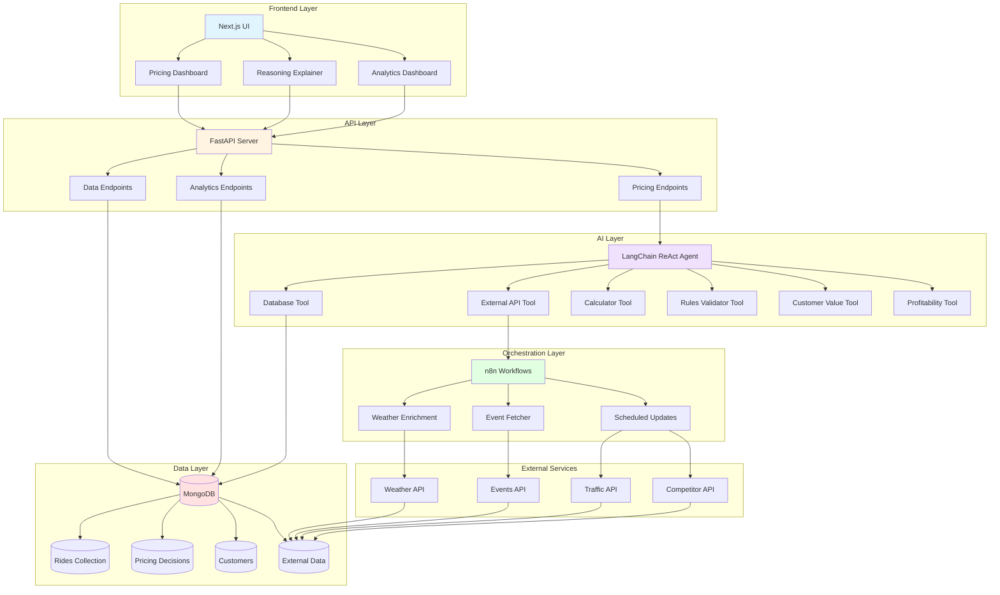
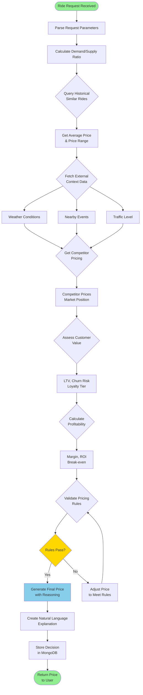
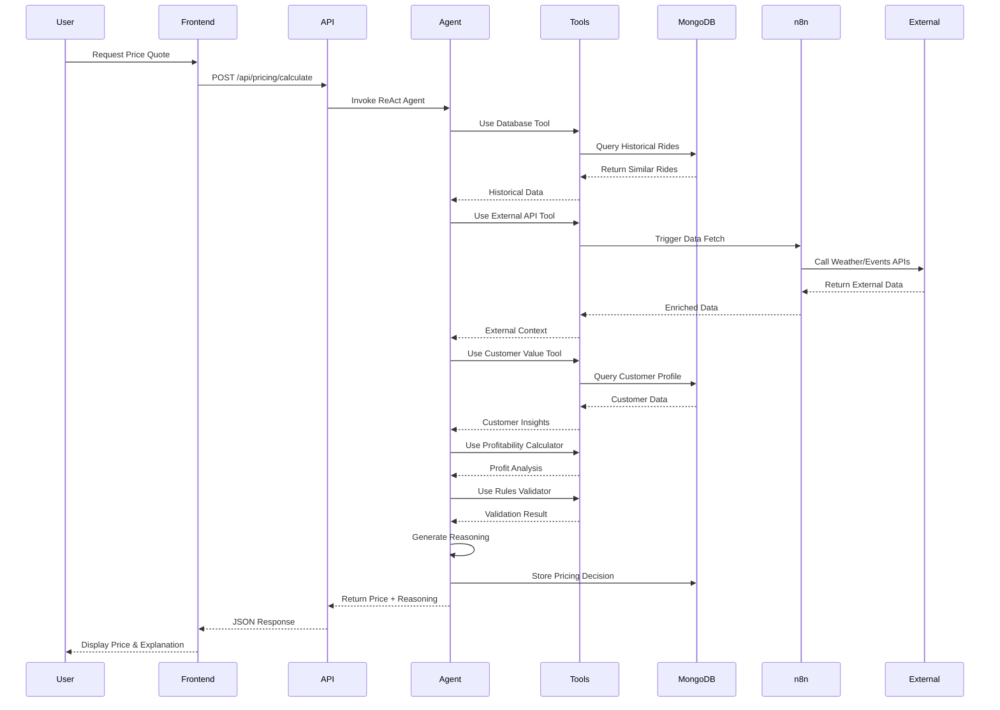
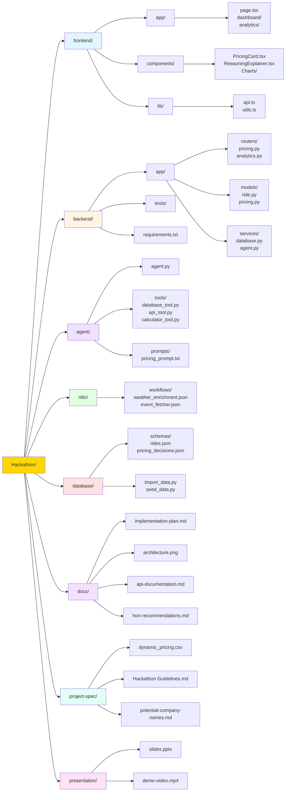
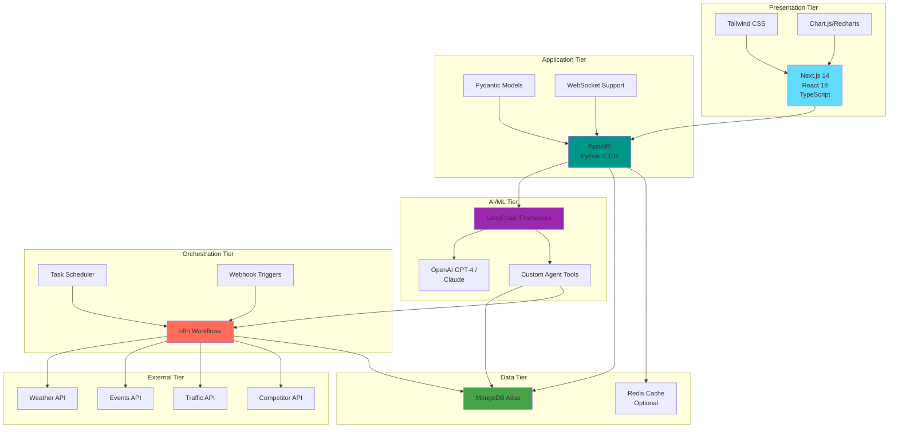
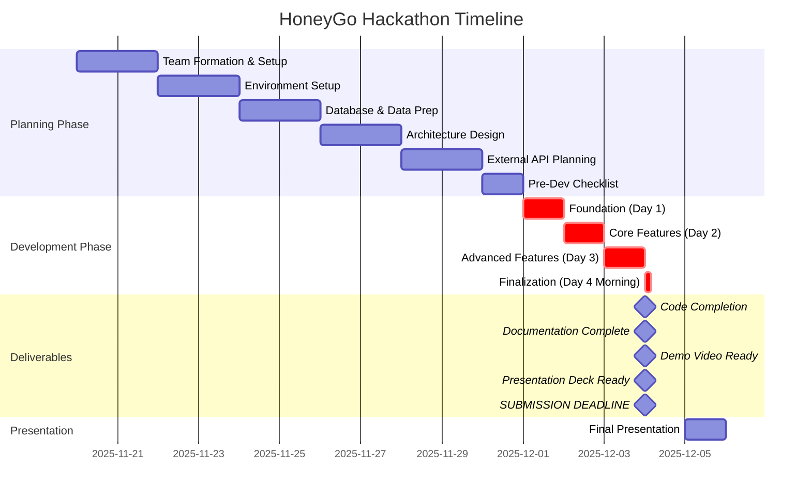

# HoneyGo Dynamic Pricing - Implementation Plan
## Team #1 Hackathon Project

---

## 1. Project Overview & Objectives

### Project Name
**HoneyGo: Intelligent Ride-Sharing Platform with Dynamic Pricing**

### Mission Statement
Develop an innovative Agentic AI solution for dynamic pricing in a ride-sharing context (HoneyGo) that demonstrates reasoning applicable to Honeywell's catalog demand pricing, supply constraints, and customer tier management.

### Core Objectives
- Build a full-stack dynamic pricing application using Next.js, FastAPI, LangChain, and n8n/MCP
- Implement Agentic AI that provides explainable, data-driven pricing decisions
- Integrate unique external data sources for competitive advantage
- Demonstrate clear applicability to Honeywell's aerospace catalog pricing challenges
- Deliver an intuitive UI that visualizes pricing logic and reasoning

### Success Metrics (Judging Criteria)
- **Creativity (40%)**: Novel agent reasoning, unique data integration, HON-relevant innovation
- **Explainability (30%)**: Clear "why" behind pricing, well-articulated architecture
- **Technical Implementation (20%)**: Full tech stack integration functioning smoothly
- **Visualization (10%)**: Intuitive UI for understanding pricing at-a-glance

---

## 2. Technical Architecture

### Technology Stack

#### Frontend Layer
- **Framework**: Next.js 14+ (App Router)
- **UI Library**: React 18+ with TypeScript
- **Styling**: Tailwind CSS for modern, responsive design
- **Visualization**: Chart.js or Recharts for pricing dashboards
- **State Management**: React Context API or Zustand

#### Backend Layer
- **API Framework**: FastAPI (Python 3.10+)
- **API Features**:
  - RESTful endpoints for pricing calculations
  - WebSocket support for real-time updates
  - Pydantic models for data validation
- **CORS**: Configured for Next.js frontend

#### AI/Agent Layer
- **Framework**: LangChain (Python)
- **LLM**: OpenAI GPT-4 or Claude (for reasoning)
- **Agent Type**: ReAct (Reasoning + Acting) agent
- **Tools**: Custom tools for:
  - Database queries
  - External API calls
  - Pricing calculations
  - Rule validation

#### Workflow Orchestration
- **Platform**: n8n (preferred) or MCP
- **Use Cases**:
  - Automated data enrichment workflows
  - Scheduled external data fetching
  - Event-driven pricing updates
  - Notification triggers

#### Database
- **Primary DB**: MongoDB
- **Collections**:
  - `rides`: Historical ride data (1000 records from dataset)
  - `pricing_decisions`: AI-generated pricing with reasoning
  - `external_data`: Weather, events, competitor data
  - `customers`: Customer profiles and loyalty tiers

#### External Data Sources (Competitive Advantage)
- **Weather API**: OpenWeatherMap or WeatherAPI (impacts demand)
- **Events API**: Ticketmaster or Eventbrite (surge pricing triggers)
- **Traffic API**: Google Maps or TomTom (affects ride duration)
- **Competitor Pricing**: Mock API or web scraping (market positioning)
- **Economic Indicators**: Gas prices, inflation data

### Architecture Diagram Components
```
┌─────────────────────────────────────────────────────────────┐
│                      User Interface (Next.js)                │
│  ┌──────────────┐  ┌──────────────┐  ┌──────────────┐      │
│  │ Pricing      │  │ Reasoning    │  │ Analytics    │      │
│  │ Dashboard    │  │ Explainer    │  │ Dashboard    │      │
│  └──────────────┘  └──────────────┘  └──────────────┘      │
└─────────────────────────────────────────────────────────────┘
                            ↕ REST/WebSocket
┌─────────────────────────────────────────────────────────────┐
│                    API Layer (FastAPI)                       │
│  ┌──────────────┐  ┌──────────────┐  ┌──────────────┐      │
│  │ Pricing      │  │ Data         │  │ Analytics    │      │
│  │ Endpoints    │  │ Endpoints    │  │ Endpoints    │      │
│  └──────────────┘  └──────────────┘  └──────────────┘      │
└─────────────────────────────────────────────────────────────┘
                            ↕
┌─────────────────────────────────────────────────────────────┐
│              Agentic AI Layer (LangChain)                    │
│  ┌──────────────────────────────────────────────────────┐   │
│  │  ReAct Agent (Reasoning + Acting)                    │   │
│  │  • Analyze demand/supply                             │   │
│  │  • Query external data                               │   │
│  │  • Apply pricing rules                               │   │
│  │  • Generate explainable decisions                    │   │
│  └──────────────────────────────────────────────────────┘   │
│  ┌──────────┐  ┌──────────┐  ┌──────────┐  ┌──────────┐   │
│  │ DB Tool  │  │ API Tool │  │ Calc Tool│  │ Rule Tool│   │
│  └──────────┘  └──────────┘  └──────────┘  └──────────┘   │
└─────────────────────────────────────────────────────────────┘
                            ↕
┌─────────────────────────────────────────────────────────────┐
│          Workflow Orchestration (n8n/MCP)                    │
│  • Data enrichment workflows                                 │
│  • Scheduled external API polling                            │
│  • Event-driven pricing triggers                             │
└─────────────────────────────────────────────────────────────┘
                            ↕
┌─────────────────────────────────────────────────────────────┐
│                    Data Layer                                │
│  ┌──────────────┐  ┌──────────────┐  ┌──────────────┐      │
│  │  MongoDB     │  │  External    │  │  Cache       │      │
│  │  (Primary)   │  │  APIs        │  │  (Redis)     │      │
│  └──────────────┘  └──────────────┘  └──────────────┘      │
└─────────────────────────────────────────────────────────────┘
```

### Architecture Diagrams (Mermaid)

#### System Architecture Flow



#### Agent Reasoning Workflow



#### Data Flow Diagram



#### Project Folder Structure



#### Technology Stack Integration



#### Development Timeline



---

## 3. Data Strategy

### MongoDB Schema Design

#### Collection: `rides`
```javascript
{
  _id: ObjectId,
  number_of_riders: Number,        // Demand level
  number_of_drivers: Number,       // Supply level
  location_category: String,       // Urban/Suburban/Rural
  customer_loyalty_status: String, // Regular/Silver/Gold
  number_of_past_rides: Number,    // Customer history
  average_ratings: Number,         // Quality metric (1-5)
  time_of_booking: String,         // Morning/Afternoon/Evening/Night
  vehicle_type: String,            // Economy/Premium
  expected_ride_duration: Number,  // Minutes
  historical_cost_of_ride: Number, // Target variable ($)
  timestamp: ISODate,              // When record was created
  enriched_data: {
    weather: Object,               // From external API
    events_nearby: Array,          // From events API
    traffic_level: String,         // From traffic API
    competitor_price: Number       // From competitor API
  }
}
```

#### Collection: `pricing_decisions`
```javascript
{
  _id: ObjectId,
  ride_id: ObjectId,               // Reference to rides collection
  calculated_price: Number,        // AI-generated price
  base_price: Number,              // Starting price
  surge_multiplier: Number,        // Dynamic multiplier
  reasoning: {
    factors_considered: Array,     // List of data points analyzed
    decision_logic: String,        // Natural language explanation
    confidence_score: Number,      // 0-1 scale
    alternative_prices: Array      // Other considered prices
  },
  agent_trace: Array,              // LangChain agent execution steps
  timestamp: ISODate,
  applied: Boolean                 // Whether price was used
}
```

#### Collection: `customers`
```javascript
{
  _id: ObjectId,
  customer_id: String,
  loyalty_status: String,          // Regular/Silver/Gold
  total_rides: Number,
  average_rating: Number,
  total_spent: Number,
  surge_protection: Boolean,       // For Gold customers
  contract_rate: Number,           // Special negotiated rate
  preferences: Object
}
```

#### Collection: `drivers`
```javascript
{
  _id: ObjectId,
  driver_id: String,
  name: String,
  status: String,                  // Active/Inactive/On-Break
  vehicle_type: String,            // Economy/Premium
  rating: Number,                  // Average driver rating (1-5)
  total_rides_completed: Number,
  total_earnings: Number,          // Lifetime earnings
  current_location: String,        // Urban/Suburban/Rural
  availability: {
    is_available: Boolean,
    last_active: ISODate
  },
  earnings_stats: {
    today: Number,
    this_week: Number,
    this_month: Number,
    average_per_ride: Number
  },
  incentives: {
    surge_bonus_earned: Number,    // Extra earnings from surge pricing
    peak_hour_bonus: Number,       // Bonus for working peak hours
    quality_bonus: Number,         // Bonus for high ratings
    retention_bonus: Number        // Loyalty bonus for active drivers
  },
  performance_metrics: {
    acceptance_rate: Number,       // % of rides accepted
    cancellation_rate: Number,     // % of rides cancelled
    on_time_rate: Number,          // % of on-time pickups
    customer_satisfaction: Number  // Average customer rating
  },
  joined_date: ISODate,
  last_ride_date: ISODate
}
```

#### Collection: `external_data`
```javascript
{
  _id: ObjectId,
  data_type: String,               // weather/events/traffic/competitor
  location: String,
  timestamp: ISODate,
  data: Object,                    // Flexible schema for various APIs
  ttl: ISODate                     // Time-to-live for cache expiry
}
```

### Data Enrichment Strategy

#### Phase 1: Load Base Dataset
- Import 1000 rows from `dynamic_pricing - dynamic_pricing.csv`
- Validate data integrity
- Create indexes on frequently queried fields

#### Phase 2: Enrich with External Data
- **Weather Data**: Fetch current/historical weather for each location
- **Event Data**: Identify major events near ride locations
- **Traffic Data**: Get traffic conditions for time of booking
- **Competitor Pricing**: Mock competitor rates for comparison

#### Phase 3: Feature Engineering
- Calculate demand/supply ratio
- Create time-based features (rush hour, weekend, holiday)
- Generate customer lifetime value scores
- Compute location-based pricing zones

### Data-to-HON Mapping

| Ride-Share Data | HON Catalog Pricing Equivalent |
|-----------------|--------------------------------|
| Number of Riders | Demand for HON catalog item |
| Number of Drivers | HON supply (supply-constrained industry) |
| **Driver Earnings & Incentives** | **Supplier/Partner compensation & retention** |
| **Driver Retention Programs** | **Channel partner loyalty programs** |
| Location Category | Geographic regions/markets |
| Customer Loyalty Status | Customer tiers based on business volume |
| Number of Past Rides | Customer buying history |
| Average Ratings | Customer relationship quality |
| Time of Booking | Order timing/urgency |
| Vehicle Type | Quality of HON item (new/overhaul/repair) |
| Expected Ride Duration | Service level/complexity |
| Historical Cost | Previous HON catalog prices |

**Key Insight:** Just as HoneyGo values driver earnings and retention, Honeywell must maintain strong relationships with channel partners (MROs, distributors) through fair pricing and incentive programs. Happy, well-compensated partners lead to better service and customer satisfaction.

---

## 4. Agentic AI Design

### Focus Area Selection

**Primary Focus: "Targeting Profitability with Driver Value"**

*Problem Statement*: Maximize single-ride profitability during high-traffic hours without losing customers, while ensuring fair driver compensation and retention. Consider competitor rates, historical route costs, booking lead time, and driver earnings optimization.

**Why This Focus?**
- Directly addresses revenue optimization (hackathon scenario)
- **Differentiator**: Emphasizes driver welfare and retention - a key competitive advantage
- Requires sophisticated multi-factor reasoning (creativity points)
- Highly explainable to non-technical audience
- Clear parallel to HON's catalog pricing AND channel partner relationships
- **Social Impact**: Demonstrates corporate values and employee-first thinking

### Agent Architecture (LangChain)

#### Agent Type: ReAct (Reasoning + Acting)

**Agent Workflow**:
1. **Observe**: Receive ride request with all parameters
2. **Reason**: Analyze multiple data sources to understand context
3. **Act**: Use tools to gather additional information
4. **Decide**: Calculate optimal price with justification
5. **Explain**: Generate natural language reasoning

#### Custom Tools for Agent

```python
# Tool 1: Database Query Tool
def query_historical_data(filters: dict) -> dict:
    """Query MongoDB for similar historical rides"""
    # Returns: Average price, price range, ride count

# Tool 2: External Data Tool
def fetch_external_context(location: str, time: str) -> dict:
    """Fetch weather, events, traffic data"""
    # Returns: Weather conditions, nearby events, traffic level

# Tool 3: Competitor Analysis Tool
def get_competitor_pricing(ride_params: dict) -> dict:
    """Get competitor prices for similar rides"""
    # Returns: Competitor prices, market position

# Tool 4: Profitability Calculator
def calculate_profitability(price: float, costs: dict) -> dict:
    """Calculate profit margin and ROI"""
    # Returns: Profit margin, break-even analysis

# Tool 5: Customer Value Tool
def assess_customer_value(customer_id: str) -> dict:
    """Evaluate customer lifetime value and churn risk"""
    # Returns: LTV, churn probability, retention strategy

# Tool 6: Pricing Rules Validator
def validate_pricing_rules(price: float, context: dict) -> dict:
    """Ensure price maintains integrity constraints"""
    # Returns: Rule compliance, violations, adjustments

# Tool 7: Driver Earnings Optimizer
def optimize_driver_earnings(ride_params: dict, available_drivers: list) -> dict:
    """Calculate fair driver compensation and match optimal driver"""
    # Inputs: Ride details, available drivers in area
    # Calculates:
    #   - Base driver payment (60-70% of ride cost)
    #   - Surge bonus for high-demand periods
    #   - Peak hour incentives
    #   - Quality bonuses for high-rated drivers
    #   - Retention bonuses for active drivers
    # Returns: Driver earnings breakdown, recommended driver match, incentive details
```

#### Reasoning Chain Example

```
User Request: Calculate price for ride
  ├─ Riders: 90, Drivers: 45, Location: Urban, Time: Night
  ├─ Customer: Silver, 13 past rides, Rating: 4.47
  └─ Vehicle: Premium, Duration: 90 min

Agent Reasoning:
1. "I need to analyze the demand/supply ratio"
   → Action: Calculate ratio = 90/45 = 2.0 (high demand)
   
2. "Let me check historical prices for similar conditions"
   → Action: query_historical_data({location: "Urban", time: "Night"})
   → Result: Average = $285, Range = $250-$320
   
3. "What external factors might affect demand?"
   → Action: fetch_external_context("Urban", "Night")
   → Result: Rain forecast, Concert nearby, Heavy traffic
   
4. "What are competitors charging?"
   → Action: get_competitor_pricing(ride_params)
   → Result: Competitor A: $295, Competitor B: $310
   
5. "What's the customer's value and price sensitivity?"
   → Action: assess_customer_value(customer_id)
   → Result: LTV = $1,200, Churn risk = Low, Silver tier
   
6. "Calculate optimal price for profitability"
   → Action: calculate_profitability($300, costs)
   → Result: Margin = 35%, ROI = High
   
7. "What about driver earnings and incentives?"
   → Action: optimize_driver_earnings(ride_params, available_drivers)
   → Result: 
      - Driver base pay: $210 (70% of $300)
      - Surge bonus: $30 (high demand period)
      - Total driver earnings: $240
      - Recommended driver: Driver #4523 (4.9 rating, active 8hrs today)
      - Driver retention: High earnings will keep drivers engaged
   
8. "Validate against pricing rules"
   → Action: validate_pricing_rules($300, context)
   → Result: ✓ Within range, ✓ Competitive, ✓ Fair to customer, ✓ Fair to driver

Final Decision: $300.00
Driver Earnings: $240.00 (80% of fare)
Platform Fee: $60.00 (20%)
Confidence: 92%

Reasoning Summary:
"Based on high demand (2:1 ratio), adverse weather conditions, 
nearby concert event, and competitive market analysis, I recommend 
a price of $300. This is 5% above historical average but 3% below 
top competitor, ensuring profitability while maintaining customer 
retention. The Silver customer's low churn risk supports this 
pricing strategy.

IMPORTANTLY: The driver will earn $240 (80% of fare) including a 
$30 surge bonus, which is above market average and helps retain 
our driver workforce. Fair driver compensation during high-demand 
periods improves driver satisfaction, reduces churn, and ensures 
reliable service availability."
```

### Explainability Mechanisms

#### 1. Natural Language Explanations
- Plain English summary of pricing decision
- Key factors highlighted in order of importance
- Comparison to alternatives

#### 2. Visual Explanations
- Factor contribution chart (bar chart showing impact)
- Price breakdown (base + surge + adjustments)
- Confidence meter

#### 3. Interactive Drill-Down
- Click on any factor to see detailed analysis
- View agent's step-by-step reasoning trace
- Compare with historical decisions

#### 4. Transparency Dashboard
- Show all data sources consulted
- Display external API responses
- Reveal pricing rules applied

---

## 5. Implementation Phases

### Timeline Overview
- **Planning Phase**: November 20 - November 30
- **Development Phase**: December 1 - December 4 (midday)
- **Presentation**: December 5

**CRITICAL DEADLINE**: All deliverables (code, documentation, demo video, presentation deck) must be completed and submitted by **midday December 4th**.

---

### Phase 1: Planning & Setup (Nov 20 - Nov 30)

#### Week 1 Goals
- ✅ Team formation and role assignment
- ✅ Technology stack setup and environment configuration
- ✅ Database design and MongoDB setup
- ✅ Data import and validation
- ✅ Architecture design finalized
- ✅ External API research and account setup

#### Detailed Tasks

**Days 1-2 (Nov 20-21): Project Kickoff**
- [ ] Team meeting: Review hackathon requirements
- [ ] Assign roles and responsibilities
- [ ] Create GitHub repository with proper structure
- [ ] Set up project management board (GitHub Projects)
- [ ] Define coding standards and Git workflow
- [ ] Create initial README.md

**Days 3-4 (Nov 22-23): Environment Setup**
- [ ] Set up development environments for all team members
- [ ] Install and configure:
  - Node.js 18+ and Next.js 14
  - Python 3.10+ and FastAPI
  - MongoDB (local or Atlas)
  - n8n (self-hosted or cloud)
- [ ] Create `.env` files with API keys (template)
- [ ] Set up Docker containers (optional but recommended)
- [ ] Test basic connectivity between components

**Days 5-6 (Nov 24-25): Database & Data Preparation**
- [ ] Design MongoDB schemas (rides, pricing_decisions, customers, external_data)
- [ ] Create database initialization scripts
- [ ] Import 1000 rows from CSV to MongoDB
- [ ] Validate data integrity and create indexes
- [ ] Write data access layer (Python/FastAPI)
- [ ] Create mock external data for testing

**Days 7-8 (Nov 26-27): Architecture & API Design**
- [ ] Finalize architecture diagram (use Lucidchart or draw.io)
- [ ] Define API endpoints and contracts
- [ ] Create API documentation (OpenAPI/Swagger)
- [ ] Design frontend component structure
- [ ] Plan LangChain agent workflow
- [ ] Document n8n workflow requirements

**Days 9-10 (Nov 28-29): External Data Integration Planning**
- [ ] Research and select external APIs:
  - Weather: OpenWeatherMap (free tier)
  - Events: Ticketmaster or mock data
  - Traffic: Google Maps or mock data
  - Competitor pricing: Mock API
- [ ] Create API accounts and get keys
- [ ] Design data enrichment workflows
- [ ] Create mock data generators for testing

**Day 11 (Nov 30): Pre-Development Checklist**
- [ ] Review all planning artifacts
- [ ] Ensure all team members have working environments
- [ ] Validate database is populated and accessible
- [ ] Confirm API keys and external services are working
- [ ] Final architecture review with trainers (Scrum validation)
- [ ] Create development task board with specific tickets

---

### Phase 2: Development (Dec 1 - Dec 4 Midday)

#### Critical Path: 4 Days to Complete All Functional Code

**Day 1 (Dec 1): Foundation**

*Morning (Backend Team)*
- [ ] Create FastAPI project structure
- [ ] Implement database connection and models
- [ ] Build basic CRUD endpoints for rides
- [ ] Set up CORS for Next.js integration
- [ ] Write unit tests for data layer

*Morning (Frontend Team)*
- [ ] Create Next.js project with TypeScript
- [ ] Set up Tailwind CSS and component library
- [ ] Build basic layout and navigation
- [ ] Create API client utilities
- [ ] Set up environment variables

*Afternoon (AI Team)*
- [ ] Set up LangChain project structure
- [ ] Implement basic ReAct agent
- [ ] Create first custom tool (database query)
- [ ] Test agent with simple prompts
- [ ] Document agent configuration

*Afternoon (Integration Team)*
- [ ] Set up n8n instance
- [ ] Create first workflow (data enrichment)
- [ ] Test MongoDB connection from n8n
- [ ] Set up webhook endpoints
- [ ] Document workflow designs

*End of Day 1 Milestone*: All components running independently

---

**Day 2 (Dec 2): Core Features**

*Morning (Backend Team)*
- [ ] Implement pricing calculation endpoint
- [ ] Integrate LangChain agent into FastAPI
- [ ] Build external data fetching endpoints
- [ ] Create WebSocket endpoint for real-time updates
- [ ] Add error handling and logging

*Morning (Frontend Team)*
- [ ] Build pricing dashboard page
- [ ] Create ride input form
- [ ] Implement API integration for pricing
- [ ] Add loading states and error handling
- [ ] Build basic charts for visualization

*Afternoon (AI Team)*
- [ ] Implement all 6 custom tools
- [ ] Enhance agent reasoning logic
- [ ] Add external API calls to tools
- [ ] Implement explainability features
- [ ] Test agent with diverse scenarios

*Afternoon (Integration Team)*
- [ ] Create weather data enrichment workflow
- [ ] Build event data fetching workflow
- [ ] Set up scheduled jobs in n8n
- [ ] Implement error notifications
- [ ] Test end-to-end data flow

*End of Day 2 Milestone*: Basic pricing functionality working end-to-end

---

**Day 3 (Dec 3): Advanced Features & Polish**

*Morning (Backend Team)*
- [ ] Optimize API performance
- [ ] Add caching layer (Redis optional)
- [ ] Implement analytics endpoints
- [ ] Build historical comparison features
- [ ] Complete API documentation

*Morning (Frontend Team)*
- [ ] Build reasoning explainer component
- [ ] Create analytics dashboard
- [ ] Add interactive visualizations
- [ ] Implement customer loyalty view
- [ ] Polish UI/UX with animations

*Afternoon (AI Team)*
- [ ] Fine-tune agent prompts for better reasoning
- [ ] Implement confidence scoring
- [ ] Add alternative pricing scenarios
- [ ] Create detailed reasoning traces
- [ ] Test edge cases and failure modes

*Afternoon (Integration Team)*
- [ ] Complete all n8n workflows
- [ ] Set up monitoring and alerts
- [ ] Create backup/recovery procedures
- [ ] Test system under load
- [ ] Document all workflows

*Evening (Full Team)*
- [ ] Integration testing across all components
- [ ] Bug fixing and issue resolution
- [ ] Performance optimization
- [ ] Security review (API keys, CORS, validation)
- [ ] Code review and refactoring

*End of Day 3 Milestone*: Feature-complete application ready for demo

---

**Day 4 (Dec 4): Finalization & Submission - DEADLINE: MIDDAY**

*Morning (6:00 AM - 9:00 AM)*

**Code Team**:
- [ ] Final bug fixes and testing
- [ ] Code cleanup and comments
- [ ] Update README with setup instructions
- [ ] Ensure all environment variables documented
- [ ] Push final code to GitHub

**Documentation Team**:
- [ ] Complete architecture diagram (export as PNG/PDF)
- [ ] Write HON application recommendations
- [ ] Create deployment guide
- [ ] Document all API endpoints
- [ ] Write testing guide

**Demo Team**:
- [ ] Record 10-minute demo video showing:
  - Application overview
  - Pricing calculation demo
  - Reasoning explanation
  - Analytics dashboard
  - HON applicability
- [ ] Edit video with captions and highlights
- [ ] Upload to YouTube/Google Drive

**Presentation Team**:
- [ ] Create presentation deck (10-15 slides):
  - Title slide with team info
  - Problem statement
  - Solution overview
  - Architecture diagram
  - Live demo (or video backup)
  - AI reasoning example
  - HON recommendations
  - Q&A preparation
- [ ] Practice presentation timing (10 min)
- [ ] Prepare Q&A responses

*Late Morning (9:00 AM - 12:00 PM)*

**Final Review**:
- [ ] Team review of all deliverables
- [ ] Test GitHub repo clone and setup
- [ ] Verify all links work in documentation
- [ ] Confirm video plays correctly
- [ ] Practice presentation one final time

**Submission (by 12:00 PM)**:
- [ ] Push all final changes to GitHub
- [ ] Tag release as `v1.0-hackathon-submission`
- [ ] Submit GitHub link to instructor
- [ ] Upload presentation deck
- [ ] Upload demo video
- [ ] Submit any required forms

**DEADLINE: MIDDAY DECEMBER 4TH** ⏰

---

### Phase 3: Presentation Day (Dec 5)

**Pre-Presentation**:
- [ ] Arrive early to test equipment
- [ ] Load presentation on venue computer
- [ ] Test internet connection for live demo
- [ ] Have video backup ready
- [ ] Review Q&A preparation

**During Presentation (15 minutes total)**:
- [ ] Introduction (1 min)
- [ ] Problem & Solution (2 min)
- [ ] Architecture Overview (2 min)
- [ ] Live Demo (4 min)
- [ ] HON Applicability (1 min)
- [ ] Q&A (5 min)

**Post-Presentation**:
- [ ] Gather feedback from judges
- [ ] Network with other teams
- [ ] Celebrate completion! 🎉

---

## 6. Team Structure & Responsibilities

### Team Size: 4-5 Members

### Role Assignments

#### Role 1: Frontend Developer (Next.js/React)
**Primary Responsibilities**:
- Build and style all UI components
- Implement responsive design
- Create data visualizations
- Integrate with backend APIs
- Ensure excellent UX

**Key Deliverables**:
- Pricing dashboard
- Reasoning explainer interface
- Analytics views
- Mobile-responsive design

**Skills Required**:
- React/Next.js expertise
- TypeScript
- Tailwind CSS
- Chart libraries
- API integration

---

#### Role 2: Backend/API Developer (FastAPI/Python)
**Primary Responsibilities**:
- Build RESTful API endpoints
- Integrate LangChain agent
- Manage database connections
- Implement business logic
- Handle error management

**Key Deliverables**:
- FastAPI application
- API documentation
- Database models
- Integration tests

**Skills Required**:
- Python expertise
- FastAPI framework
- MongoDB/PyMongo
- RESTful API design
- Testing (pytest)

---

#### Role 3: AI/ML Engineer (LangChain/Agent)
**Primary Responsibilities**:
- Design and implement LangChain agent
- Create custom tools for agent
- Develop reasoning logic
- Implement explainability features
- Optimize agent performance

**Key Deliverables**:
- ReAct agent implementation
- Custom tool library
- Reasoning engine
- Explainability module

**Skills Required**:
- LangChain framework
- LLM integration (OpenAI/Claude)
- Python programming
- AI/ML concepts
- Prompt engineering

---

#### Role 4: Data Engineer (MongoDB/n8n)
**Primary Responsibilities**:
- Design database schemas
- Import and validate data
- Build n8n workflows
- Integrate external APIs
- Manage data enrichment

**Key Deliverables**:
- MongoDB database setup
- Data import scripts
- n8n workflows
- External API integrations

**Skills Required**:
- MongoDB expertise
- n8n workflow design
- API integration
- Data modeling
- ETL processes

---

#### Role 5: Full-Stack/Integration Lead (Optional for 5-person team)
**Primary Responsibilities**:
- Coordinate between all teams
- Ensure component integration
- Manage GitHub repository
- Lead architecture decisions
- Oversee testing and deployment

**Key Deliverables**:
- Integration testing
- CI/CD setup (optional)
- Documentation coordination
- Demo preparation

**Skills Required**:
- Full-stack development
- DevOps basics
- Project management
- Technical writing
- Presentation skills

---

### Collaboration Model

**Daily Standups** (15 minutes):
- What did you complete yesterday?
- What will you work on today?
- Any blockers or dependencies?

**Pair Programming**:
- Complex features developed in pairs
- Code reviews before merging
- Knowledge sharing across roles

**Communication Channels**:
- Slack/Discord for real-time chat
- GitHub Issues for task tracking
- GitHub Projects for sprint board
- Zoom/Teams for video calls

**Git Workflow**:
- `main` branch: Production-ready code
- `develop` branch: Integration branch
- Feature branches: `feature/pricing-dashboard`
- Pull requests required for all merges
- At least 1 reviewer per PR

---

## 7. Deliverables Checklist

### Code Deliverables

- [ ] **GitHub Repository**
  - [ ] Well-organized folder structure
  - [ ] Comprehensive README.md
  - [ ] Setup and installation instructions
  - [ ] Environment variables documentation
  - [ ] Code comments and documentation
  - [ ] .gitignore configured properly
  - [ ] LICENSE file (if applicable)

- [ ] **Frontend Application (Next.js)**
  - [ ] Pricing dashboard
  - [ ] Reasoning explainer
  - [ ] Analytics views
  - [ ] Responsive design
  - [ ] Error handling
  - [ ] Loading states

- [ ] **Backend Application (FastAPI)**
  - [ ] RESTful API endpoints
  - [ ] OpenAPI/Swagger documentation
  - [ ] Database integration
  - [ ] LangChain agent integration
  - [ ] Error handling and logging
  - [ ] Unit tests

- [ ] **AI Agent (LangChain)**
  - [ ] ReAct agent implementation
  - [ ] Custom tools (6+ tools)
  - [ ] Reasoning logic
  - [ ] Explainability features
  - [ ] Configuration files

- [ ] **Workflows (n8n/MCP)**
  - [ ] Data enrichment workflows
  - [ ] External API integration
  - [ ] Scheduled jobs
  - [ ] Event triggers
  - [ ] Workflow documentation

- [ ] **Database (MongoDB)**
  - [ ] Schema definitions
  - [ ] Data import scripts
  - [ ] 1000+ records loaded
  - [ ] Indexes configured
  - [ ] Backup procedures

---

### Documentation Deliverables

- [ ] **Architecture Diagram**
  - [ ] System components clearly labeled
  - [ ] Data flow arrows
  - [ ] Technology stack indicated
  - [ ] External integrations shown
  - [ ] High-resolution export (PNG/PDF)

- [ ] **Technical Documentation**
  - [ ] API documentation (Swagger/OpenAPI)
  - [ ] Database schema documentation
  - [ ] Agent workflow documentation
  - [ ] n8n workflow documentation
  - [ ] Setup and deployment guide

- [ ] **HON Application Document**
  - [ ] Mapping ride-share to HON catalog pricing
  - [ ] Recommendations for HON implementation
  - [ ] Benefits and ROI analysis
  - [ ] Scalability considerations
  - [ ] Risk mitigation strategies

- [ ] **README.md**
  - [ ] Project overview
  - [ ] Technology stack
  - [ ] Prerequisites
  - [ ] Installation steps
  - [ ] Configuration guide
  - [ ] Running the application
  - [ ] Testing instructions
  - [ ] Team member credits

---

### Presentation Deliverables

- [ ] **Demo Video (10 minutes)**
  - [ ] Introduction (30 sec)
  - [ ] Problem statement (1 min)
  - [ ] Solution overview (1 min)
  - [ ] Live application demo (5 min)
    - [ ] Pricing calculation
    - [ ] Reasoning explanation
    - [ ] Analytics dashboard
  - [ ] HON applicability (1.5 min)
  - [ ] Conclusion (1 min)
  - [ ] Uploaded to accessible platform (YouTube/Drive)

- [ ] **Presentation Deck (10-15 slides)**
  - [ ] Title slide (Team #1, member names)
  - [ ] Agenda
  - [ ] Problem statement
  - [ ] Solution overview
  - [ ] Architecture diagram
  - [ ] Key features
  - [ ] Live demo (or video)
  - [ ] AI reasoning example
  - [ ] Creativity highlights
  - [ ] HON recommendations
  - [ ] Technical stack
  - [ ] Thank you / Q&A

- [ ] **Presentation Preparation**
  - [ ] Rehearse timing (10 min presentation)
  - [ ] Prepare Q&A responses
  - [ ] Test equipment and connectivity
  - [ ] Have backup video ready
  - [ ] Assign speaker roles

---

### Submission Checklist (Due: Midday Dec 4)

- [ ] GitHub repository link submitted
- [ ] All code pushed and tagged (`v1.0-hackathon-submission`)
- [ ] Demo video uploaded and link shared
- [ ] Presentation deck uploaded
- [ ] Architecture diagram included
- [ ] Documentation complete
- [ ] README.md finalized
- [ ] All team members credited

---

## 8. Judging Criteria Alignment

### Creativity (40%) - Maximizing Innovation

**Strategy**:
1. **Novel Agent Reasoning**
   - Implement multi-step reasoning with tool chaining
   - Use LLM to generate creative pricing strategies
   - Demonstrate adaptive learning from historical data

2. **Unique Data Sources**
   - Weather API: Correlate rain/snow with demand
   - Events API: Detect concerts, sports, conferences
   - Traffic API: Factor in congestion and delays
   - Economic indicators: Gas prices, inflation
   - Social media sentiment (optional): Twitter/Reddit for event buzz

3. **HON-Relevant Innovation**
   - Implement "surge protection" for Gold customers (like HON contract pricing)
   - Create pricing hierarchy (Premium > Economy, similar to New > Overhaul > Repair)
   - Build supply constraint modeling (like aerospace parts scarcity)
   - Demonstrate customer tier management

4. **Creative Features**
   - Predictive pricing: Forecast prices for future time slots
   - "What-if" scenarios: Let users explore pricing alternatives
   - Competitive positioning: Show where HoneyGo stands vs. competitors
   - Dynamic discounting: Loyalty rewards and retention strategies

**Deliverables for Judges**:
- Document all unique data sources used
- Highlight novel reasoning approaches in demo
- Show creative visualizations
- Explain HON parallels clearly

---

### Explainability (30%) - Making AI Transparent

**Strategy**:
1. **Natural Language Explanations**
   - Every price comes with plain English reasoning
   - Highlight top 3-5 factors influencing decision
   - Use storytelling: "Because it's raining and there's a concert nearby..."

2. **Visual Explanations**
   - Factor contribution chart (horizontal bar chart)
   - Price breakdown (base + surge + adjustments)
   - Confidence meter (0-100%)
   - Comparison with historical average

3. **Agent Trace Visibility**
   - Show LangChain agent's step-by-step reasoning
   - Display which tools were called and why
   - Reveal external data consulted
   - Show rule validation results

4. **Interactive Drill-Down**
   - Click any factor to see detailed analysis
   - Expand agent trace for technical users
   - Compare current decision with alternatives
   - Show sensitivity analysis (what if factors changed?)

**Deliverables for Judges**:
- Clear reasoning for every pricing decision
- Well-articulated architecture during demo
- Visual explanations that non-technical judges understand
- Documentation of decision-making process

---

### Technical Implementation (20%) - Demonstrating Excellence

**Strategy**:
1. **Full Stack Integration**
   - Next.js frontend ✓
   - FastAPI backend ✓
   - LangChain agent ✓
   - n8n/MCP workflows ✓
   - MongoDB database ✓

2. **Smooth Functionality**
   - No crashes or errors during demo
   - Fast response times (<2 seconds for pricing)
   - Graceful error handling
   - Real-time updates (WebSocket)

3. **Code Quality**
   - Clean, well-commented code
   - Proper error handling
   - Unit tests for critical functions
   - API documentation (Swagger)

4. **Advanced Features**
   - WebSocket for real-time updates
   - Caching for performance
   - Async operations
   - Scalable architecture

**Deliverables for Judges**:
- Live demo showing all components working
- GitHub repo with clean code
- Technical documentation
- Architecture diagram showing integration

---

### Visualization (10%) - Making Data Beautiful

**Strategy**:
1. **Intuitive Dashboard**
   - Clean, modern design (Tailwind CSS)
   - Clear visual hierarchy
   - Consistent color scheme
   - Professional typography

2. **Effective Charts**
   - Factor contribution (horizontal bar chart)
   - Price trends over time (line chart)
   - Demand/supply visualization (area chart)
   - Customer distribution (pie chart)

3. **At-a-Glance Understanding**
   - Key metrics prominently displayed
   - Color coding for status (green=good, red=alert)
   - Icons for quick recognition
   - Tooltips for additional context

4. **Responsive Design**
   - Works on desktop and mobile
   - Adaptive layouts
   - Touch-friendly interactions

**Deliverables for Judges**:
- Polished UI/UX in demo
- Screenshots in presentation
- Highlight design decisions
- Show mobile responsiveness

---

## 9. HON Application Recommendations

### How HoneyGo Solution Applies to Honeywell Aerospace Catalog Pricing

---

### 9.1 Direct Parallels

| HoneyGo Feature | HON Catalog Pricing Application |
|---------------|----------------------------------|
| **Dynamic Pricing Agent** | Automate catalog price adjustments based on market conditions |
| **Demand/Supply Analysis** | Monitor part demand vs. inventory levels (supply constraints) |
| **Customer Tier Management** | Implement tiered pricing for Commercial Airlines, BGA, MRO, Defense |
| **Pricing Hierarchy** | Maintain integrity: New Spare > UFR > Contracted Repair |
| **External Data Integration** | Factor in commodity prices, competitor pricing, economic indicators |
| **Explainable Decisions** | Provide transparent reasoning for price changes to stakeholders |
| **Real-Time Adjustments** | Respond to market shifts, supply disruptions, competitor moves |

---

### 9.2 Specific Recommendations

#### Recommendation 1: Implement Agentic AI for Catalog Price Optimization

**Current Challenge**: 
- Manual price reviews are time-consuming and inconsistent
- Difficult to consider all factors (supply, demand, competition, contracts)
- Price changes lag behind market conditions

**HoneyGo Solution Applied**:
- Deploy LangChain-based agent to analyze catalog items continuously
- Agent considers:
  - Current inventory levels (supply constraint)
  - Historical demand patterns
  - Competitor pricing (USM market)
  - Customer tier and contract obligations
  - Commodity costs (materials, labor)
  - Economic indicators
- Generate price recommendations with explainable reasoning
- Maintain pricing hierarchy automatically

**Expected Benefits**:
- 30-40% reduction in pricing review time
- More consistent pricing across catalog
- Faster response to market changes
- Improved profit margins through optimization

---

#### Recommendation 2: Customer Tier-Based Dynamic Pricing

**Current Challenge**:
- Different customer tiers (Commercial Airlines, BGA, MRO, Defense) require different pricing strategies
- Standard discounts don't account for customer lifetime value
- Risk of losing high-value customers to competitors

**HoneyGo Solution Applied**:
- Implement "surge protection" logic for Gold-tier customers (like HoneyGo loyalty)
- Analyze customer buying history and lifetime value
- Apply dynamic discounts to retain high-value relationships
- Balance profitability with customer retention

**Mapping**:
- **Gold Customers** → Major Commercial Airlines (high volume, long-term contracts)
- **Silver Customers** → MRO partners (medium volume, regular orders)
- **Regular Customers** → Smaller operators (transactional, price-sensitive)

**Expected Benefits**:
- Reduced churn among high-value customers
- Increased customer lifetime value
- Competitive advantage in customer retention
- Data-driven discount strategies

---

#### Recommendation 3: Supply Constraint Modeling

**Current Challenge**:
- Aerospace is a supply-constrained industry
- Part availability varies (new spares vs. USM vs. R&O)
- Pricing doesn't always reflect scarcity

**HoneyGo Solution Applied**:
- Model supply constraints like driver availability in HoneyGo
- Implement dynamic pricing based on inventory levels:
  - High inventory → Competitive pricing
  - Low inventory → Premium pricing (but within acceptable range)
  - Critical shortage → Prioritize high-value customers
- Factor in lead times for manufacturing/repair

**Pricing Hierarchy Maintenance**:
```
New Spare (highest price, immediate availability)
  ↓
UFR (Universal Flat Rate - overhaul, moderate price)
  ↓
SPEX (Spares Exchange - repair, lower price)
  ↓
USM (Used Serviceable Material - lowest price)
```

**Expected Benefits**:
- Optimized inventory turnover
- Better allocation of scarce resources
- Maintained pricing integrity
- Improved profitability on constrained items

---

#### Recommendation 4: External Data Integration for Market Intelligence

**Current Challenge**:
- Limited visibility into competitor pricing (especially USM market)
- Economic factors (commodity prices, inflation) not systematically considered
- Reactive rather than proactive pricing

**HoneyGo Solution Applied**:
- Integrate external data sources (like HoneyGo's weather/events APIs):
  - **Commodity Prices**: Aluminum, titanium, electronics components
  - **Competitor Pricing**: USM market monitoring, competitor catalogs
  - **Economic Indicators**: Inflation, currency exchange rates
  - **Industry Trends**: Aircraft production rates, fleet utilization
  - **Regulatory Changes**: FAA/EASA requirements affecting demand
- Use n8n workflows to automate data collection
- Feed data into pricing agent for holistic analysis

**Expected Benefits**:
- Proactive pricing adjustments
- Competitive market positioning
- Reduced risk of being undercut
- Better forecasting accuracy

---

#### Recommendation 5: Explainable Pricing for Stakeholder Buy-In

**Current Challenge**:
- Pricing decisions often opaque to sales teams and customers
- Difficult to justify price increases
- Internal stakeholders (finance, sales, operations) need transparency

**HoneyGo Solution Applied**:
- Every price recommendation comes with natural language explanation
- Visual dashboards showing factor contributions
- Transparent reasoning accessible to non-technical users
- Audit trail for compliance and review

**Example Explanation**:
```
"The price for Part #12345 is recommended at $1,250 because:
1. Inventory is low (15 units, below threshold of 50)
2. Demand has increased 25% in the past 30 days
3. Competitor USM pricing is $1,180 (we're 6% premium)
4. Material costs increased 8% this quarter
5. Customer is Gold-tier (applied 5% loyalty discount)

This price maintains our New Spare > UFR hierarchy and 
maximizes profitability while retaining customer loyalty."
```

**Expected Benefits**:
- Faster internal approval of price changes
- Better communication with customers
- Increased trust in pricing system
- Compliance and auditability

---

#### Recommendation 6: Channel Partner & Supplier Retention Programs

**Current Challenge**:
- MRO partners and distributors are critical to HON's supply chain
- Partner churn leads to service disruptions and lost revenue
- Difficult to balance profitability with partner satisfaction
- Lack of systematic incentive programs for high-performing partners

**HoneyGo Solution Applied (Driver Retention Model)**:
- **Driver Earnings Optimization**: HoneyGo ensures drivers earn 70-80% of ride fares
- **Surge Bonuses**: Extra compensation during high-demand periods
- **Performance Incentives**: Bonuses for high ratings, reliability, and activity
- **Retention Programs**: Loyalty bonuses for consistent availability
- **Analytics Dashboard**: Track driver satisfaction, earnings, and retention metrics

**Applied to HON Channel Partners**:

```
Partner Compensation Model:
1. Base Margin: Fair profit margins on parts sales (similar to driver base pay)
2. Volume Bonuses: Incentives for high-volume partners (like surge bonuses)
3. Quality Bonuses: Rewards for fast turnaround, low defect rates (like driver ratings)
4. Retention Programs: Loyalty bonuses for long-term partnerships
5. Performance Dashboard: Real-time visibility into partner earnings and metrics
```

**Example Partner Incentive Structure**:
```
MRO Partner: "AeroTech Services"
- Base Margin on Parts: 25%
- Volume Bonus (>$1M/quarter): +3%
- Quality Bonus (98% on-time, <1% defects): +2%
- Retention Bonus (5+ years): +2%
- Total Effective Margin: 32%

This transparent, performance-based model:
✓ Ensures fair partner compensation
✓ Incentivizes quality and reliability
✓ Reduces partner churn
✓ Improves supply chain stability
```

**Expected Benefits**:
- 20-30% reduction in partner churn
- Improved partner satisfaction and loyalty
- More reliable supply chain
- Better service levels to end customers
- Competitive advantage in partner relationships
- Demonstrates HON values frontline partners (like HoneyGo values drivers)

**Social Impact & Corporate Values**:
- Shows HON values its entire ecosystem, not just end customers
- Builds reputation as a fair, partner-friendly company
- Attracts top-tier MRO partners and distributors
- Aligns with modern ESG (Environmental, Social, Governance) expectations
- **"A company that values its partners is a company worth partnering with"**

---

### 9.3 Implementation Roadmap for HON

#### Phase 1: Pilot Program (3-6 months)
- Select 100-200 high-volume catalog items
- Implement basic agent with limited data sources
- Run in parallel with current pricing process
- Measure accuracy and performance

#### Phase 2: Expansion (6-12 months)
- Scale to 1,000+ catalog items
- Integrate more external data sources
- Add customer tier logic
- Train sales teams on new system

#### Phase 3: Full Deployment (12-18 months)
- Cover entire catalog (10,000+ items)
- Automate price updates (with human oversight)
- Integrate with ERP and CRM systems
- Continuous improvement based on feedback

---

### 9.4 Risk Mitigation

**Risk 1: Pricing Errors**
- **Mitigation**: Human approval required for changes >10%
- **Mitigation**: Pricing rules validator prevents violations
- **Mitigation**: Gradual rollout with monitoring

**Risk 2: Customer Pushback**
- **Mitigation**: Explainable reasoning for price changes
- **Mitigation**: Grandfather clauses for existing contracts
- **Mitigation**: Loyalty protection for high-value customers

**Risk 3: Technical Complexity**
- **Mitigation**: Start with pilot program
- **Mitigation**: Comprehensive training for users
- **Mitigation**: Dedicated support team

**Risk 4: Data Quality**
- **Mitigation**: Data validation and cleansing processes
- **Mitigation**: Multiple data sources for verification
- **Mitigation**: Regular audits and updates

---

### 9.5 Expected ROI

**Revenue Impact**:
- 5-10% increase in profit margins through optimization
- Reduced revenue leakage from outdated pricing
- Improved win rates against competitors

**Cost Savings**:
- 30-40% reduction in pricing analyst time
- Faster time-to-market for new products
- Reduced errors and rework

**Strategic Benefits**:
- Competitive advantage through AI-driven pricing
- Better customer relationships through transparency
- Data-driven decision making culture
- Scalable pricing operations

**Estimated Annual Value**: $5-10M for a $500M catalog business

---

## 10. Risk Management

### Technical Risks

| Risk | Probability | Impact | Mitigation |
|------|-------------|--------|------------|
| LLM API downtime | Medium | High | Cache responses, implement fallback logic |
| MongoDB connection issues | Low | High | Use connection pooling, implement retries |
| External API rate limits | Medium | Medium | Cache data, use multiple providers |
| n8n workflow failures | Low | Medium | Implement error notifications, manual fallback |
| Frontend-backend integration issues | Medium | High | Early integration testing, mock APIs |
| Performance bottlenecks | Medium | Medium | Load testing, caching, optimization |

### Project Risks

| Risk | Probability | Impact | Mitigation |
|------|-------------|--------|------------|
| Team member unavailability | Medium | High | Cross-training, documentation, backup roles |
| Scope creep | High | Medium | Strict feature prioritization, MVP focus |
| Missed deadline | Low | Critical | Daily standups, progress tracking, buffer time |
| Technical skill gaps | Medium | Medium | Pair programming, trainer consultation |
| Integration delays | Medium | High | Parallel development, early testing |
| Demo failures | Low | Critical | Rehearsals, backup video, tested equipment |

### Mitigation Strategies

1. **Daily Standups**: Identify blockers early
2. **Incremental Integration**: Test components together frequently
3. **Backup Plans**: Video demo if live demo fails
4. **Code Reviews**: Catch issues before they become problems
5. **Documentation**: Ensure knowledge transfer
6. **Trainer Consultation**: Validate approach early (Scrum Master role)

---

## 11. Success Metrics

### Development Metrics
- [ ] All required technologies integrated (Next.js, FastAPI, LangChain, n8n, MongoDB)
- [ ] 100% of planned features implemented
- [ ] <5 critical bugs at submission
- [ ] API response time <2 seconds
- [ ] 90%+ test coverage for critical paths

### Judging Metrics (Target Scores)
- **Creativity (40%)**: Target 35/40 points
  - Novel agent reasoning ✓
  - Unique data sources (3+) ✓
  - HON-relevant innovation ✓
  
- **Explainability (30%)**: Target 27/30 points
  - Clear natural language explanations ✓
  - Visual reasoning displays ✓
  - Well-articulated architecture ✓
  
- **Technical Implementation (20%)**: Target 18/20 points
  - Full stack functioning smoothly ✓
  - Clean code and documentation ✓
  
- **Visualization (10%)**: Target 9/10 points
  - Intuitive UI ✓
  - Effective charts ✓

**Target Total**: 89/100 points (A grade)

### Team Metrics
- 100% team member participation
- All deliverables submitted on time
- Positive feedback from trainers
- Successful presentation delivery

---

## 12. Resources & References

### Documentation
- [Next.js Documentation](https://nextjs.org/docs)
- [FastAPI Documentation](https://fastapi.tiangolo.com/)
- [LangChain Documentation](https://python.langchain.com/docs/get_started/introduction)
- [n8n Documentation](https://docs.n8n.io/)
- [MongoDB Documentation](https://www.mongodb.com/docs/)

### Tutorials
- [Building AI Agents with LangChain](https://python.langchain.com/docs/modules/agents/)
- [FastAPI + MongoDB Tutorial](https://www.mongodb.com/languages/python/pymongo-tutorial)
- [Next.js + FastAPI Integration](https://vercel.com/guides/using-express-with-vercel)
- [n8n Workflow Examples](https://n8n.io/workflows/)

### External APIs
- [OpenWeatherMap API](https://openweathermap.org/api)
- [Ticketmaster API](https://developer.ticketmaster.com/)
- [Google Maps API](https://developers.google.com/maps)
- [OpenAI API](https://platform.openai.com/docs)

### Tools
- [Lucidchart](https://www.lucidchart.com/) - Architecture diagrams
- [Postman](https://www.postman.com/) - API testing
- [MongoDB Compass](https://www.mongodb.com/products/compass) - Database GUI
- [VS Code](https://code.visualstudio.com/) - Code editor

### Dataset
- Original: `project-spec/dynamic_pricing - dynamic_pricing.csv`
- 1,000 rows of ride-sharing data
- 10 columns (riders, drivers, location, loyalty, etc.)

---

## 13. Appendix

### A. Project Folder Structure

```
Hackathon/
├── frontend/                    # Next.js application
│   ├── app/
│   │   ├── page.tsx            # Home page
│   │   ├── dashboard/          # Pricing dashboard
│   │   ├── analytics/          # Analytics views
│   │   └── layout.tsx          # Root layout
│   ├── components/
│   │   ├── PricingCard.tsx
│   │   ├── ReasoningExplainer.tsx
│   │   ├── Charts/
│   │   └── ...
│   ├── lib/
│   │   ├── api.ts              # API client
│   │   └── utils.ts
│   ├── public/
│   ├── package.json
│   └── next.config.js
│
├── backend/                     # FastAPI application
│   ├── app/
│   │   ├── main.py             # FastAPI app
│   │   ├── routers/
│   │   │   ├── pricing.py
│   │   │   ├── analytics.py
│   │   │   └── data.py
│   │   ├── models/
│   │   │   ├── ride.py
│   │   │   ├── pricing.py
│   │   │   └── customer.py
│   │   ├── services/
│   │   │   ├── database.py
│   │   │   ├── agent.py
│   │   │   └── external_api.py
│   │   └── utils/
│   ├── tests/
│   ├── requirements.txt
│   └── .env.example
│
├── agent/                       # LangChain agent
│   ├── agent.py                # Main agent logic
│   ├── tools/
│   │   ├── database_tool.py
│   │   ├── external_api_tool.py
│   │   ├── calculator_tool.py
│   │   └── rules_tool.py
│   ├── prompts/
│   │   └── pricing_prompt.txt
│   └── config.py
│
├── n8n/                        # n8n workflows
│   ├── workflows/
│   │   ├── weather_enrichment.json
│   │   ├── event_fetcher.json
│   │   └── scheduled_updates.json
│   └── README.md
│
├── database/                    # Database scripts
│   ├── schemas/
│   │   ├── rides.json
│   │   ├── pricing_decisions.json
│   │   └── customers.json
│   ├── import_data.py
│   ├── seed_data.py
│   └── indexes.js
│
├── docs/                        # Documentation
│   ├── implementation-plan.md   # This document
│   ├── architecture.png
│   ├── api-documentation.md
│   ├── hon-recommendations.md
│   └── setup-guide.md
│
├── project-spec/                # Hackathon specifications
│   ├── dynamic_pricing - dynamic_pricing.csv
│   ├── Hackathon Documented Guidelines.md
│   ├── HON dynamic pricing hackathon.txt
│   └── potential-company-names.md
│
├── presentation/                # Presentation materials
│   ├── slides.pptx
│   ├── demo-video.mp4
│   └── script.md
│
├── .gitignore
├── README.md
└── docker-compose.yml          # Optional: Docker setup
```

---

### B. Environment Variables Template

**Frontend (.env.local)**:
```bash
NEXT_PUBLIC_API_URL=http://localhost:8000
NEXT_PUBLIC_APP_NAME=HoneyGo
```

**Backend (.env)**:
```bash
# MongoDB
MONGODB_URL=mongodb://localhost:27017
MONGODB_DB_NAME=HoneyGo_pricing

# OpenAI
OPENAI_API_KEY=sk-...

# External APIs
WEATHER_API_KEY=...
EVENTS_API_KEY=...
TRAFFIC_API_KEY=...

# Application
DEBUG=True
LOG_LEVEL=INFO
```

**Agent (.env)**:
```bash
OPENAI_API_KEY=sk-...
LANGCHAIN_TRACING_V2=true
LANGCHAIN_API_KEY=...
```

---

### C. Git Commit Message Convention

```
feat: Add pricing dashboard component
fix: Resolve MongoDB connection timeout
docs: Update API documentation
test: Add unit tests for agent tools
refactor: Optimize database queries
style: Format code with Black
chore: Update dependencies
```

---

### D. Testing Checklist

**Frontend Testing**:
- [ ] All pages load without errors
- [ ] Forms validate input correctly
- [ ] API calls handle errors gracefully
- [ ] Charts render with real data
- [ ] Responsive design works on mobile
- [ ] Loading states display properly

**Backend Testing**:
- [ ] All endpoints return correct status codes
- [ ] Database queries execute successfully
- [ ] Agent integration works end-to-end
- [ ] Error handling catches exceptions
- [ ] API documentation is accurate
- [ ] Performance meets <2s requirement

**Integration Testing**:
- [ ] Frontend can call all backend endpoints
- [ ] Agent receives and processes requests
- [ ] n8n workflows trigger correctly
- [ ] External APIs respond as expected
- [ ] Database updates persist correctly
- [ ] WebSocket connections stable

**Demo Testing**:
- [ ] Live demo runs without errors
- [ ] All features demonstrated
- [ ] Backup video plays correctly
- [ ] Presentation timing is accurate
- [ ] Equipment and connectivity tested

---

### E. Q&A Preparation

**Expected Questions**:

1. **"How does your agent handle unexpected data?"**
   - Answer: Robust error handling, fallback logic, validation rules

2. **"What if the LLM API goes down during production?"**
   - Answer: Cached responses, rule-based fallback, graceful degradation

3. **"How scalable is this solution?"**
   - Answer: Horizontal scaling, caching, async operations, load balancing

4. **"How do you prevent the agent from making unfair pricing decisions?"**
   - Answer: Pricing rules validator, human oversight, fairness constraints

5. **"What data privacy concerns exist?"**
   - Answer: No PII in prompts, encrypted connections, compliance with regulations

6. **"How would this work with HON's existing systems?"**
   - Answer: API integration, gradual rollout, ERP/CRM connectivity

7. **"What's the ROI timeline for HON?"**
   - Answer: Pilot in 3-6 months, measurable impact in 6-12 months

8. **"How do you validate the agent's pricing recommendations?"**
   - Answer: A/B testing, historical comparison, business rule validation

---

## 14. Conclusion

This implementation plan provides a comprehensive roadmap for Team #1 to successfully complete the HoneyGo Dynamic Pricing Hackathon project. By following this structured approach, the team will:

✅ Deliver a fully functional, innovative solution
✅ Demonstrate clear applicability to Honeywell's business needs
✅ Meet all technical requirements (Next.js, FastAPI, LangChain, n8n, MongoDB)
✅ Provide explainable, transparent AI reasoning
✅ Create compelling visualizations and user experience
✅ Submit all deliverables by midday December 4th
✅ Present confidently on December 5th

**Key Success Factors**:
1. **Early Planning**: Use Nov 20-30 to set solid foundations
2. **Disciplined Development**: Focus on MVP, avoid scope creep
3. **Continuous Integration**: Test components together frequently
4. **Clear Communication**: Daily standups, transparent blockers
5. **Trainer Engagement**: Validate approach early with Scrum Masters
6. **Time Management**: Respect the midday Dec 4 deadline

**Team Motto**: *"Innovate with Intelligence, Execute with Excellence"*

---

**Document Version**: 1.0  
**Last Updated**: November 26, 2025  
**Team**: #1 (4-5 members)  
**Project**: HoneyGo Dynamic Pricing Hackathon  
**Deadline**: Midday December 4, 2025  
**Presentation**: December 5, 2025

---

*Good luck, Team #1! Let's build something amazing! 🚀*

