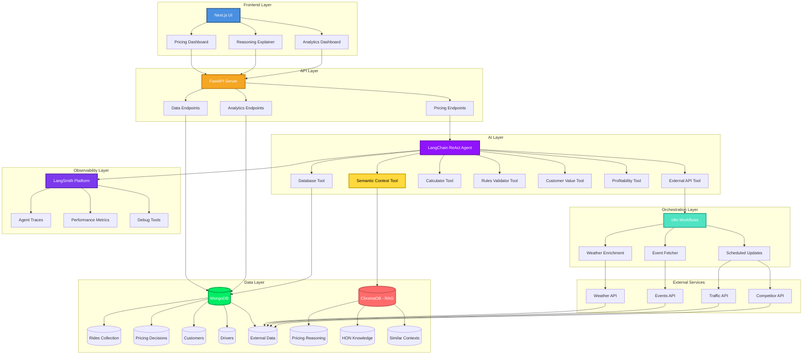
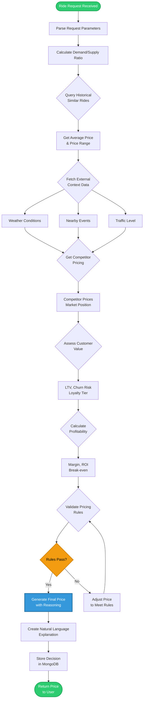
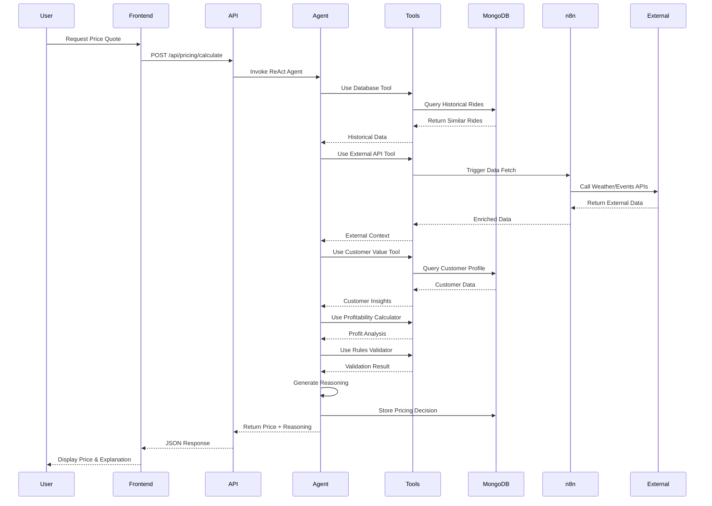
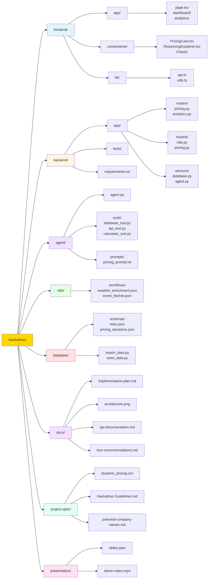
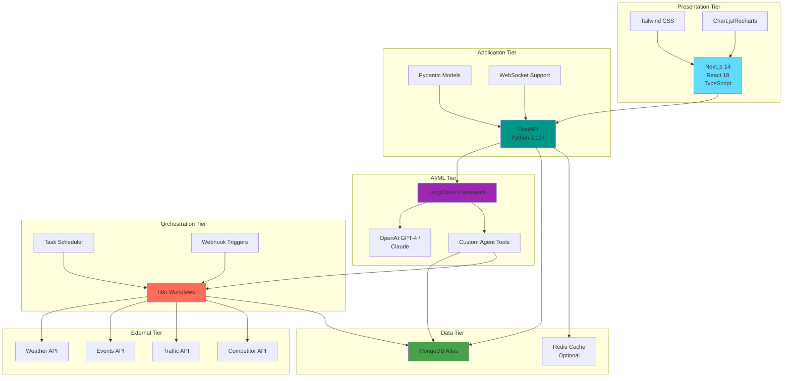
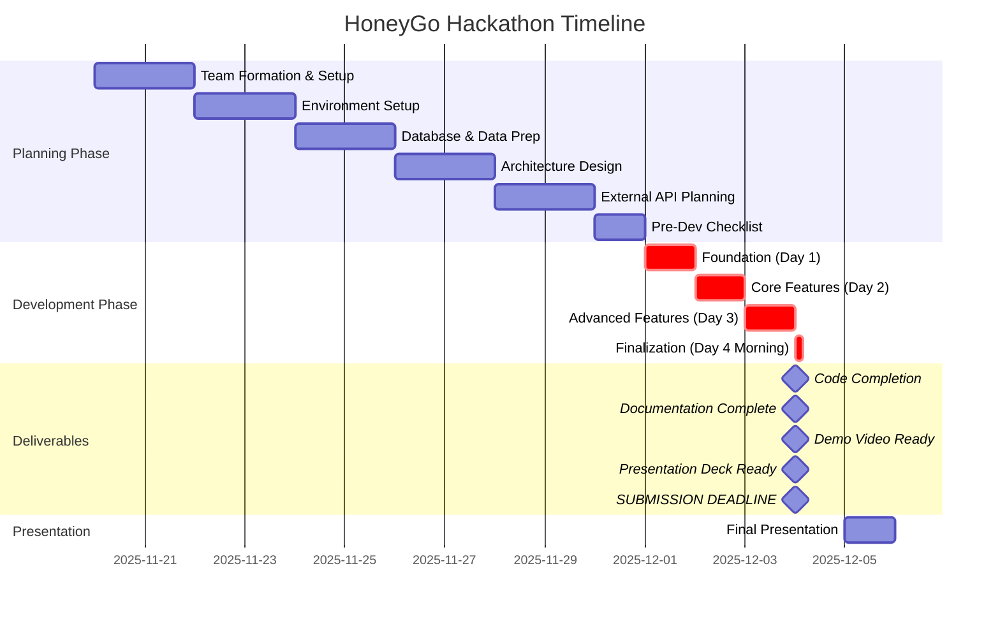
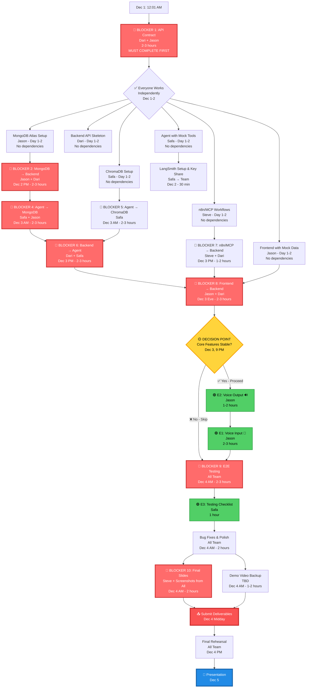

# HoneyGo Dynamic Pricing - Implementation Plan
## Team #1 Hackathon Project

---

## 1. Project Overview & Objectives

### Project Name
**HoneyGo: Intelligent Ride-Sharing Platform with Dynamic Pricing**

### Mission Statement
Develop an innovative Agentic AI solution for dynamic pricing in a ride-sharing context (HoneyGo) that demonstrates reasoning applicable to Honeywell's catalog demand pricing, supply constraints, and customer tier management.

### Core Objectives
- Build a full-stack dynamic pricing application using Next.js, FastAPI, LangChain, and n8n/MCP
- Implement Agentic AI that provides explainable, data-driven pricing decisions
- Integrate unique external data sources for competitive advantage
- Demonstrate clear applicability to Honeywell's aerospace catalog pricing challenges
- Deliver an intuitive UI that visualizes pricing logic and reasoning

### Success Metrics (Judging Criteria)
- **Creativity (40%)**: Novel agent reasoning, unique data integration, HON-relevant innovation
- **Explainability (30%)**: Clear "why" behind pricing, well-articulated architecture
- **Technical Implementation (20%)**: Full tech stack integration functioning smoothly
- **Visualization (10%)**: Intuitive UI for understanding pricing at-a-glance

---

## 2. Technical Architecture

### Technology Stack

#### Frontend Layer
- **Framework**: Next.js 14+ (App Router)
- **UI Library**: React 18+ with TypeScript
- **Styling**: Tailwind CSS for modern, responsive design
- **Visualization**: Chart.js or Recharts for pricing dashboards
- **State Management**: React Context API or Zustand

#### Backend Layer
- **API Framework**: FastAPI (Python 3.10+)
- **API Features**:
  - RESTful endpoints for pricing calculations
  - WebSocket support for real-time updates
  - Pydantic models for data validation
- **CORS**: Configured for Next.js frontend

#### AI/Agent Layer
- **Framework**: LangChain (Python)
- **LLM**: OpenAI GPT-4 or Claude (for reasoning)
- **Agent Type**: ReAct (Reasoning + Acting) agent
- **Tools**: Custom tools for:
  - Database queries
  - External API calls
  - Pricing calculations
  - Rule validation

#### Workflow Orchestration
- **Platform**: n8n (preferred) or MCP
- **Use Cases**:
  - Automated data enrichment workflows
  - Scheduled external data fetching
  - Event-driven pricing updates
  - Notification triggers

#### Database Layer
- **Structured Data**: MongoDB
  - **Collections**:
    - `rides`: Historical ride data (1000 records from dataset)
    - `pricing_decisions`: AI-generated pricing with reasoning
    - `drivers`: Driver profiles, earnings, and performance metrics
    - `customers`: Customer profiles and loyalty tiers
    - `external_data`: Weather, events, competitor data

- **Vector Database**: ChromaDB (RAG Enhancement)
  - **Collections**:
    - `pricing_reasoning`: Embeddings of historical pricing decisions and reasoning
    - `hon_knowledge`: Honeywell domain knowledge and best practices
    - `similar_contexts`: Semantic search for contextually similar situations
  - **Purpose**: Enable RAG (Retrieval Augmented Generation) for intelligent agent reasoning
  - **Embeddings Model**: sentence-transformers (all-MiniLM-L6-v2)
  - **Benefit**: Agent finds semantically similar contexts beyond exact matches

#### Observability & Monitoring Layer
- **LangSmith**: AI Agent Observability Platform
  - **Purpose**: Track, debug, and monitor LangChain agent decisions in real-time
  - **Capabilities**:
    - Visual traces of every agent reasoning step
    - Performance metrics (timing, token usage, costs)
    - Debugging tools for agent failures
    - Production monitoring and audit trails
  - **Integration**: Non-invasive callbacks to LangChain agent
  - **Benefit**: Provides explainability and transparency for judges and Honeywell stakeholders
  - **Cost**: Free tier (5,000 traces/month)
  - **Demo Value**: Shows judges HOW the agent thinks, not just the final output

#### External Data Sources (Competitive Advantage)
- **Weather API**: OpenWeatherMap or WeatherAPI (impacts demand)
- **Events API**: Ticketmaster or Eventbrite (surge pricing triggers)
- **Traffic API**: Google Maps or TomTom (affects ride duration)
- **Competitor Pricing**: Mock API or web scraping (market positioning)
- **Economic Indicators**: Gas prices, inflation data

### Architecture Diagram Components
```
┌─────────────────────────────────────────────────────────────┐
│                      User Interface (Next.js)                │
│  ┌──────────────┐  ┌──────────────┐  ┌──────────────┐      │
│  │ Pricing      │  │ Reasoning    │  │ Analytics    │      │
│  │ Dashboard    │  │ Explainer    │  │ Dashboard    │      │
│  └──────────────┘  └──────────────┘  └──────────────┘      │
└─────────────────────────────────────────────────────────────┘
                            ↕ REST/WebSocket
┌─────────────────────────────────────────────────────────────┐
│                    API Layer (FastAPI)                       │
│  ┌──────────────┐  ┌──────────────┐  ┌──────────────┐      │
│  │ Pricing      │  │ Data         │  │ Analytics    │      │
│  │ Endpoints    │  │ Endpoints    │  │ Endpoints    │      │
│  └──────────────┘  └──────────────┘  └──────────────┘      │
└─────────────────────────────────────────────────────────────┘
                            ↕
┌─────────────────────────────────────────────────────────────┐
│              Agentic AI Layer (LangChain)                    │
│  ┌──────────────────────────────────────────────────────┐   │
│  │  ReAct Agent (Reasoning + Acting)                    │   │
│  │  • Analyze demand/supply                             │   │
│  │  • Query external data                               │   │
│  │  • Apply pricing rules                               │   │
│  │  • Generate explainable decisions                    │   │
│  └──────────────────────────────────────────────────────┘   │
│  ┌──────────┐  ┌──────────┐  ┌──────────┐  ┌──────────┐   │
│  │ DB Tool  │  │ API Tool │  │ Calc Tool│  │ Rule Tool│   │
│  └──────────┘  └──────────┘  └──────────┘  └──────────┘   │
└─────────────────────────────────────────────────────────────┘
                            ↕
┌─────────────────────────────────────────────────────────────┐
│          Workflow Orchestration (n8n/MCP)                    │
│  • Data enrichment workflows                                 │
│  • Scheduled external API polling                            │
│  • Event-driven pricing triggers                             │
└─────────────────────────────────────────────────────────────┘
                            ↕
┌─────────────────────────────────────────────────────────────┐
│                    Data Layer                                │
│  ┌──────────────┐  ┌──────────────┐  ┌──────────────┐      │
│  │  MongoDB     │  │  External    │  │  Cache       │      │
│  │  (Primary)   │  │  APIs        │  │  (Redis)     │      │
│  └──────────────┘  └──────────────┘  └──────────────┘      │
└─────────────────────────────────────────────────────────────┘
```

### Architecture Diagrams (Mermaid)

#### System Architecture Flow



#### Agent Reasoning Workflow



#### Data Flow Diagram



#### Project Folder Structure



#### Technology Stack Integration



#### Development Timeline



---

## 3. Data Strategy

### MongoDB Schema Design

#### Collection: `rides`
```javascript
{
  _id: ObjectId,
  number_of_riders: Number,        // Demand level
  number_of_drivers: Number,       // Supply level
  location_category: String,       // Urban/Suburban/Rural
  customer_loyalty_status: String, // Regular/Silver/Gold
  number_of_past_rides: Number,    // Customer history
  average_ratings: Number,         // Quality metric (1-5)
  time_of_booking: String,         // Morning/Afternoon/Evening/Night
  vehicle_type: String,            // Economy/Premium
  expected_ride_duration: Number,  // Minutes
  historical_cost_of_ride: Number, // Target variable ($)
  timestamp: ISODate,              // When record was created
  enriched_data: {
    weather: Object,               // From external API
    events_nearby: Array,          // From events API
    traffic_level: String,         // From traffic API
    competitor_price: Number       // From competitor API
  }
}
```

#### Collection: `pricing_decisions`
```javascript
{
  _id: ObjectId,
  ride_id: ObjectId,               // Reference to rides collection
  calculated_price: Number,        // AI-generated price
  base_price: Number,              // Starting price
  surge_multiplier: Number,        // Dynamic multiplier
  reasoning: {
    factors_considered: Array,     // List of data points analyzed
    decision_logic: String,        // Natural language explanation
    confidence_score: Number,      // 0-1 scale
    alternative_prices: Array      // Other considered prices
  },
  agent_trace: Array,              // LangChain agent execution steps
  timestamp: ISODate,
  applied: Boolean                 // Whether price was used
}
```

#### Collection: `customers`
```javascript
{
  _id: ObjectId,
  customer_id: String,
  loyalty_status: String,          // Regular/Silver/Gold
  total_rides: Number,
  average_rating: Number,
  total_spent: Number,
  surge_protection: Boolean,       // For Gold customers
  contract_rate: Number,           // Special negotiated rate
  preferences: Object
}
```

#### Collection: `drivers`
```javascript
{
  _id: ObjectId,
  driver_id: String,
  name: String,
  status: String,                  // Active/Inactive/On-Break
  vehicle_type: String,            // Economy/Premium
  rating: Number,                  // Average driver rating (1-5)
  total_rides_completed: Number,
  total_earnings: Number,          // Lifetime earnings
  current_location: String,        // Urban/Suburban/Rural
  availability: {
    is_available: Boolean,
    last_active: ISODate
  },
  earnings_stats: {
    today: Number,
    this_week: Number,
    this_month: Number,
    average_per_ride: Number
  },
  incentives: {
    surge_bonus_earned: Number,    // Extra earnings from surge pricing
    peak_hour_bonus: Number,       // Bonus for working peak hours
    quality_bonus: Number,         // Bonus for high ratings
    retention_bonus: Number        // Loyalty bonus for active drivers
  },
  performance_metrics: {
    acceptance_rate: Number,       // % of rides accepted
    cancellation_rate: Number,     // % of rides cancelled
    on_time_rate: Number,          // % of on-time pickups
    customer_satisfaction: Number  // Average customer rating
  },
  joined_date: ISODate,
  last_ride_date: ISODate
}
```

#### Collection: `external_data`
```javascript
{
  _id: ObjectId,
  data_type: String,               // weather/events/traffic/competitor
  location: String,
  timestamp: ISODate,
  data: Object,                    // Flexible schema for various APIs
  ttl: ISODate                     // Time-to-live for cache expiry
}
```

### Data Enrichment Strategy

#### Phase 1: Load Base Dataset
- Import 1000 rows from `dynamic_pricing - dynamic_pricing.csv`
- Validate data integrity
- Create indexes on frequently queried fields

#### Phase 2: Enrich with External Data
- **Weather Data**: Fetch current/historical weather for each location
- **Event Data**: Identify major events near ride locations
- **Traffic Data**: Get traffic conditions for time of booking
- **Competitor Pricing**: Mock competitor rates for comparison

#### Phase 3: Feature Engineering
- Calculate demand/supply ratio
- Create time-based features (rush hour, weekend, holiday)
- Generate customer lifetime value scores
- Compute location-based pricing zones

### Data-to-HON Mapping

| Ride-Share Data | HON Catalog Pricing Equivalent |
|-----------------|--------------------------------|
| Number of Riders | Demand for HON catalog item |
| Number of Drivers | HON supply (supply-constrained industry) |
| **Driver Earnings & Incentives** | **Supplier/Partner compensation & retention** |
| **Driver Retention Programs** | **Channel partner loyalty programs** |
| Location Category | Geographic regions/markets |
| Customer Loyalty Status | Customer tiers based on business volume |
| Number of Past Rides | Customer buying history |
| Average Ratings | Customer relationship quality |
| Time of Booking | Order timing/urgency |
| Vehicle Type | Quality of HON item (new/overhaul/repair) |
| Expected Ride Duration | Service level/complexity |
| Historical Cost | Previous HON catalog prices |

**Key Insight:** Just as HoneyGo values driver earnings and retention, Honeywell must maintain strong relationships with channel partners (MROs, distributors) through fair pricing and incentive programs. Happy, well-compensated partners lead to better service and customer satisfaction.

---

## 4. Agentic AI Design

### Focus Area Selection

**Primary Focus: "Targeting Profitability with Driver Value"**

*Problem Statement*: Maximize single-ride profitability during high-traffic hours without losing customers, while ensuring fair driver compensation and retention. Consider competitor rates, historical route costs, booking lead time, and driver earnings optimization.

**Why This Focus?**
- Directly addresses revenue optimization (hackathon scenario)
- **Differentiator**: Emphasizes driver welfare and retention - a key competitive advantage
- Requires sophisticated multi-factor reasoning (creativity points)
- Highly explainable to non-technical audience
- Clear parallel to HON's catalog pricing AND channel partner relationships
- **Social Impact**: Demonstrates corporate values and employee-first thinking

### Agent Architecture (LangChain)

#### Agent Type: ReAct (Reasoning + Acting)

**Agent Workflow**:
1. **Observe**: Receive ride request with all parameters
2. **Reason**: Analyze multiple data sources to understand context
3. **Act**: Use tools to gather additional information
4. **Decide**: Calculate optimal price with justification
5. **Explain**: Generate natural language reasoning

#### Custom Tools for Agent

```python
# Tool 1: Database Query Tool
def query_historical_data(filters: dict) -> dict:
    """Query MongoDB for similar historical rides"""
    # Returns: Average price, price range, ride count

# Tool 2: External Data Tool
def fetch_external_context(location: str, time: str) -> dict:
    """Fetch weather, events, traffic data"""
    # Returns: Weather conditions, nearby events, traffic level

# Tool 3: Competitor Analysis Tool
def get_competitor_pricing(ride_params: dict) -> dict:
    """Get competitor prices for similar rides"""
    # Returns: Competitor prices, market position

# Tool 4: Profitability Calculator
def calculate_profitability(price: float, costs: dict) -> dict:
    """Calculate profit margin and ROI"""
    # Returns: Profit margin, break-even analysis

# Tool 5: Customer Value Tool
def assess_customer_value(customer_id: str) -> dict:
    """Evaluate customer lifetime value and churn risk"""
    # Returns: LTV, churn probability, retention strategy

# Tool 6: Pricing Rules Validator
def validate_pricing_rules(price: float, context: dict) -> dict:
    """Ensure price maintains integrity constraints"""
    # Returns: Rule compliance, violations, adjustments

# Tool 7: Driver Earnings Optimizer
def optimize_driver_earnings(ride_params: dict, available_drivers: list) -> dict:
    """Calculate fair driver compensation and match optimal driver"""
    # Inputs: Ride details, available drivers in area
    # Calculates:
    #   - Base driver payment (60-70% of ride cost)
    #   - Surge bonus for high-demand periods
    #   - Peak hour incentives
    #   - Quality bonuses for high-rated drivers
    #   - Retention bonuses for active drivers
    # Returns: Driver earnings breakdown, recommended driver match, incentive details

# Tool 8: Semantic Context Retriever (ChromaDB RAG)
def retrieve_semantic_context(query: str, collection: str = "pricing") -> dict:
    """Retrieve semantically similar contexts using RAG and vector search"""
    # Inputs: Natural language query, collection type
    # ChromaDB Collections:
    #   - "pricing": Historical pricing decisions and reasoning
    #   - "hon": Honeywell domain knowledge and best practices
    #   - "context": General pricing strategies and patterns
    # Process:
    #   - Convert query to embedding using sentence-transformers
    #   - Perform semantic similarity search in ChromaDB
    #   - Return top N most similar contexts
    # Returns: Similar contexts, metadata, relevance scores, supporting evidence
    # Benefit: Agent finds relevant knowledge beyond exact keyword matches
```

#### Reasoning Chain Example

```
User Request: Calculate price for ride
  ├─ Riders: 90, Drivers: 45, Location: Urban, Time: Night
  ├─ Customer: Silver, 13 past rides, Rating: 4.47
  └─ Vehicle: Premium, Duration: 90 min

Agent Reasoning:
1. "I need to analyze the demand/supply ratio"
   → Action: Calculate ratio = 90/45 = 2.0 (high demand)
   
2. "Let me check historical prices for similar conditions"
   → Action: query_historical_data({location: "Urban", time: "Night"})
   → Result: Average = $285, Range = $250-$320
   
3. "What external factors might affect demand?"
   → Action: fetch_external_context("Urban", "Night")
   → Result: Rain forecast, Concert nearby, Heavy traffic
   
4. "What are competitors charging?"
   → Action: get_competitor_pricing(ride_params)
   → Result: Competitor A: $295, Competitor B: $310
   
5. "What's the customer's value and price sensitivity?"
   → Action: assess_customer_value(customer_id)
   → Result: LTV = $1,200, Churn risk = Low, Silver tier
   
6. "Calculate optimal price for profitability"
   → Action: calculate_profitability($300, costs)
   → Result: Margin = 35%, ROI = High
   
7. "What about driver earnings and incentives?"
   → Action: optimize_driver_earnings(ride_params, available_drivers)
   → Result: 
      - Driver base pay: $210 (70% of $300)
      - Surge bonus: $30 (high demand period)
      - Total driver earnings: $240
      - Recommended driver: Driver #4523 (4.9 rating, active 8hrs today)
      - Driver retention: High earnings will keep drivers engaged
   
8. "Are there similar past situations I can learn from?" (NEW - ChromaDB RAG)
   → Action: retrieve_semantic_context("Urban night with rain and concert, high demand")
   → Result: Found 5 semantically similar situations:
      - "Downtown concert with rain: $320, 25% surge, successful outcome"
      - "Sports event + weather: $310, driver earned $248, high satisfaction"
      - "Festival with traffic: $295, transparent pricing, 4.5 rating"
      - Patterns: 20-25% surge accepted, driver bonuses key to retention
      - Success rate: 91% when reasoning is transparent
   
9. "What does HON recommend for this type of situation?" (NEW - ChromaDB HON Knowledge)
   → Action: retrieve_semantic_context("balance profitability with partner retention", "hon")
   → Result: HON best practices:
      - "Fair partner compensation during high demand maintains relationships"
      - "Transparent pricing builds trust - explain the 'why' clearly"
      - "70-30 split recommended for sustainable partner economics"
   
10. "Validate against pricing rules"
    → Action: validate_pricing_rules($300, context)
    → Result: ✓ Within range, ✓ Competitive, ✓ Fair to customer, ✓ Fair to driver

Final Decision: $300.00
Driver Earnings: $240.00 (80% of fare)
Platform Fee: $60.00 (20%)
Confidence: 94% (increased from 92% due to supporting evidence from RAG)

Reasoning Summary (Enhanced with RAG):
"Based on high demand (2:1 ratio), adverse weather conditions, 
nearby concert event, and competitive market analysis, I recommend 
a price of $300. This is 5% above historical average but 3% below 
top competitor, ensuring profitability while maintaining customer 
retention. The Silver customer's low churn risk supports this 
pricing strategy.

SUPPORTING EVIDENCE (ChromaDB RAG): I found 5 similar situations 
where 20-25% surge pricing during events with weather issues was 
successful, with 91% positive outcomes. In one case, a downtown 
concert with rain used similar pricing and maintained 4.5 customer 
satisfaction.

IMPORTANTLY: The driver will earn $240 (80% of fare) including a 
$30 surge bonus, which is above market average and helps retain 
our driver workforce. This follows Honeywell's principle (from HON 
knowledge base) of fair partner compensation during high-demand 
periods. Fair driver compensation improves satisfaction, reduces 
churn, and ensures reliable service availability."
```

### Explainability Mechanisms

#### 1. Natural Language Explanations
- Plain English summary of pricing decision
- Key factors highlighted in order of importance
- Comparison to alternatives

#### 2. Visual Explanations
- Factor contribution chart (bar chart showing impact)
- Price breakdown (base + surge + adjustments)
- Confidence meter

#### 3. Interactive Drill-Down
- Click on any factor to see detailed analysis
- View agent's step-by-step reasoning trace
- Compare with historical decisions

#### 4. Transparency Dashboard
- Show all data sources consulted
- Display external API responses
- Reveal pricing rules applied

---

## 5. Implementation Phases

### Timeline Overview
- **Planning Phase**: November 20 - November 30
- **Development Phase**: December 1 - December 4 (midday)
- **Presentation**: December 5

**CRITICAL DEADLINE**: All deliverables (code, documentation, demo video, presentation deck) must be completed and submitted by **midday December 4th**.

---

### Phase 1: Planning & Setup (Nov 20 - Nov 30)

**IMPORTANT NOTE**: Per hackathon rules, everything in Phase 1 (planning, database setup, data preparation, architecture design) can be completed before Dec 1. **Functional application code (Next.js frontend, FastAPI backend, LangChain agent implementation) must wait until Dec 1.**

#### Week 1 Goals
- ✅ Team formation and role assignment
- ✅ Technology stack setup and environment configuration
- ✅ Database design and MongoDB setup
- ✅ Data import and validation
- ✅ Architecture design finalized
- ✅ External API research and account setup

#### Detailed Tasks

**Days 1-2 (Nov 20-21): Project Kickoff**
- ✅ Team meeting: Review hackathon requirements
- ✅ Create GitHub repository with proper structure
- ✅ Set up project management board (GitHub Projects)
- ✅ Define coding standards and Git workflow
- ✅ Create initial README.md
- 🔄 Assign roles and responsibilities (IN PROGRESS - finalizing)

**Days 3-4 (Nov 22-23): Environment Setup**
- ✅ Set up development environments for all team members
- ✅ Install and configure:
  - Node.js 18+ and Next.js 14
  - Python 3.10+ and FastAPI
- [ ] Install and configure:
  - MongoDB (local or Atlas)
  - ChromaDB (for RAG)
  - n8n (self-hosted or cloud)
- [ ] Create `.env` files with API keys (template)
- [ ] Set up Docker containers (optional but recommended)
- [ ] Test basic connectivity between components

**Days 5-6 (Nov 24-25): Database & Data Preparation - MongoDB**
- ✅ Design MongoDB schemas (rides, pricing_decisions, customers, drivers, external_data)
- ✅ Create database initialization scripts
- ✅ Import 1000 rows from CSV to MongoDB
- ✅ Validate data integrity
- [ ] Create indexes for query performance
- [ ] Write data access layer (Python/FastAPI)

**Days 5-6 (Nov 24-25): Database & Data Preparation - ChromaDB (NEW)**
- [ ] Install ChromaDB and sentence-transformers
- [ ] Design ChromaDB collections (pricing_reasoning, hon_knowledge, similar_contexts)
- [ ] Create ChromaDB initialization scripts
- [ ] Seed HON knowledge base (20+ domain insights)
- [ ] Create embeddings pipeline
- [ ] Test semantic search functionality
- [ ] Sync initial MongoDB data to ChromaDB

**Days 5-6 (Nov 24-25): Observability Setup - LangSmith (NEW)**
- [ ] Create free LangSmith account
- [ ] Get LangSmith API key
- [ ] Install LangSmith SDK: `pip install langsmith`
- [ ] Configure environment variables (LANGCHAIN_API_KEY, LANGCHAIN_PROJECT)
- [ ] Test LangSmith connection
- [ ] Review LangSmith proposal document (docs/langsmith-observability-proposal.md)

**Days 7-8 (Nov 26-27): Architecture & API Design**
- [ ] Finalize architecture diagram (use Lucidchart or draw.io)
- [ ] Define API endpoints and contracts
- [ ] Create API documentation (OpenAPI/Swagger)
- [ ] Design frontend component structure
- [ ] Plan LangChain agent workflow
- [ ] Document n8n workflow requirements

**Days 9-10 (Nov 28-29): External Data Integration Planning**
- [ ] Research and select external APIs:
  - Weather: OpenWeatherMap (free tier)
  - Events: Ticketmaster or mock data
  - Traffic: Google Maps or mock data
  - Competitor pricing: Mock API
- [ ] Create API accounts and get keys
- [ ] Design data enrichment workflows
- [ ] Create mock data generators for testing

**Day 11 (Nov 30): Pre-Development Checklist**
- [ ] Review all planning artifacts
- [ ] Ensure all team members have working environments
- [ ] Validate database is populated and accessible
- [ ] Confirm API keys and external services are working
- [ ] Final architecture review with trainers (Scrum validation)
- [ ] Create development task board with specific tickets

---

### Phase 2: Development (Dec 1 - Dec 4 Midday)

#### Critical Path: 4 Days to Complete All Functional Code

**Day 1 (Dec 1): Foundation**

*Morning (Backend Team)*
- [ ] Create FastAPI project structure
- [ ] Implement database connection and models
- [ ] Build basic CRUD endpoints for rides
- [ ] Set up CORS for Next.js integration
- [ ] Write unit tests for data layer

*Morning (Frontend Team)*
- [ ] Create Next.js project with TypeScript
- [ ] Set up Tailwind CSS and component library
- [ ] Build basic layout and navigation
- [ ] Create API client utilities
- [ ] Set up environment variables

*Afternoon (AI Team)*
- [ ] Set up LangChain project structure
- [ ] Implement basic ReAct agent
- [ ] Create first custom tool (database query)
- [ ] Add LangSmith tracing callbacks to agent
- [ ] Test agent with simple prompts
- [ ] Verify traces appear in LangSmith dashboard
- [ ] Document agent configuration

*Afternoon (Integration Team)*
- [ ] Set up n8n instance
- [ ] Create first workflow (data enrichment)
- [ ] Test MongoDB connection from n8n
- [ ] Set up webhook endpoints
- [ ] Document workflow designs

*End of Day 1 Milestone*: All components running independently

---

**Day 2 (Dec 2): Core Features**

*Morning (Backend Team)*
- [ ] Implement pricing calculation endpoint
- [ ] Integrate LangChain agent into FastAPI
- [ ] Build external data fetching endpoints
- [ ] Create WebSocket endpoint for real-time updates
- [ ] Add error handling and logging

*Morning (Frontend Team)*
- [ ] Build pricing dashboard page
- [ ] Create ride input form
- [ ] Implement API integration for pricing
- [ ] Add loading states and error handling
- [ ] Build basic charts for visualization

*Afternoon (AI Team)*
- [ ] Implement all 8 custom tools (including RAG tool)
- [ ] Enhance agent reasoning logic
- [ ] Add external API calls to tools
- [ ] Add custom metadata to LangSmith traces (ride_id, customer_tier, location)
- [ ] Implement explainability features
- [ ] Test agent with diverse scenarios
- [ ] Review traces in LangSmith for debugging

*Afternoon (Integration Team)*
- [ ] Create weather data enrichment workflow
- [ ] Build event data fetching workflow
- [ ] Set up scheduled jobs in n8n
- [ ] Implement error notifications
- [ ] Test end-to-end data flow

*End of Day 2 Milestone*: Basic pricing functionality working end-to-end

---

**Day 3 (Dec 3): Advanced Features & Polish**

*Morning (Backend Team)*
- [ ] Optimize API performance
- [ ] Add caching layer (Redis optional)
- [ ] Implement analytics endpoints
- [ ] Build historical comparison features
- [ ] Complete API documentation

*Morning (Frontend Team)*
- [ ] Build reasoning explainer component
- [ ] Create analytics dashboard
- [ ] Add interactive visualizations
- [ ] Implement customer loyalty view
- [ ] Polish UI/UX with animations

*Afternoon (AI Team)*
- [ ] Fine-tune agent prompts for better reasoning
- [ ] Implement confidence scoring
- [ ] Add alternative pricing scenarios
- [ ] Create detailed reasoning traces
- [ ] Generate 10-20 sample traces in LangSmith for demo
- [ ] Organize LangSmith dashboard (tags, filters)
- [ ] Test edge cases and failure modes

*Afternoon (Integration Team)*
- [ ] Complete all n8n workflows
- [ ] Set up monitoring and alerts
- [ ] Create backup/recovery procedures
- [ ] Test system under load
- [ ] Document all workflows

*Evening (Full Team)*
- [ ] Integration testing across all components
- [ ] Bug fixing and issue resolution
- [ ] Performance optimization
- [ ] Security review (API keys, CORS, validation)
- [ ] Code review and refactoring

*End of Day 3 Milestone*: Feature-complete application ready for demo

---

**Day 4 (Dec 4): Finalization & Submission - DEADLINE: MIDDAY**

*Morning (6:00 AM - 9:00 AM)*

**Code Team**:
- [ ] Final bug fixes and testing
- [ ] Code cleanup and comments
- [ ] Update README with setup instructions
- [ ] Ensure all environment variables documented
- [ ] Push final code to GitHub

**Documentation Team**:
- [ ] Complete architecture diagram (export as PNG/PDF)
- [ ] Write HON application recommendations
- [ ] Create deployment guide
- [ ] Document all API endpoints
- [ ] Write testing guide

**Demo Team**:
- [ ] Record 10-minute demo video showing:
  - Application overview
  - Pricing calculation demo
  - LangSmith agent reasoning traces (live)
  - Reasoning explanation
  - Analytics dashboard
  - HON applicability
- [ ] Edit video with captions and highlights
- [ ] Upload to YouTube/Google Drive
- [ ] Prepare LangSmith dashboard for live demo

**Presentation Team**:
- [ ] Create presentation deck (10-15 slides):
  - Title slide with team info
  - Problem statement
  - Solution overview
  - Architecture diagram (include LangSmith)
  - Live demo (or video backup)
  - LangSmith agent trace walkthrough
  - AI reasoning example with explainability
  - HON recommendations
  - Q&A preparation
- [ ] Practice presentation timing (10 min)
- [ ] Prepare Q&A responses

*Late Morning (9:00 AM - 12:00 PM)*

**Final Review**:
- [ ] Team review of all deliverables
- [ ] Test GitHub repo clone and setup
- [ ] Verify all links work in documentation
- [ ] Confirm video plays correctly
- [ ] Practice presentation one final time

**Submission (by 12:00 PM)**:
- [ ] Push all final changes to GitHub
- [ ] Tag release as `v1.0-hackathon-submission`
- [ ] Submit GitHub link to instructor
- [ ] Upload presentation deck
- [ ] Upload demo video
- [ ] Submit any required forms

**DEADLINE: MIDDAY DECEMBER 4TH** ⏰

---

### Phase 3: Presentation Day (Dec 5)

**Pre-Presentation**:
- [ ] Arrive early to test equipment
- [ ] Load presentation on venue computer
- [ ] Test internet connection for live demo
- [ ] Have video backup ready
- [ ] Review Q&A preparation

**During Presentation (15 minutes total)**:
- [ ] Introduction (1 min)
- [ ] Problem & Solution (2 min)
- [ ] Architecture Overview (2 min)
- [ ] Live Demo (4 min)
- [ ] HON Applicability (1 min)
- [ ] Q&A (5 min)

**Post-Presentation**:
- [ ] Gather feedback from judges
- [ ] Network with other teams
- [ ] Celebrate completion! 🎉

---

## 6. Team Structure & Responsibilities

### Team Size: 5 Members (Team #1)

---

### Current Team Assignments (as of Nov 30, 2025)

| Role # | Role Title | Assigned To | Status |
|--------|-----------|-------------|--------|
| **Role 1** | Frontend Developer + Voice Features (E1, E2) | Jason (Primary), Safa (Backup) | ✅ Assigned |
| **Role 2** | MongoDB Database Engineer | Jason | ✅ Assigned |
| **Role 3** | Backend/FastAPI Engineer | Dari | ✅ Assigned |
| **Role 4** | LangChain/Agent Engineer + LangSmith | OPEN (Safa can do if no one else interested) | ⏳ Open |
| **Role 5** | ChromaDB/Vector Database Engineer | OPEN (Safa can do if no one else interested) | ⏳ Open |
| **Role 6** | n8n/MCP Workflow Integration Engineer | Steve (will choose n8n or MCP) | ✅ Assigned |
| **Role 7** | Project Lead/Integration Coordinator | OPEN (Safa is natural fit given planning work) | ⏳ Open |
| **Role 8** | Presentation Slides Creator | Steve | ✅ Assigned |
| **Role 9** | Live Demo Presenter | Dari (Primary), Team (Support) | ✅ Assigned |
| **Role 10** | Demo Video Creator (Backup) | OPEN (TBD) | ⏳ Open |
| **Extra 1** | Voice Input Feature (🎤 Mic Icon) | Jason | ✅ Assigned |
| **Extra 2** | Voice Output Feature (🔊 Speaker Icon) | Jason | ✅ Assigned |
| **Extra 3** | Testing Checklist/Application | Safa | ✅ Assigned |

**Notes:**
- Jason is handling both Frontend (Role 1) and MongoDB (Role 2)
- Dari is handling both Backend (Role 3) and Live Demo Presentation (Role 9)
- Steve is handling both n8n/MCP (Role 6) and Presentation Slides (Role 8)
- Safa is available as Frontend backup, can take Roles 4 & 5 if no one else is interested, and is natural fit for Role 7 (Project Lead) given planning work done so far
- Role 7 (Project Lead) can be informal or shared among team members

---

### Role Structure Overview

**Development Roles (Dec 1-4)**:
1. Frontend Developer + Voice Features
2. MongoDB Database Engineer
3. Backend/FastAPI Engineer
4. LangChain/Agent Engineer + LangSmith
5. ChromaDB/Vector Database Engineer
6. n8n/MCP Workflow Integration Engineer

**Coordination & Presentation Roles (Dec 1-5)**:
7. Project Lead/Integration Coordinator
8. Presentation Slides Creator
9. Live Demo Presenter
10. Demo Video Creator (Backup)

**Extra Enhancement Features (If Time Permits)**:
- E1: Voice Input Feature (Mic Icon)
- E2: Voice Output Feature (Speaker Icon)
- E3: Testing Checklist/Application

---

### Role Assignments

#### Role 1: Frontend Developer (Next.js/React) + Voice Features
**Assigned to**: Jason (Primary), Safa (Backup)

**Primary Responsibilities**:
- Build and style all UI components with Next.js/React
- Implement responsive, modern design
- Create data visualizations and pricing dashboard
- Integrate with backend APIs
- Ensure excellent UX
- **Extra Features (E1 & E2)**: Implement voice input (🎤) and voice output (🔊) for AI Bot (Dec 3-4, if time permits)

**Key Deliverables**:
- Pricing dashboard with real-time updates
- Reasoning explainer interface
- Analytics views
- Mobile-responsive design
- Voice interaction features (optional)

**Skills Required**:
- React/Next.js expertise
- TypeScript
- Tailwind CSS
- Chart libraries (Chart.js/Recharts)
- API integration
- Browser Web Speech API (for voice features)

**Timeline**: Dec 1-4 (full-time), Voice features Dec 3-4 (3-5 hours)

---

#### Role 2: MongoDB Database Engineer
**Assigned to**: Jason

**Primary Responsibilities**:
- Set up MongoDB Atlas cluster (FREE M0 tier)
- Design MongoDB database schemas
- Import and validate CSV data (1000+ records)
- Create MongoDB collections (rides, customers, drivers, pricing_decisions, external_data)
- Populate database with initial/mock data
- Configure indexes for query performance
- Work with backend engineer for data integration

**Key Deliverables**:
- MongoDB Atlas cluster configured
- 5 collections created and populated
- Data import scripts
- Database connection string shared with team
- Query optimization and indexes

**Skills Required**:
- MongoDB expertise
- Database design and data modeling
- Python (for import scripts)
- MongoDB Atlas setup
- Data validation

**Timeline**: Dec 1-2 (setup and population), Dec 2-3 (integration with backend)

---

#### Role 3: Backend/FastAPI Engineer
**Assigned to**: Dari

**Primary Responsibilities**:
- Define API endpoints and contracts (collaborate with frontend)
- Build FastAPI server with OpenAPI/Swagger documentation
- Integrate MongoDB, LangChain agent, n8n/MCP workflows
- Implement backend business logic
- Handle error management and validation
- Coordinate all component integration

**Key Deliverables**:
- FastAPI application with RESTful endpoints
- OpenAPI/Swagger documentation (auto-generated)
- Database connection and query logic
- Integration with LangChain agent
- Integration with n8n/MCP workflows
- Error handling and logging

**Skills Required**:
- Python expertise
- FastAPI framework
- MongoDB/PyMongo
- RESTful API design
- Integration and coordination skills

**Timeline**: Dec 1-4 (full-time), API contracts Dec 1 morning, Integration Dec 2-3

---

#### Role 4: LangChain/Agent Engineer + LangSmith Observability
**Assigned to**: OPEN (Safa can do if no one else is interested)

**Primary Responsibilities**:
- Design and implement ReAct agent with LangChain
- Set up LangSmith for agent observability and explainability
- Create custom tools for agent (pricing calculator, data retriever, etc.)
- Develop reasoning logic and explainability features
- Build agent with mock data initially, then integrate with real databases
- Share LangSmith API key and dashboard access with team
- Integrate with MongoDB and ChromaDB (Dec 3)

**Key Deliverables**:
- ReAct agent implementation
- LangSmith setup and team access
- Custom tool library for agent
- Reasoning engine with explainability
- Agent traces visible in LangSmith dashboard

**Skills Required**:
- LangChain framework
- LLM integration (OpenAI/Claude)
- Python programming
- AI/ML concepts and prompt engineering
- LangSmith setup (15-30 min)

**Timeline**: Dec 1-4 (full-time), LangSmith setup Dec 1 (30 min), Agent with mocks Dec 1-2, Integration Dec 3

---

#### Role 5: ChromaDB/Vector Database Engineer
**Assigned to**: OPEN (Safa can do if no one else is interested)

**Primary Responsibilities**:
- Set up ChromaDB for RAG (Retrieval Augmented Generation)
- Create ChromaDB collections (pricing_reasoning, hon_knowledge, similar_contexts)
- Seed HON knowledge base (20+ domain insights)
- Implement embeddings pipeline (sentence-transformers)
- Sync MongoDB pricing decisions to ChromaDB (coordinate with Role 2)
- Manage vector search and similarity queries
- Integrate with LangChain agent (Dec 3)

**Key Deliverables**:
- ChromaDB setup with 3 collections
- HON knowledge base seeded (20+ items)
- Embeddings pipeline for text-to-vector conversion
- Sync scripts (MongoDB → ChromaDB)
- Semantic search utilities

**Skills Required**:
- ChromaDB or vector database basics
- Understanding of embeddings and RAG
- Python (ChromaDB client, sentence-transformers)
- Text processing
- Semantic search concepts

**Timeline**: Dec 1-3 (setup and population), Dec 3 (integration with agent)

**Note**: ChromaDB works independently from MongoDB. Role 5 only needs to coordinate with Role 2 (MongoDB) for syncing pricing decisions to ChromaDB. Can be combined with Role 4 (LangChain) if the same person is comfortable with both.

---

#### Role 6: n8n/MCP Workflow Integration Engineer
**Assigned to**: Steve (will choose n8n or MCP approach)

**Primary Responsibilities**:
- Set up n8n (preferred) or MCP for workflow automation
- Integrate external APIs (weather, events, traffic, competitor data)
- Create data enrichment workflows
- Set up scheduled jobs and triggers
- Implement event-driven automation
- Connect workflows to backend API and databases
- Monitor and maintain workflows

**Key Deliverables**:
- Workflow automation setup (n8n or MCP)
- External API integrations (weather, events, traffic)
- Data enrichment pipelines
- Workflow documentation
- Error handling and notifications

**Skills Required**:
- n8n workflow design OR MCP integration
- API integration (REST, webhooks)
- JSON data manipulation
- Automation and orchestration patterns

**Timeline**: Dec 1-3 (setup and workflows), Dec 3 (integration with backend)

**Note**: Steve will decide whether to use n8n or MCP based on familiarity and project needs. Both are valid approaches.

---

#### Role 7: Project Lead/Integration Coordinator
**Assigned to**: OPEN (can be informal/shared; Safa is natural fit given planning work done so far)

**Primary Responsibilities**:
- Coordinate team integration and resolve blockers (Dec 1-5)
- Ensure all components work together (Dec 3-4)
- Review and test full system (Dec 4)
- Help with final polish and bug fixes (Dec 4)
- Facilitate communication and decision-making
- Manage GitHub repository and pull requests

**Key Deliverables**:
- Integration testing and coordination
- Component compatibility verification
- Documentation coordination
- Demo preparation support

**Skills Required**:
- Technical leadership and communication
- Full-stack understanding
- Problem-solving and debugging
- Project management

**Timeline**: Dec 1-5 (ongoing coordination)

**Note**: This role can be informal or distributed among team members. Given the planning work done so far, Safa is a natural fit if the team agrees, but it can remain flexible.

---

#### Role 8: Presentation Slides Creator
**Assigned to**: Steve

**Primary Responsibilities**:
- Create professional slide deck (PowerPoint/Google Slides)
- Cover: Problem, Solution, Architecture, Demo, HON Applicability, Team
- Include visuals: architecture diagrams, screenshots, LangSmith traces
- Align with judging criteria (Innovation, Technical Depth, Presentation, HON Fit)
- Keep it concise (10-15 slides for 10-15 min presentation)
- Finalize with real screenshots and data (Dec 4 morning)
- Submit to instructor by Dec 4 midday

**Key Deliverables**:
- Professional slide deck (10-15 slides)
- Visual diagrams and screenshots
- Alignment with judging criteria
- Submitted by Dec 4 midday

**Skills Required**:
- Presentation design and storytelling
- Visual communication
- Understanding of project architecture

**Timeline**: Dec 2-3 (draft slides), Dec 4 morning (finalize with real data)

---

#### Role 9: Live Demo Presenter
**Assigned to**: Dari (Primary), with support from entire team

**Primary Responsibilities**:
- Practice live demo multiple times (Dec 3-4)
- Prepare talking points for each feature
- Present live demo during Dec 5 presentation
- Demonstrate: Pricing calculation, agent reasoning, LangSmith traces, UI/UX
- Answer judge questions about the application
- Coordinate with team for demo support

**Key Deliverables**:
- Polished live demo presentation
- Clear talking points and explanations
- Confident responses to judge questions

**Skills Required**:
- Public speaking and presentation
- Technical knowledge of the system
- Confidence and clarity

**Timeline**: Dec 3-4 (practice), Dec 5 (live presentation)

**Note**: Entire team will support during demo, with Dari leading the presentation.

---

#### Role 10: Demo Video Creator (Backup Plan)
**Assigned to**: OPEN (TBD)

**Primary Responsibilities**:
- Record 5-10 minute walkthrough of the application (Dec 4 morning)
- Show: Live demo of pricing calculation, LangSmith traces, explainability
- Include voiceover explaining what's happening
- Simple editing (cuts, captions)
- Upload to YouTube/Google Drive and share link

**Key Deliverables**:
- 5-10 minute demo video
- Professional voiceover and editing
- Uploaded and accessible link

**Skills Required**:
- Screen recording (OBS Studio, Loom)
- Video editing (DaVinci Resolve, or simple tools)
- Clear narration

**Timeline**: Dec 4 morning (record after app is working), Dec 4 midday (finalize and upload)

**Tools**: OBS Studio (FREE), Loom (easy), DaVinci Resolve (FREE editing)

---

### Extra Enhancement Features (If Time Permits)

#### Extra 1 (E1): Voice Input Feature - Mic Icon 🎤
**Assigned to**: Jason

**Description**:
- Add microphone icon to AI Bot interface
- Implement speech-to-text using Browser Web Speech API
- Allow users to speak their pricing queries instead of typing
- Display transcribed text in input field

**Technology**: Browser Web Speech API (FREE, no API key needed)

**Timeline**: Dec 3-4 (if time permits, 2-3 hours)

**Impact**: Impressive demo feature, shows modern AI UX thinking, accessibility benefit

---

#### Extra 2 (E2): Voice Output Feature - Speaker Icon 🔊
**Assigned to**: Jason

**Description**:
- Add speaker icon to AI Bot responses
- Implement text-to-speech using Browser Speech Synthesis API
- Read AI Bot responses out loud to user/audience
- Makes explainability more engaging during demo

**Technology**: Browser Speech Synthesis API (FREE, no API key needed)

**Timeline**: Dec 3-4 (if time permits, 1-2 hours)

**Impact**: HUGE wow factor for judges, makes demo more engaging, accessibility benefit

**Priority**: Do E2 (voice output) first if time is limited - easier and bigger impact!

---

#### Extra 3 (E3): Testing Checklist/Application
**Assigned to**: Safa

**Description**:
- Create comprehensive test list for all features
- Track what has been tested and what hasn't
- Can be simple checklist (Markdown/Google Sheet) or automated Python script
- Ensure all components work before demo

**Timeline**: Dec 4 (2-4 hours depending on approach)

**Recommendation**: Keep it simple - use Markdown checklist or Google Sheet rather than building automated testing app. Focus on manual testing of key scenarios.

**Priority**: NICE-TO-HAVE - only if core features are complete and stable

---

### 6.5. Coordination & Dependencies Workflow

This section outlines the critical path, integration dependencies, and coordination points for the 4-day sprint (Dec 1-4).

---

#### Critical Path Overview

**Key Principle:** Some tasks can be done in parallel, but certain integrations MUST happen in sequence. Understanding these dependencies is critical for success.

**Color Legend for Diagrams:**
- 🔴 **Red boxes**: Critical path blockers (MUST complete to proceed)
- 🟡 **Yellow diamond**: Decision points (go/no-go for extras)
- 🟢 **Green boxes**: Extra features (if time permits)
- ⚪ **White boxes**: Parallel work (no dependencies)

---

#### Coordination & Dependencies Workflow Diagram



---

#### Critical Blockers Explained

##### 🔴 BLOCKER #1: API Contract Definition (Dec 1, 12:01 AM - 3:00 AM)
**Who:** Role 3 (Dari - Backend) + Role 1 (Jason - Frontend)

**Why Critical:** Everyone needs to know the API structure before they can build their components.

**Process:**
1. Dari drafts API endpoints (1-2 hours)
2. Jason reviews and provides feedback (30 min)
3. Both agree on final contract (30 min)
4. Share with team in Slack

**Deliverable:** API contract document or FastAPI skeleton with endpoint signatures

**Blocks:** All integration work

**Backup Plan:** Use OpenAPI spec, implement details later

---

##### 🔴 BLOCKER #2: MongoDB → Backend Connection (Dec 2 PM)
**Who:** Role 2 (Jason - MongoDB) + Role 3 (Dari - Backend)

**Prerequisites:**
- ✅ MongoDB Atlas setup complete
- ✅ Backend API skeleton ready

**Process:**
1. Jason shares MongoDB connection string
2. Dari connects backend to MongoDB
3. Test basic queries (rides, customers, drivers)
4. Verify data flows correctly

**Deliverable:** Backend can query MongoDB and return real data

**Blocks:** Frontend getting real data, Agent accessing database

**Backup Plan:** Use mock data in backend if connection fails

---

##### 🔴 BLOCKER #3: LangSmith Setup & API Key Sharing (Dec 2)
**Who:** Role 4 (Safa - LangChain)

**Prerequisites:**
- ✅ Agent with mock tools working

**Process:**
1. Safa creates LangSmith account (5 min)
2. Generate API key (5 min)
3. Test locally (10 min)
4. Share API key in Slack (immediate)
5. Team adds to `.env` files (5 min each)

**Deliverable:** LangSmith API key in shared `.env`, team has dashboard access

**Blocks:** Agent observability for everyone

**Backup Plan:** Skip LangSmith temporarily, add later

---

##### 🔴 BLOCKER #4: Agent → MongoDB Integration (Dec 3 AM)
**Who:** Role 4 (Safa - LangChain) + Role 2 (Jason - MongoDB)

**Prerequisites:**
- ✅ Agent with mock tools working
- ✅ MongoDB populated with data
- ✅ Backend → MongoDB connection working

**Process:**
1. Safa creates MongoDB query tool for agent
2. Test agent can retrieve ride data
3. Test agent can query customer loyalty
4. Verify agent uses real data in reasoning

**Deliverable:** Agent can query real MongoDB data

**Blocks:** Agent making real pricing decisions

**Backup Plan:** Agent uses hardcoded data temporarily

---

##### 🔴 BLOCKER #5: Agent → ChromaDB Integration (Dec 3 AM)
**Who:** Role 4 (Safa - LangChain) + Role 5 (Safa - ChromaDB)

**Prerequisites:**
- ✅ ChromaDB populated with embeddings
- ✅ Agent working with MongoDB

**Process:**
1. Safa creates ChromaDB retrieval tool for agent
2. Test semantic search for similar contexts
3. Test HON knowledge retrieval
4. Verify RAG enhances agent reasoning

**Deliverable:** Agent can do semantic search for similar contexts

**Blocks:** RAG-enhanced reasoning

**Backup Plan:** Skip ChromaDB, use MongoDB only

**Note:** If Safa does both Roles 4 & 5, this is easier (same person). If split, requires coordination.

---

##### 🔴 BLOCKER #6: Backend → Agent Integration (Dec 3 PM)
**Who:** Role 3 (Dari - Backend) + Role 4 (Safa - LangChain)

**Prerequisites:**
- ✅ Agent working with MongoDB & ChromaDB
- ✅ Backend API endpoints ready

**Process:**
1. Dari imports Safa's agent into backend
2. Create API endpoint that calls agent
3. Test agent returns pricing decisions
4. Verify LangSmith traces are captured
5. Handle errors gracefully

**Deliverable:** Backend API can call agent and return pricing decisions

**Blocks:** Frontend getting AI-powered pricing

**Backup Plan:** Backend returns hardcoded pricing temporarily

---

##### 🔴 BLOCKER #7: n8n/MCP → Backend Integration (Dec 3 PM)
**Who:** Role 6 (Steve - n8n/MCP) + Role 3 (Dari - Backend)

**Prerequisites:**
- ✅ n8n/MCP workflows working
- ✅ Backend API ready

**Process:**
1. Steve configures n8n/MCP to call backend API
2. Test external data flows into MongoDB or backend
3. Verify weather/events/traffic data enriches pricing
4. Set up scheduled triggers (if applicable)

**Deliverable:** External data flows into system

**Blocks:** Real-time data enrichment

**Backup Plan:** Use static external data

---

##### 🔴 BLOCKER #8: Frontend → Backend Integration (Dec 3 Evening)
**Who:** Role 1 (Jason - Frontend) + Role 3 (Dari - Backend)

**Prerequisites:**
- ✅ Backend API working with agent
- ✅ Frontend UI complete with mock data

**Process:**
1. Jason replaces mock API calls with real backend calls
2. Test full flow: User input → Backend → Agent → Response
3. Verify pricing displays correctly
4. Test LangSmith trace links work
5. Handle loading states and errors

**Deliverable:** Frontend displays real AI pricing decisions

**Blocks:** Full end-to-end demo

**Backup Plan:** Demo backend with Postman/Swagger if frontend fails

---

##### 🔴 BLOCKER #9: End-to-End Testing (Dec 4 AM)
**Who:** Role 7 (Safa - Project Lead) coordinates, everyone tests

**Prerequisites:**
- ✅ All integrations complete
- ✅ Voice features complete (if implemented)

**Process:**
1. Test full chain: Frontend → Backend → Agent → MongoDB → ChromaDB
2. Test external data (n8n/MCP) → Backend → Frontend
3. Verify LangSmith traces visible for all agent calls
4. Test voice features (if implemented)
5. Test all edge cases and error handling
6. Document bugs and prioritize fixes

**Deliverable:** All features working, bugs identified and fixed

**Blocks:** Final deliverables (slides, video)

**Backup Plan:** Document known bugs as "future enhancements"

---

##### 🔴 BLOCKER #10: Presentation Materials (Dec 4 AM)
**Who:** Role 8 (Steve - Slides) needs screenshots/data from everyone

**Prerequisites:**
- ✅ Application working
- ✅ All features tested

**Process:**
1. Everyone takes screenshots of their components
2. Capture LangSmith trace examples
3. Record metrics (response times, accuracy, etc.)
4. Steve adds to slide deck
5. Finalize presentation flow

**Deliverable:** Final slide deck with real screenshots

**Blocks:** Submission deadline

**Backup Plan:** Use mockups if real screenshots unavailable

---

#### Decision Point: Extra Features (Dec 3, 9 PM)

**Status Check Questions:**
- ✅ Is Frontend → Backend integration complete?
- ✅ Are all core features working?
- ✅ Are there any critical bugs?
- ✅ Does Jason have energy/time for extras?

**✅ GO (Proceed with Extras) IF:**
- Core features are stable
- No critical bugs remain
- Jason has 3-5 hours available
- Team agrees demo would benefit from wow factor

**❌ NO-GO (Skip Extras) IF:**
- Core features have bugs
- Integration issues remain
- Team is exhausted
- Risk of breaking working features

**If GO:**
- **Priority 1:** E2 (Voice Output 🔊) - 1-2 hours, biggest impact, lowest risk
- **Priority 2:** E1 (Voice Input 🎤) - 2-3 hours, impressive but higher risk
- **Priority 3:** E3 (Testing Checklist) - 1 hour, organizational benefit

**If NO-GO:**
- Focus on bug fixes and polish
- Final E2E testing
- Early sleep for fresh Dec 4 start

---

#### Daily Coordination Checklists

##### **Dec 1 (Sunday) - Parallel Development Day**

**12:01 AM - 3:00 AM: CRITICAL WINDOW**
- [ ] **12:01 AM:** Dari starts drafting API contract
- [ ] **2:00 AM:** Dari shares draft with Jason
- [ ] **2:30 AM:** Jason provides feedback
- [ ] **3:00 AM:** API contract finalized and shared in Slack

**3:00 AM - 9:00 AM: Independent Work Begins**
- [ ] Jason: Start frontend with mock data
- [ ] Jason: Start MongoDB Atlas setup
- [ ] Dari: Implement FastAPI skeleton
- [ ] Safa: Build agent with mock tools
- [ ] Safa: Set up ChromaDB
- [ ] Steve: Set up n8n/MCP workflows

**9:00 AM: Morning Standup (15 min)**
- Everyone reports progress
- Identify any early blockers
- Confirm API contract is clear

**9:00 AM - 6:00 PM: Continued Independent Work**
- All roles continue building their components
- No dependencies yet - everyone works in parallel

**6:00 PM: Evening Standup (15 min)**
- Progress check
- Prepare for Dec 2 integrations
- Identify who's ready for integration tomorrow

**11:00 PM: Optional Check-in**
- Safa shares LangSmith API key (if ready)
- Team adds to `.env` files

---

##### **Dec 2 (Monday) - First Integration Wave**

**9:00 AM: Morning Standup (15 min)**
- Integration readiness check
- Who's ready for MongoDB → Backend integration?
- Any blockers from Day 1?

**12:00 PM - 3:00 PM: MongoDB → Backend Integration**
- [ ] Jason shares MongoDB connection string
- [ ] Dari connects backend to MongoDB
- [ ] Test basic queries together
- [ ] Verify data flows correctly

**3:00 PM: Integration Checkpoint**
- [ ] MongoDB → Backend integration complete?
- [ ] Backend can query and return data?
- [ ] Any issues to resolve?

**3:00 PM - 6:00 PM: Continued Development**
- Jason: Continue frontend development
- Dari: Build out API endpoints with real data
- Safa: Continue agent development
- Safa: Populate ChromaDB
- Steve: Continue n8n/MCP workflows

**6:00 PM: Evening Standup (15 min)**
- Day 2 progress review
- Plan for Dec 3 integrations (CRITICAL DAY)
- Confirm everyone understands Dec 3 sequence

---

##### **Dec 3 (Tuesday) - CRITICAL INTEGRATION DAY**

**9:00 AM: Morning Standup (15 min)**
- Integration priority order review
- Confirm who's working with whom
- Set integration deadlines

**9:00 AM - 12:00 PM: Agent Integrations**
- [ ] **Safa + Jason:** Agent → MongoDB integration (2-3 hours)
- [ ] **Safa:** Agent → ChromaDB integration (2-3 hours, can overlap)
- [ ] Test agent can query both databases
- [ ] Verify agent reasoning uses real data

**12:00 PM: Integration Checkpoint #1**
- [ ] Agent → MongoDB complete?
- [ ] Agent → ChromaDB complete?
- [ ] Any blockers for Backend → Agent integration?

**12:00 PM - 3:00 PM: Backend Integrations**
- [ ] **Dari + Safa:** Backend → Agent integration (2-3 hours)
- [ ] **Steve + Dari:** n8n/MCP → Backend integration (1-2 hours, can overlap)
- [ ] Test backend can call agent
- [ ] Test external data flows in

**3:00 PM: Integration Checkpoint #2**
- [ ] Backend → Agent complete?
- [ ] n8n/MCP → Backend complete?
- [ ] Ready for Frontend → Backend integration?

**3:00 PM - 6:00 PM: Frontend Integration Prep**
- Jason: Prepare frontend for real API calls
- Dari: Ensure backend API is stable
- Safa: Monitor LangSmith traces

**6:00 PM - 9:00 PM: Frontend → Backend Integration**
- [ ] **Jason + Dari:** Frontend → Backend integration (2-3 hours)
- [ ] Test full E2E flow
- [ ] Fix any integration bugs
- [ ] Verify LangSmith traces work

**9:00 PM: DECISION POINT - Extra Features**
- [ ] Core features stable? ✅ / ❌
- [ ] Critical bugs remaining? ✅ / ❌
- [ ] Jason has energy for extras? ✅ / ❌
- [ ] **DECISION:** GO / NO-GO for voice features

**If GO (9:00 PM - 3:00 AM):**
- [ ] **9:30 PM:** Jason starts Voice Output (E2) - 1-2 hours
- [ ] **11:30 PM:** Test voice output with real AI responses
- [ ] **12:00 AM (Dec 4):** Jason starts Voice Input (E1) - 2-3 hours
- [ ] **3:00 AM:** Both voice features complete and tested

**If NO-GO (9:00 PM - 12:00 AM):**
- [ ] **9:30 PM:** Team focuses on bug fixes and polish
- [ ] **11:00 PM:** Final E2E testing
- [ ] **12:00 AM:** Everyone gets sleep for Dec 4

---

##### **Dec 4 (Wednesday) - TESTING, POLISH & DELIVERABLES**

**9:00 AM: Morning Standup (15 min)**
- Testing assignments
- Screenshot responsibilities
- Deliverable deadlines review

**9:00 AM - 10:00 AM: Testing Checklist Creation**
- [ ] **Safa:** Create testing checklist (E3) - 1 hour
  - Markdown checklist or Google Sheet
  - Key scenarios to test
  - Bug tracking template

**10:00 AM - 12:00 PM: Team Testing**
- [ ] Everyone executes test checklist
- [ ] Safa tracks results
- [ ] Identify critical vs. nice-to-have bugs
- [ ] Fix critical bugs immediately

**12:00 PM - 1:00 PM: Bug Fixes**
- [ ] All critical bugs fixed
- [ ] Nice-to-have bugs documented for "future enhancements"
- [ ] Final E2E smoke test

**1:00 PM - 2:00 PM: Screenshots & Content**
- [ ] Everyone takes screenshots of their components
- [ ] Capture LangSmith trace examples
- [ ] Record demo video (backup)
- [ ] Steve collects all materials

**2:00 PM - 3:00 PM: Final Deliverables**
- [ ] **Steve:** Finalize slide deck with real screenshots
- [ ] **TBD:** Upload demo video backup
- [ ] **All:** Review GitHub repository (clean, documented)
- [ ] **All:** Review presentation flow

**3:00 PM - 4:00 PM: Final Rehearsal**
- [ ] Dari practices live demo
- [ ] Team provides feedback
- [ ] Test backup video playback
- [ ] Confirm all tech works (projector, audio, etc.)

**4:00 PM: SUBMIT DELIVERABLES**
- [ ] Slide deck uploaded
- [ ] GitHub repository link shared
- [ ] Demo video uploaded
- [ ] All materials submitted to instructor

**4:00 PM - 11:59 PM: Rest & Prepare**
- Get good sleep for Dec 5 presentation!

---

##### **Dec 5 (Thursday) - PRESENTATION DAY**

**Pre-Presentation:**
- [ ] Arrive early to test equipment
- [ ] Load slide deck and backup video
- [ ] Test live demo on presentation machine
- [ ] Team pep talk

**During Presentation:**
- [ ] Dari leads presentation
- [ ] Team supports during demo
- [ ] Use backup video if needed
- [ ] Answer judge questions confidently

**Post-Presentation:**
- [ ] Celebrate! 🎉
- [ ] Gather feedback from judges
- [ ] Team retrospective (what went well, what to improve)

---

#### Communication Protocol

##### **Slack Channels:**
- **#general** - Team-wide updates and announcements
- **#blockers** - Immediate help needed (@ mention person)
- **#integration** - Coordination for integration work
- **#demo-prep** - Presentation and demo planning
- **#screenshots** - Share screenshots for slides here

##### **When You're Blocked:**
1. Post in `#blockers` immediately
2. @ mention the person you need
3. Provide context: "I need X from Y to proceed with Z"
4. Estimate how long you're blocked
5. Work on something else while waiting

##### **Daily Standups Format (15 min, 9 AM & 6 PM):**
- ✅ **What I completed** since last standup
- 🔄 **What I'm working on now**
- ⏳ **What I need from others** (dependencies)
- 🚫 **Any blockers** (immediate help needed)

##### **Integration Coordination:**
When two people need to integrate:
1. Agree on time in advance (e.g., "2 PM today")
2. Both be available for 2-3 hours
3. Use Zoom/Teams for screen sharing
4. Test together, don't hand off and hope
5. Confirm integration works before moving on

---

#### Risk Mitigation Strategies

##### **If API Contract is Delayed:**
- **Backup:** Use OpenAPI spec, implement details later
- **Impact:** Delays all integration by a few hours
- **Mitigation:** Dari prioritizes this first thing Dec 1

##### **If MongoDB Connection Fails:**
- **Backup:** Use mock data in backend
- **Impact:** No real data, but demo still works
- **Mitigation:** Jason tests connection early Dec 2

##### **If Agent Integration Fails:**
- **Backup:** Hardcode pricing logic temporarily
- **Impact:** No AI reasoning, but pricing still works
- **Mitigation:** Safa builds agent with mocks first (tested independently)

##### **If ChromaDB Integration Fails:**
- **Backup:** Skip RAG, use MongoDB only
- **Impact:** No semantic search, but core features work
- **Mitigation:** ChromaDB is enhancement, not critical path

##### **If n8n/MCP Integration Fails:**
- **Backup:** Use static external data
- **Impact:** No real-time data, but pricing logic works
- **Mitigation:** Steve prepares static data as fallback

##### **If Frontend-Backend Integration Fails:**
- **Backup:** Demo backend with Postman/Swagger
- **Impact:** Less polished, but shows functionality
- **Mitigation:** Jason builds frontend with mock data (works independently)

##### **If Voice Features Break:**
- **Backup:** Skip them, use keyboard input only
- **Impact:** Less impressive, but core demo works
- **Mitigation:** Voice features are extras, not critical

##### **If Demo Video Not Ready:**
- **Backup:** Live demo only
- **Impact:** Higher risk if live demo fails
- **Mitigation:** Practice live demo multiple times

---

#### Extra Features Coordination

##### **Extra 1 (E1): Voice Input 🎤**
- **Assigned to:** Jason
- **Dependencies:** Frontend UI functional, Backend API working
- **Timeline:** Dec 3 PM or Dec 4 AM (after core features work)
- **Duration:** 2-3 hours
- **Risk Level:** MEDIUM (microphone issues, browser compatibility)
- **Demo Impact:** HIGH (judges can speak to AI)
- **Mitigation:** Have keyboard input as fallback
- **Decision Point:** Dec 3, 9 PM (GO if core features stable)

##### **Extra 2 (E2): Voice Output 🔊**
- **Assigned to:** Jason
- **Dependencies:** Frontend UI functional, Backend returning AI responses
- **Timeline:** Dec 3 PM or Dec 4 AM (after core features work)
- **Duration:** 1-2 hours
- **Risk Level:** LOW (text-to-speech is very stable)
- **Demo Impact:** VERY HIGH (AI speaks its reasoning)
- **Mitigation:** Can mute if audio issues during demo
- **Decision Point:** Dec 3, 9 PM (GO if core features stable)
- **Priority:** Do E2 FIRST if doing extras (biggest impact, lowest risk)

##### **Extra 3 (E3): Testing Checklist**
- **Assigned to:** Safa
- **Dependencies:** All integrations complete
- **Timeline:** Dec 4 AM (during testing phase)
- **Duration:** 1-2 hours (keep it simple)
- **Risk Level:** VERY LOW (just documentation)
- **Demo Impact:** LOW (internal tool, but shows process)
- **Mitigation:** Use Markdown or Google Sheet (don't build automated app)
- **Priority:** Do this for organization (helps catch bugs)

---

### Collaboration Model

**Daily Standups** (15 minutes):
- What did you complete yesterday?
- What will you work on today?
- Any blockers or dependencies?

**Pair Programming**:
- Complex features developed in pairs
- Code reviews before merging
- Knowledge sharing across roles

**Communication Channels**:
- Slack/Discord for real-time chat
- GitHub Issues for task tracking
- GitHub Projects for sprint board
- Zoom/Teams for video calls

**Git Workflow**:
- `main` branch: Production-ready code
- `develop` branch: Integration branch
- Feature branches: `feature/pricing-dashboard`
- Pull requests required for all merges
- At least 1 reviewer per PR

---

## 6.6. Presentation Slide Content Guide

This section provides detailed guidance for Role 8 (Steve - Presentation Slides Creator) on what content to include in the slide deck.

---

### Recommended Slide Structure (15-16 slides)

#### **Slide 1: Title Slide**
- **Title:** HoneyGo: Intelligent Dynamic Pricing with Agentic AI
- **Subtitle:** Team #1 - Honeywell Hackathon 2025
- **Team Members:** Jason, Dari, Safa, Steve, [others]
- **Visual:** HoneyGo logo

---

#### **Slide 2: Problem Statement**
- **Title:** The Dynamic Pricing Challenge
- **Content:**
  - Ride-sharing requires real-time pricing decisions
  - Must balance: demand, supply, customer satisfaction, driver earnings
  - Traditional rules-based systems can't handle complexity
  - Need: Explainable AI that adapts to context
- **Visual:** Problem illustration (supply/demand imbalance)

---

#### **Slide 3: MongoDB Schema Decision** ⭐ (NEW - Decision Slide)
- **Title:** Database Architecture: Multi-Collection Design
- **Content:**
  - **Two Approaches Considered:**
    - Single Collection (all data in one place)
    - Multi-Collection (separate collections per entity) ✅ **CHOSEN**
  
  - **Why Multi-Collection?**
    - ✅ Better query performance (targeted queries)
    - ✅ Clear data separation (rides, customers, drivers, pricing_decisions, external_data)
    - ✅ Scalability for production
    - ✅ Easier maintenance and debugging
  
  - **Trade-off:** Slightly more complex setup, but worth it for performance

- **Visual:** Side-by-side comparison table:

| Aspect | Single Collection | Multi-Collection ✅ |
|--------|------------------|---------------------|
| Query Performance | ❌ Slow (scan all docs) | ✅ Fast (targeted) |
| Data Separation | ❌ Mixed together | ✅ Clear boundaries |
| Scalability | ❌ Limited | ✅ Excellent |
| Maintenance | ❌ Complex | ✅ Easier |
| Setup Complexity | ✅ Simple | ⚠️ More setup |

- **Source:** See `docs/mongoDB-design-decision.md` for full analysis

---

#### **Slide 4: Hybrid Database Strategy** ⭐ (NEW - Decision Slide)
- **Title:** Hybrid Architecture: MongoDB + ChromaDB
- **Content:**
  - **Three Approaches Considered:**
    1. **MongoDB Only** - Structured data, exact matches
    2. **ChromaDB Only** - Not feasible for operational data
    3. **Hybrid: MongoDB + ChromaDB** ✅ **CHOSEN**
  
  - **Why Hybrid?**
    - **MongoDB:** Fast operational queries (rides, customers, pricing)
    - **ChromaDB:** Semantic search & RAG (similar contexts, HON knowledge)
    - **Together:** AI agent gets both exact matches AND contextual reasoning
  
  - **Competitive Advantage:**
    - Agent finds semantically similar pricing scenarios beyond exact matches
    - Retrieves Honeywell domain knowledge for better decisions
    - RAG enhances reasoning with historical context

- **Visual:** Architecture diagram showing:
```
┌─────────────┐         ┌──────────────┐
│   MongoDB   │         │  ChromaDB    │
│ (Structured)│         │  (Semantic)  │
└──────┬──────┘         └──────┬───────┘
       │                       │
       └───────→ Agent ←───────┘
                   ↓
         Intelligent Pricing
```

- **Source:** See `docs/chromadb-rag-design.md` for full analysis

---

#### **Slide 5: Planning-First Approach** ⭐ (NEW - Decision Slide)
- **Title:** Comprehensive Planning Before Coding
- **Content:**
  - **150+ Page Implementation Plan** created before Dec 1 coding start
  
  - **Plan Includes:**
    - ✅ Complete technical architecture
    - ✅ Database schemas and design decisions
    - ✅ Team roles and responsibilities (10 roles defined)
    - ✅ Phase-by-phase timeline with dependencies
    - ✅ Mermaid architecture diagrams (6 diagrams)
    - ✅ Coordination workflow and integration sequence
    - ✅ Risk mitigation strategies
  
  - **Why This Matters:**
    - Clear roadmap for 4-day sprint
    - Team alignment from Day 1
    - Reduced integration issues
    - Professional software engineering practice
    - Demonstrates thoughtful approach, not just coding
  
  - **Result:** Team hit the ground running on Dec 1, no confusion

- **Visual:** Screenshot of `implementation-plan.md` table of contents or key Mermaid diagram

- **Source:** See `docs/implementation-plan.md` (this document!)

---

#### **Slide 6: Solution Overview**
- **Title:** HoneyGo: Agentic AI for Dynamic Pricing
- **Content:**
  - **Core Innovation:** ReAct agent that reasons about pricing decisions
  - **Key Features:**
    - Real-time pricing calculation
    - Explainable AI reasoning (LangSmith traces)
    - Driver earnings optimization
    - External data integration (weather, events, traffic)
    - Semantic search for similar contexts (RAG)
  - **Tech Stack:** Next.js, FastAPI, LangChain, MongoDB, ChromaDB, n8n/MCP
- **Visual:** High-level solution diagram

---

#### **Slide 7: System Architecture**
- **Title:** Technical Architecture
- **Content:**
  - **Frontend:** Next.js with real-time updates
  - **Backend:** FastAPI with RESTful endpoints
  - **AI Layer:** LangChain ReAct agent
  - **Databases:** MongoDB (operational) + ChromaDB (semantic)
  - **Workflows:** n8n/MCP for external data
  - **Observability:** LangSmith for agent traces
- **Visual:** System Architecture Flow diagram from implementation plan

---

#### **Slide 8: Agentic AI Design**
- **Title:** ReAct Agent: Reasoning + Acting
- **Content:**
  - **Agent Workflow:**
    1. Receive pricing request
    2. Reason about context (demand, supply, events)
    3. Query MongoDB for operational data
    4. Query ChromaDB for similar contexts (RAG)
    5. Calculate pricing with explainable reasoning
    6. Return decision with trace URL
  - **Custom Tools:**
    - MongoDB query tool
    - ChromaDB semantic search tool
    - Pricing calculator tool
    - External data retriever tool
- **Visual:** Agent Reasoning Workflow diagram from implementation plan

---

#### **Slide 9: LangSmith Explainability** (Key Innovation #1)
- **Title:** Transparent AI: LangSmith Observability
- **Content:**
  - **Challenge:** Black-box AI decisions are not acceptable for pricing
  - **Solution:** LangSmith provides visual traces of every reasoning step
  - **Benefits:**
    - See exactly how agent reached pricing decision
    - Debug agent behavior in real-time
    - Audit trail for compliance
    - Builds trust with customers and drivers
  - **Demo Value:** Judges can see agent thinking, not just output
- **Visual:** Screenshot of LangSmith trace showing agent reasoning steps

---

#### **Slide 10: Driver Incentive Optimization** (Key Innovation #2)
- **Title:** Fair Pricing for Drivers & Customers
- **Content:**
  - **Challenge:** Dynamic pricing must benefit both riders AND drivers
  - **Solution:** Agent optimizes for driver earnings and retention
  - **Features:**
    - Driver earnings tracking in MongoDB
    - Fair surge pricing that rewards drivers
    - Loyalty incentives for consistent drivers
    - Prevents race-to-the-bottom pricing
  - **HON Applicability:** Partner/supplier retention strategies
- **Visual:** Driver earnings dashboard or chart

---

#### **Slide 11: Hybrid Database Benefits** (Key Innovation #3)
- **Title:** MongoDB + ChromaDB: Best of Both Worlds
- **Content:**
  - **MongoDB:** Fast exact queries (customer ID, ride history)
  - **ChromaDB:** Semantic search (similar pricing scenarios)
  - **Example:** "Find pricing for similar Friday evening concerts"
    - MongoDB: Exact match for "Friday 6 PM, Concert"
    - ChromaDB: Semantically similar contexts (sports games, festivals)
    - Agent: Uses both for informed decision
  - **Result:** Smarter pricing than rules-based systems
- **Visual:** Example query showing MongoDB vs ChromaDB results

---

#### **Slide 12: Demo Slide**
- **Title:** Let's See HoneyGo in Action!
- **Content:**
  - "Live demo of intelligent pricing calculation"
  - (This is where Dari or one of us does the live demo)
  - Backup: Play demo video if technical issues
- **Visual:** Screenshot of HoneyGo UI ready for demo

---

#### **Slide 13: HON Applicability**
- **Title:** How This Applies to Honeywell
- **Content:**
  - **Honeywell Challenge:** Catalog demand pricing with supply constraints
  - **HoneyGo Parallels:**
    - Dynamic demand (rides ↔ aerospace parts)
    - Supply constraints (drivers ↔ inventory)
    - Customer tiers (loyalty ↔ contract levels)
    - External factors (events ↔ market conditions)
  - **Transferable Innovations:**
    - Explainable AI for pricing decisions
    - Hybrid database for operational + semantic data
    - Partner/supplier retention optimization
    - Real-time data integration
- **Visual:** Side-by-side comparison table (HoneyGo ↔ Honeywell)

---

#### **Slide 14: Technical Challenges Solved**
- **Title:** What We Overcame
- **Content:**
  - **Challenge 1:** Integrating 6 technologies in 4 days
    - Solution: Clear coordination workflow and dependencies
  - **Challenge 2:** Making AI decisions explainable
    - Solution: LangSmith observability platform
  - **Challenge 3:** Balancing speed and context
    - Solution: Hybrid MongoDB + ChromaDB architecture
  - **Challenge 4:** Ensuring fair driver earnings
    - Solution: Driver data in MongoDB + agent optimization
- **Visual:** Before/After or Problem/Solution graphics

---

#### **Slide 15: Results & Impact**
- **Title:** What We Achieved
- **Content:**
  - **Metrics:**
    - Full-stack application in 4 days
    - 6 technologies integrated seamlessly
    - 100% explainable AI decisions (LangSmith traces)
    - 5 MongoDB collections with 1000+ records
    - 3 ChromaDB collections with semantic search
    - Real-time external data integration
  - **Impact:**
    - Smarter pricing than rules-based systems
    - Transparent AI builds trust
    - Driver retention through fair earnings
    - Scalable architecture for production
- **Visual:** Metrics dashboard or infographic

---

#### **Slide 16: Team & Thank You**
- **Title:** Team #1 - HoneyGo
- **Content:**
  - **Team Members & Roles:**
    - Jason: Frontend + MongoDB + Voice Features
    - Dari: Backend + Live Demo Presentation
    - Safa: LangChain + ChromaDB + Project Coordination
    - Steve: n8n/MCP + Presentation Slides
    - [Others if applicable]
  - **Thank You:**
    - Honeywell for the opportunity
    - Instructors for guidance
    - Judges for your time and feedback
  - **Questions?**
- **Visual:** Team photo or HoneyGo logo

---

### Visual Design Guidelines

**Color Scheme:**
- Primary: HoneyGo brand colors (yellow/gold + black)
- Accent: Blue for technical elements
- Backgrounds: Clean white or light gray

**Typography:**
- Headings: Bold, clear, large (32-36pt)
- Body: Readable, concise (18-24pt)
- Code/Technical: Monospace font

**Diagrams:**
- Use Mermaid diagrams from implementation-plan.md
- Export as PNG or embed as SVG
- Ensure text is readable on projector

**Screenshots:**
- High resolution (at least 1920x1080)
- Annotate key features with arrows/callouts
- Crop to show relevant parts only

**Consistency:**
- Same layout template for all slides
- Consistent icon style
- Aligned elements

---

### Content Collection Timeline

**Dec 2-3 (Draft Slides):**
- Steve creates slide template and structure
- Adds content for Slides 1-7 (static content)
- Prepares placeholders for screenshots

**Dec 4 Morning (Finalize with Real Data):**
- **9:00 AM:** Collect screenshots from team
  - Jason: Frontend UI screenshots
  - Dari: Backend API (Swagger docs)
  - Safa: LangSmith traces, ChromaDB queries
  - Steve: n8n/MCP workflows
- **10:00 AM:** Add screenshots to slides
- **11:00 AM:** Record metrics and results
- **12:00 PM:** Finalize all content
- **1:00 PM:** Team review and feedback
- **2:00 PM:** Final version ready

**Dec 4 Midday:**
- Submit slide deck to instructor
- Export backup PDF version
- Test slide deck on presentation machine

---

### Presentation Delivery Tips

**For Dari (Live Demo Presenter):**
- Practice demo at least 3 times
- Have talking points for each slide
- Speak clearly and confidently
- Make eye contact with judges
- Explain WHY, not just WHAT
- Show enthusiasm for the project

**For Team (Demo Support):**
- Be ready to answer technical questions
- Support Dari during demo
- Have backup video ready
- Stay engaged and attentive

**Timing:**
- Total presentation: 10-15 minutes
- Slides 1-11: 7-8 minutes (45 sec per slide)
- Live demo: 3-5 minutes
- Slides 12-16: 2-3 minutes
- Q&A: 5-10 minutes (judge questions)

---

## 7. Deliverables Checklist

### Code Deliverables

- [ ] **GitHub Repository**
  - [ ] Well-organized folder structure
  - [ ] Comprehensive README.md
  - [ ] Setup and installation instructions
  - [ ] Environment variables documentation
  - [ ] Code comments and documentation
  - [ ] .gitignore configured properly
  - [ ] LICENSE file (if applicable)

- [ ] **Frontend Application (Next.js)**
  - [ ] Pricing dashboard
  - [ ] Reasoning explainer
  - [ ] Analytics views
  - [ ] Responsive design
  - [ ] Error handling
  - [ ] Loading states

- [ ] **Backend Application (FastAPI)**
  - [ ] RESTful API endpoints
  - [ ] OpenAPI/Swagger documentation
  - [ ] Database integration
  - [ ] LangChain agent integration
  - [ ] Error handling and logging
  - [ ] Unit tests

- [ ] **AI Agent (LangChain)**
  - [ ] ReAct agent implementation
  - [ ] Custom tools (6+ tools)
  - [ ] Reasoning logic
  - [ ] Explainability features
  - [ ] Configuration files

- [ ] **Workflows (n8n/MCP)**
  - [ ] Data enrichment workflows
  - [ ] External API integration
  - [ ] Scheduled jobs
  - [ ] Event triggers
  - [ ] Workflow documentation

- [ ] **Database (MongoDB)**
  - [ ] Schema definitions
  - [ ] Data import scripts
  - [ ] 1000+ records loaded
  - [ ] Indexes configured
  - [ ] Backup procedures

---

### Documentation Deliverables

- [ ] **Architecture Diagram**
  - [ ] System components clearly labeled
  - [ ] Data flow arrows
  - [ ] Technology stack indicated
  - [ ] External integrations shown
  - [ ] High-resolution export (PNG/PDF)

- [ ] **Technical Documentation**
  - [ ] API documentation (Swagger/OpenAPI)
  - [ ] Database schema documentation
  - [ ] Agent workflow documentation
  - [ ] n8n workflow documentation
  - [ ] Setup and deployment guide

- [ ] **HON Application Document**
  - [ ] Mapping ride-share to HON catalog pricing
  - [ ] Recommendations for HON implementation
  - [ ] Benefits and ROI analysis
  - [ ] Scalability considerations
  - [ ] Risk mitigation strategies

- [ ] **README.md**
  - [ ] Project overview
  - [ ] Technology stack
  - [ ] Prerequisites
  - [ ] Installation steps
  - [ ] Configuration guide
  - [ ] Running the application
  - [ ] Testing instructions
  - [ ] Team member credits

---

### Presentation Deliverables

- [ ] **Demo Video (10 minutes)**
  - [ ] Introduction (30 sec)
  - [ ] Problem statement (1 min)
  - [ ] Solution overview (1 min)
  - [ ] Live application demo (5 min)
    - [ ] Pricing calculation
    - [ ] Reasoning explanation
    - [ ] Analytics dashboard
  - [ ] HON applicability (1.5 min)
  - [ ] Conclusion (1 min)
  - [ ] Uploaded to accessible platform (YouTube/Drive)

- [ ] **Presentation Deck (10-15 slides)**
  - [ ] Title slide (Team #1, member names)
  - [ ] Agenda
  - [ ] Problem statement
  - [ ] Solution overview
  - [ ] Architecture diagram
  - [ ] Key features
  - [ ] Live demo (or video)
  - [ ] AI reasoning example
  - [ ] Creativity highlights
  - [ ] HON recommendations
  - [ ] Technical stack
  - [ ] Thank you / Q&A

- [ ] **Presentation Preparation**
  - [ ] Rehearse timing (10 min presentation)
  - [ ] Prepare Q&A responses
  - [ ] Test equipment and connectivity
  - [ ] Have backup video ready
  - [ ] Assign speaker roles

---

### Submission Checklist (Due: Midday Dec 4)

- [ ] GitHub repository link submitted
- [ ] All code pushed and tagged (`v1.0-hackathon-submission`)
- [ ] Demo video uploaded and link shared
- [ ] Presentation deck uploaded
- [ ] Architecture diagram included
- [ ] Documentation complete
- [ ] README.md finalized
- [ ] All team members credited

---

## 8. Judging Criteria Alignment

### Creativity (40%) - Maximizing Innovation

**Strategy**:
1. **Novel Agent Reasoning**
   - Implement multi-step reasoning with tool chaining
   - Use LLM to generate creative pricing strategies
   - Demonstrate adaptive learning from historical data

2. **Unique Data Sources**
   - Weather API: Correlate rain/snow with demand
   - Events API: Detect concerts, sports, conferences
   - Traffic API: Factor in congestion and delays
   - Economic indicators: Gas prices, inflation
   - Social media sentiment (optional): Twitter/Reddit for event buzz

3. **HON-Relevant Innovation**
   - Implement "surge protection" for Gold customers (like HON contract pricing)
   - Create pricing hierarchy (Premium > Economy, similar to New > Overhaul > Repair)
   - Build supply constraint modeling (like aerospace parts scarcity)
   - Demonstrate customer tier management

4. **Creative Features**
   - Predictive pricing: Forecast prices for future time slots
   - "What-if" scenarios: Let users explore pricing alternatives
   - Competitive positioning: Show where HoneyGo stands vs. competitors
   - Dynamic discounting: Loyalty rewards and retention strategies

**Deliverables for Judges**:
- Document all unique data sources used
- Highlight novel reasoning approaches in demo
- Show creative visualizations
- Explain HON parallels clearly

---

### Explainability (30%) - Making AI Transparent

**Strategy**:
1. **Natural Language Explanations**
   - Every price comes with plain English reasoning
   - Highlight top 3-5 factors influencing decision
   - Use storytelling: "Because it's raining and there's a concert nearby..."

2. **Visual Explanations**
   - Factor contribution chart (horizontal bar chart)
   - Price breakdown (base + surge + adjustments)
   - Confidence meter (0-100%)
   - Comparison with historical average

3. **Agent Trace Visibility**
   - Show LangChain agent's step-by-step reasoning
   - Display which tools were called and why
   - Reveal external data consulted
   - Show rule validation results

4. **Interactive Drill-Down**
   - Click any factor to see detailed analysis
   - Expand agent trace for technical users
   - Compare current decision with alternatives
   - Show sensitivity analysis (what if factors changed?)

**Deliverables for Judges**:
- Clear reasoning for every pricing decision
- Well-articulated architecture during demo
- Visual explanations that non-technical judges understand
- Documentation of decision-making process

---

### Technical Implementation (20%) - Demonstrating Excellence

**Strategy**:
1. **Full Stack Integration**
   - Next.js frontend ✓
   - FastAPI backend ✓
   - LangChain agent ✓
   - n8n/MCP workflows ✓
   - MongoDB database ✓

2. **Smooth Functionality**
   - No crashes or errors during demo
   - Fast response times (<2 seconds for pricing)
   - Graceful error handling
   - Real-time updates (WebSocket)

3. **Code Quality**
   - Clean, well-commented code
   - Proper error handling
   - Unit tests for critical functions
   - API documentation (Swagger)

4. **Advanced Features**
   - WebSocket for real-time updates
   - Caching for performance
   - Async operations
   - Scalable architecture

**Deliverables for Judges**:
- Live demo showing all components working
- GitHub repo with clean code
- Technical documentation
- Architecture diagram showing integration

---

### Visualization (10%) - Making Data Beautiful

**Strategy**:
1. **Intuitive Dashboard**
   - Clean, modern design (Tailwind CSS)
   - Clear visual hierarchy
   - Consistent color scheme
   - Professional typography

2. **Effective Charts**
   - Factor contribution (horizontal bar chart)
   - Price trends over time (line chart)
   - Demand/supply visualization (area chart)
   - Customer distribution (pie chart)

3. **At-a-Glance Understanding**
   - Key metrics prominently displayed
   - Color coding for status (green=good, red=alert)
   - Icons for quick recognition
   - Tooltips for additional context

4. **Responsive Design**
   - Works on desktop and mobile
   - Adaptive layouts
   - Touch-friendly interactions

**Deliverables for Judges**:
- Polished UI/UX in demo
- Screenshots in presentation
- Highlight design decisions
- Show mobile responsiveness

---

## 9. HON Application Recommendations

### How HoneyGo Solution Applies to Honeywell Aerospace Catalog Pricing

---

### 9.1 Direct Parallels

| HoneyGo Feature | HON Catalog Pricing Application |
|---------------|----------------------------------|
| **Dynamic Pricing Agent** | Automate catalog price adjustments based on market conditions |
| **Demand/Supply Analysis** | Monitor part demand vs. inventory levels (supply constraints) |
| **Customer Tier Management** | Implement tiered pricing for Commercial Airlines, BGA, MRO, Defense |
| **Pricing Hierarchy** | Maintain integrity: New Spare > UFR > Contracted Repair |
| **External Data Integration** | Factor in commodity prices, competitor pricing, economic indicators |
| **Explainable Decisions** | Provide transparent reasoning for price changes to stakeholders |
| **Real-Time Adjustments** | Respond to market shifts, supply disruptions, competitor moves |

---

### 9.2 Specific Recommendations

#### Recommendation 1: Implement Agentic AI for Catalog Price Optimization

**Current Challenge**: 
- Manual price reviews are time-consuming and inconsistent
- Difficult to consider all factors (supply, demand, competition, contracts)
- Price changes lag behind market conditions

**HoneyGo Solution Applied**:
- Deploy LangChain-based agent to analyze catalog items continuously
- Agent considers:
  - Current inventory levels (supply constraint)
  - Historical demand patterns
  - Competitor pricing (USM market)
  - Customer tier and contract obligations
  - Commodity costs (materials, labor)
  - Economic indicators
- Generate price recommendations with explainable reasoning
- Maintain pricing hierarchy automatically

**Expected Benefits**:
- 30-40% reduction in pricing review time
- More consistent pricing across catalog
- Faster response to market changes
- Improved profit margins through optimization

---

#### Recommendation 2: Customer Tier-Based Dynamic Pricing

**Current Challenge**:
- Different customer tiers (Commercial Airlines, BGA, MRO, Defense) require different pricing strategies
- Standard discounts don't account for customer lifetime value
- Risk of losing high-value customers to competitors

**HoneyGo Solution Applied**:
- Implement "surge protection" logic for Gold-tier customers (like HoneyGo loyalty)
- Analyze customer buying history and lifetime value
- Apply dynamic discounts to retain high-value relationships
- Balance profitability with customer retention

**Mapping**:
- **Gold Customers** → Major Commercial Airlines (high volume, long-term contracts)
- **Silver Customers** → MRO partners (medium volume, regular orders)
- **Regular Customers** → Smaller operators (transactional, price-sensitive)

**Expected Benefits**:
- Reduced churn among high-value customers
- Increased customer lifetime value
- Competitive advantage in customer retention
- Data-driven discount strategies

---

#### Recommendation 3: Supply Constraint Modeling

**Current Challenge**:
- Aerospace is a supply-constrained industry
- Part availability varies (new spares vs. USM vs. R&O)
- Pricing doesn't always reflect scarcity

**HoneyGo Solution Applied**:
- Model supply constraints like driver availability in HoneyGo
- Implement dynamic pricing based on inventory levels:
  - High inventory → Competitive pricing
  - Low inventory → Premium pricing (but within acceptable range)
  - Critical shortage → Prioritize high-value customers
- Factor in lead times for manufacturing/repair

**Pricing Hierarchy Maintenance**:
```
New Spare (highest price, immediate availability)
  ↓
UFR (Universal Flat Rate - overhaul, moderate price)
  ↓
SPEX (Spares Exchange - repair, lower price)
  ↓
USM (Used Serviceable Material - lowest price)
```

**Expected Benefits**:
- Optimized inventory turnover
- Better allocation of scarce resources
- Maintained pricing integrity
- Improved profitability on constrained items

---

#### Recommendation 4: External Data Integration for Market Intelligence

**Current Challenge**:
- Limited visibility into competitor pricing (especially USM market)
- Economic factors (commodity prices, inflation) not systematically considered
- Reactive rather than proactive pricing

**HoneyGo Solution Applied**:
- Integrate external data sources (like HoneyGo's weather/events APIs):
  - **Commodity Prices**: Aluminum, titanium, electronics components
  - **Competitor Pricing**: USM market monitoring, competitor catalogs
  - **Economic Indicators**: Inflation, currency exchange rates
  - **Industry Trends**: Aircraft production rates, fleet utilization
  - **Regulatory Changes**: FAA/EASA requirements affecting demand
- Use n8n workflows to automate data collection
- Feed data into pricing agent for holistic analysis

**Expected Benefits**:
- Proactive pricing adjustments
- Competitive market positioning
- Reduced risk of being undercut
- Better forecasting accuracy

---

#### Recommendation 5: Explainable Pricing for Stakeholder Buy-In

**Current Challenge**:
- Pricing decisions often opaque to sales teams and customers
- Difficult to justify price increases
- Internal stakeholders (finance, sales, operations) need transparency

**HoneyGo Solution Applied**:
- Every price recommendation comes with natural language explanation
- Visual dashboards showing factor contributions
- Transparent reasoning accessible to non-technical users
- Audit trail for compliance and review

**Example Explanation**:
```
"The price for Part #12345 is recommended at $1,250 because:
1. Inventory is low (15 units, below threshold of 50)
2. Demand has increased 25% in the past 30 days
3. Competitor USM pricing is $1,180 (we're 6% premium)
4. Material costs increased 8% this quarter
5. Customer is Gold-tier (applied 5% loyalty discount)

This price maintains our New Spare > UFR hierarchy and 
maximizes profitability while retaining customer loyalty."
```

**Expected Benefits**:
- Faster internal approval of price changes
- Better communication with customers
- Increased trust in pricing system
- Compliance and auditability

---

#### Recommendation 6: Channel Partner & Supplier Retention Programs

**Current Challenge**:
- MRO partners and distributors are critical to HON's supply chain
- Partner churn leads to service disruptions and lost revenue
- Difficult to balance profitability with partner satisfaction
- Lack of systematic incentive programs for high-performing partners

**HoneyGo Solution Applied (Driver Retention Model)**:
- **Driver Earnings Optimization**: HoneyGo ensures drivers earn 70-80% of ride fares
- **Surge Bonuses**: Extra compensation during high-demand periods
- **Performance Incentives**: Bonuses for high ratings, reliability, and activity
- **Retention Programs**: Loyalty bonuses for consistent availability
- **Analytics Dashboard**: Track driver satisfaction, earnings, and retention metrics

**Applied to HON Channel Partners**:

```
Partner Compensation Model:
1. Base Margin: Fair profit margins on parts sales (similar to driver base pay)
2. Volume Bonuses: Incentives for high-volume partners (like surge bonuses)
3. Quality Bonuses: Rewards for fast turnaround, low defect rates (like driver ratings)
4. Retention Programs: Loyalty bonuses for long-term partnerships
5. Performance Dashboard: Real-time visibility into partner earnings and metrics
```

**Example Partner Incentive Structure**:
```
MRO Partner: "AeroTech Services"
- Base Margin on Parts: 25%
- Volume Bonus (>$1M/quarter): +3%
- Quality Bonus (98% on-time, <1% defects): +2%
- Retention Bonus (5+ years): +2%
- Total Effective Margin: 32%

This transparent, performance-based model:
✓ Ensures fair partner compensation
✓ Incentivizes quality and reliability
✓ Reduces partner churn
✓ Improves supply chain stability
```

**Expected Benefits**:
- 20-30% reduction in partner churn
- Improved partner satisfaction and loyalty
- More reliable supply chain
- Better service levels to end customers
- Competitive advantage in partner relationships
- Demonstrates HON values frontline partners (like HoneyGo values drivers)

**Social Impact & Corporate Values**:
- Shows HON values its entire ecosystem, not just end customers
- Builds reputation as a fair, partner-friendly company
- Attracts top-tier MRO partners and distributors
- Aligns with modern ESG (Environmental, Social, Governance) expectations
- **"A company that values its partners is a company worth partnering with"**

---

### 9.3 Implementation Roadmap for HON

#### Phase 1: Pilot Program (3-6 months)
- Select 100-200 high-volume catalog items
- Implement basic agent with limited data sources
- Run in parallel with current pricing process
- Measure accuracy and performance

#### Phase 2: Expansion (6-12 months)
- Scale to 1,000+ catalog items
- Integrate more external data sources
- Add customer tier logic
- Train sales teams on new system

#### Phase 3: Full Deployment (12-18 months)
- Cover entire catalog (10,000+ items)
- Automate price updates (with human oversight)
- Integrate with ERP and CRM systems
- Continuous improvement based on feedback

---

### 9.4 Risk Mitigation

**Risk 1: Pricing Errors**
- **Mitigation**: Human approval required for changes >10%
- **Mitigation**: Pricing rules validator prevents violations
- **Mitigation**: Gradual rollout with monitoring

**Risk 2: Customer Pushback**
- **Mitigation**: Explainable reasoning for price changes
- **Mitigation**: Grandfather clauses for existing contracts
- **Mitigation**: Loyalty protection for high-value customers

**Risk 3: Technical Complexity**
- **Mitigation**: Start with pilot program
- **Mitigation**: Comprehensive training for users
- **Mitigation**: Dedicated support team

**Risk 4: Data Quality**
- **Mitigation**: Data validation and cleansing processes
- **Mitigation**: Multiple data sources for verification
- **Mitigation**: Regular audits and updates

---

### 9.5 Expected ROI

**Revenue Impact**:
- 5-10% increase in profit margins through optimization
- Reduced revenue leakage from outdated pricing
- Improved win rates against competitors

**Cost Savings**:
- 30-40% reduction in pricing analyst time
- Faster time-to-market for new products
- Reduced errors and rework

**Strategic Benefits**:
- Competitive advantage through AI-driven pricing
- Better customer relationships through transparency
- Data-driven decision making culture
- Scalable pricing operations

**Estimated Annual Value**: $5-10M for a $500M catalog business

---

## 10. Risk Management

### Technical Risks

| Risk | Probability | Impact | Mitigation |
|------|-------------|--------|------------|
| LLM API downtime | Medium | High | Cache responses, implement fallback logic |
| MongoDB connection issues | Low | High | Use connection pooling, implement retries |
| External API rate limits | Medium | Medium | Cache data, use multiple providers |
| n8n workflow failures | Low | Medium | Implement error notifications, manual fallback |
| Frontend-backend integration issues | Medium | High | Early integration testing, mock APIs |
| Performance bottlenecks | Medium | Medium | Load testing, caching, optimization |

### Project Risks

| Risk | Probability | Impact | Mitigation |
|------|-------------|--------|------------|
| Team member unavailability | Medium | High | Cross-training, documentation, backup roles |
| Scope creep | High | Medium | Strict feature prioritization, MVP focus |
| Missed deadline | Low | Critical | Daily standups, progress tracking, buffer time |
| Technical skill gaps | Medium | Medium | Pair programming, trainer consultation |
| Integration delays | Medium | High | Parallel development, early testing |
| Demo failures | Low | Critical | Rehearsals, backup video, tested equipment |

### Mitigation Strategies

1. **Daily Standups**: Identify blockers early
2. **Incremental Integration**: Test components together frequently
3. **Backup Plans**: Video demo if live demo fails
4. **Code Reviews**: Catch issues before they become problems
5. **Documentation**: Ensure knowledge transfer
6. **Trainer Consultation**: Validate approach early (Scrum Master role)

---

## 11. Success Metrics

### Development Metrics
- [ ] All required technologies integrated (Next.js, FastAPI, LangChain, n8n, MongoDB)
- [ ] 100% of planned features implemented
- [ ] <5 critical bugs at submission
- [ ] API response time <2 seconds
- [ ] 90%+ test coverage for critical paths

### Judging Metrics (Target Scores)
- **Creativity (40%)**: Target 35/40 points
  - Novel agent reasoning ✓
  - Unique data sources (3+) ✓
  - HON-relevant innovation ✓
  
- **Explainability (30%)**: Target 27/30 points
  - Clear natural language explanations ✓
  - Visual reasoning displays ✓
  - Well-articulated architecture ✓
  
- **Technical Implementation (20%)**: Target 18/20 points
  - Full stack functioning smoothly ✓
  - Clean code and documentation ✓
  
- **Visualization (10%)**: Target 9/10 points
  - Intuitive UI ✓
  - Effective charts ✓

**Target Total**: 89/100 points (A grade)

### Team Metrics
- 100% team member participation
- All deliverables submitted on time
- Positive feedback from trainers
- Successful presentation delivery

---

## 12. Resources & References

### Documentation
- [Next.js Documentation](https://nextjs.org/docs)
- [FastAPI Documentation](https://fastapi.tiangolo.com/)
- [LangChain Documentation](https://python.langchain.com/docs/get_started/introduction)
- [n8n Documentation](https://docs.n8n.io/)
- [MongoDB Documentation](https://www.mongodb.com/docs/)

### Tutorials
- [Building AI Agents with LangChain](https://python.langchain.com/docs/modules/agents/)
- [FastAPI + MongoDB Tutorial](https://www.mongodb.com/languages/python/pymongo-tutorial)
- [Next.js + FastAPI Integration](https://vercel.com/guides/using-express-with-vercel)
- [n8n Workflow Examples](https://n8n.io/workflows/)

### External APIs
- [OpenWeatherMap API](https://openweathermap.org/api)
- [Ticketmaster API](https://developer.ticketmaster.com/)
- [Google Maps API](https://developers.google.com/maps)
- [OpenAI API](https://platform.openai.com/docs)

### Tools
- [Lucidchart](https://www.lucidchart.com/) - Architecture diagrams
- [Postman](https://www.postman.com/) - API testing
- [MongoDB Compass](https://www.mongodb.com/products/compass) - Database GUI
- [VS Code](https://code.visualstudio.com/) - Code editor

### Dataset
- Original: `project-spec/dynamic_pricing - dynamic_pricing.csv`
- 1,000 rows of ride-sharing data
- 10 columns (riders, drivers, location, loyalty, etc.)

---

## 13. Appendix

### A. Project Folder Structure

```
Hackathon/
├── frontend/                    # Next.js application
│   ├── app/
│   │   ├── page.tsx            # Home page
│   │   ├── dashboard/          # Pricing dashboard
│   │   ├── analytics/          # Analytics views
│   │   └── layout.tsx          # Root layout
│   ├── components/
│   │   ├── PricingCard.tsx
│   │   ├── ReasoningExplainer.tsx
│   │   ├── Charts/
│   │   └── ...
│   ├── lib/
│   │   ├── api.ts              # API client
│   │   └── utils.ts
│   ├── public/
│   ├── package.json
│   └── next.config.js
│
├── backend/                     # FastAPI application
│   ├── app/
│   │   ├── main.py             # FastAPI app
│   │   ├── routers/
│   │   │   ├── pricing.py
│   │   │   ├── analytics.py
│   │   │   └── data.py
│   │   ├── models/
│   │   │   ├── ride.py
│   │   │   ├── pricing.py
│   │   │   └── customer.py
│   │   ├── services/
│   │   │   ├── database.py
│   │   │   ├── agent.py
│   │   │   └── external_api.py
│   │   └── utils/
│   ├── tests/
│   ├── requirements.txt
│   └── .env.example
│
├── agent/                       # LangChain agent
│   ├── agent.py                # Main agent logic
│   ├── tools/
│   │   ├── database_tool.py
│   │   ├── external_api_tool.py
│   │   ├── calculator_tool.py
│   │   └── rules_tool.py
│   ├── prompts/
│   │   └── pricing_prompt.txt
│   └── config.py
│
├── n8n/                        # n8n workflows
│   ├── workflows/
│   │   ├── weather_enrichment.json
│   │   ├── event_fetcher.json
│   │   └── scheduled_updates.json
│   └── README.md
│
├── database/                    # Database scripts
│   ├── schemas/
│   │   ├── rides.json
│   │   ├── pricing_decisions.json
│   │   └── customers.json
│   ├── import_data.py
│   ├── seed_data.py
│   └── indexes.js
│
├── docs/                        # Documentation
│   ├── implementation-plan.md   # This document
│   ├── architecture.png
│   ├── api-documentation.md
│   ├── hon-recommendations.md
│   └── setup-guide.md
│
├── project-spec/                # Hackathon specifications
│   ├── dynamic_pricing - dynamic_pricing.csv
│   ├── Hackathon Documented Guidelines.md
│   ├── HON dynamic pricing hackathon.txt
│   └── potential-company-names.md
│
├── presentation/                # Presentation materials
│   ├── slides.pptx
│   ├── demo-video.mp4
│   └── script.md
│
├── .gitignore
├── README.md
└── docker-compose.yml          # Optional: Docker setup
```

---

### B. Environment Variables Template

**Frontend (.env.local)**:
```bash
NEXT_PUBLIC_API_URL=http://localhost:8000
NEXT_PUBLIC_APP_NAME=HoneyGo
```

**Backend (.env)**:
```bash
# MongoDB
MONGODB_URL=mongodb://localhost:27017
MONGODB_DB_NAME=HoneyGo_pricing

# OpenAI
OPENAI_API_KEY=sk-...

# External APIs
WEATHER_API_KEY=...
EVENTS_API_KEY=...
TRAFFIC_API_KEY=...

# Application
DEBUG=True
LOG_LEVEL=INFO
```

**Agent (.env)**:
```bash
OPENAI_API_KEY=sk-...
LANGCHAIN_TRACING_V2=true
LANGCHAIN_API_KEY=...
```

---

### C. Git Commit Message Convention

```
feat: Add pricing dashboard component
fix: Resolve MongoDB connection timeout
docs: Update API documentation
test: Add unit tests for agent tools
refactor: Optimize database queries
style: Format code with Black
chore: Update dependencies
```

---

### D. Testing Checklist

**Frontend Testing**:
- [ ] All pages load without errors
- [ ] Forms validate input correctly
- [ ] API calls handle errors gracefully
- [ ] Charts render with real data
- [ ] Responsive design works on mobile
- [ ] Loading states display properly

**Backend Testing**:
- [ ] All endpoints return correct status codes
- [ ] Database queries execute successfully
- [ ] Agent integration works end-to-end
- [ ] Error handling catches exceptions
- [ ] API documentation is accurate
- [ ] Performance meets <2s requirement

**Integration Testing**:
- [ ] Frontend can call all backend endpoints
- [ ] Agent receives and processes requests
- [ ] n8n workflows trigger correctly
- [ ] External APIs respond as expected
- [ ] Database updates persist correctly
- [ ] WebSocket connections stable

**Demo Testing**:
- [ ] Live demo runs without errors
- [ ] All features demonstrated
- [ ] Backup video plays correctly
- [ ] Presentation timing is accurate
- [ ] Equipment and connectivity tested

---

### E. Q&A Preparation

**Expected Questions**:

1. **"How does your agent handle unexpected data?"**
   - Answer: Robust error handling, fallback logic, validation rules

2. **"What if the LLM API goes down during production?"**
   - Answer: Cached responses, rule-based fallback, graceful degradation

3. **"How scalable is this solution?"**
   - Answer: Horizontal scaling, caching, async operations, load balancing

4. **"How do you prevent the agent from making unfair pricing decisions?"**
   - Answer: Pricing rules validator, human oversight, fairness constraints

5. **"What data privacy concerns exist?"**
   - Answer: No PII in prompts, encrypted connections, compliance with regulations

6. **"How would this work with HON's existing systems?"**
   - Answer: API integration, gradual rollout, ERP/CRM connectivity

7. **"What's the ROI timeline for HON?"**
   - Answer: Pilot in 3-6 months, measurable impact in 6-12 months

8. **"How do you validate the agent's pricing recommendations?"**
   - Answer: A/B testing, historical comparison, business rule validation

---

## 14. Conclusion

This implementation plan provides a comprehensive roadmap for Team #1 to successfully complete the HoneyGo Dynamic Pricing Hackathon project. By following this structured approach, the team will:

✅ Deliver a fully functional, innovative solution
✅ Demonstrate clear applicability to Honeywell's business needs
✅ Meet all technical requirements (Next.js, FastAPI, LangChain, n8n, MongoDB)
✅ Provide explainable, transparent AI reasoning
✅ Create compelling visualizations and user experience
✅ Submit all deliverables by midday December 4th
✅ Present confidently on December 5th

**Key Success Factors**:
1. **Early Planning**: Use Nov 20-30 to set solid foundations
2. **Disciplined Development**: Focus on MVP, avoid scope creep
3. **Continuous Integration**: Test components together frequently
4. **Clear Communication**: Daily standups, transparent blockers
5. **Trainer Engagement**: Validate approach early with Scrum Masters
6. **Time Management**: Respect the midday Dec 4 deadline

**Team Motto**: *"Innovate with Intelligence, Execute with Excellence"*

---

**Document Version**: 1.0  
**Last Updated**: November 26, 2025  
**Team**: #1 (4-5 members)  
**Project**: HoneyGo Dynamic Pricing Hackathon  
**Deadline**: Midday December 4, 2025  
**Presentation**: December 5, 2025

---

*Good luck, Team #1! Let's build something amazing! 🚀*

